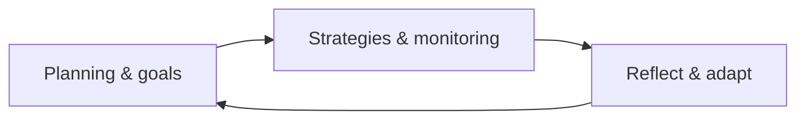
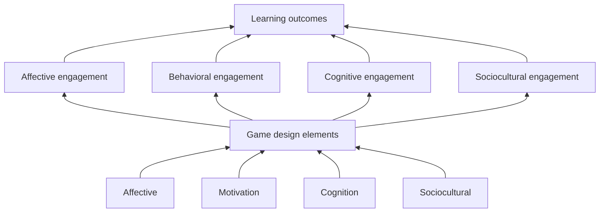

## Can media influence learning?

### Kozma

Kozma puts that educational technology is a design science; the phenomena we study are products of our own making. If there is not yet a relationship between media and learning, we have not *made one*, yet.

He claims we fail to see this relationship due to the behavioural roots of our field. We examine cause and effect, but rarely the causal mechanism. We look at the surface features of a medium (the stimuli), and then compare performance on a test (the response). According to Kozma, we should instead be studying the structure of the media and how it can sollicit cognitive processes associated with learning<!-- (via causal mechanisms)-->.

Media has three attributes:

- **Technology**: the physical, mechanical or electronic capabilities of a medium, determining its features. We use technology to classify media, such as 'television', 'radio', 'tablet' etc.
- **Symbol systems**: the way of transmitting information via the medium; examples include spoken language, printed text, pictures, numbers, musical score, maps, graphs etc.
- **Processing capabilities**: the ability of the medium to manipulate/operate on symbol systems; eg. displaying, receiving, storing, retrieving, organising, translating, transforming, evaluating etc.

Given these properties, any medium can be profiled and described in terms of its attributes, which determine the capacity to present certain representations or perform certain operations. Given the fact students perform the same representations and operations mentally, these attributes may influence learning.

A critique (by Clark) of this perspective is that attributes of media are neither unique nor necessary to a specific medium. In other words: the capabilities of a TV can be seen in another medium (eg. a computer), and may also be unused (eg. using the TV for displaying static images). Therefore, learning benefits can not be accounted to the media in question.

> It must be noted that a distinction can be made between attributes and variables:
> 
> - An **attribute** is a property of a medium defined by its presence; it exists or not.
> - A **variable** is a also a property of a medium, but defined by being present to a degree.
> 
> In other words: an attribute is a capability, a variable is whether this capability is used.

Kozma responds by saying individual attributes might not be unique to a medium, but the combination of different attributes can be distinctive nonetheless. Therefore, this unique combination of attributes can sollicit cognitive processes and thus learning benefits can be attributed to a certain medium.

### Clark

Clark instead claims media can never influence learning, because we confound media with instructional methods. That is, the instructional method is the 'active ingredient' of instruction, and can be delivered by a range of media (replacement hypothesis), given they offer the affordances needed for the method.

In this view, media are 'mere verhicles that deliver instruction, but not influence student achievement'. Methods influence learning, media influence timely access/delivery and cost of doing so.

Therefore, the choice for media is purely economic. The designer must choose the least expensive and most cognitively efficient way to deliver instruction.

<!-- The instructional method is defined as "any way to shape information, that activates cognitive processing necessary for learning", which students cannot or will not provide themselves. -->

<!-- This same conclusion is also reached by meta-analytic reviews of computer-based instruction; it is not the computer but the teaching method built into CBI that accounts for learning gains. -->

With regard to media attributes, Clark says the following: a number of distinct media attributes can serve the same cognitive function. Therefore, the attributes must be proxies of other variables (the underlying instructional method).

<!-- When learning occurs, almost always some mix of media is required to deliver instruction. However, learning outcomes cannot be attributed to exposure to media, but rather the method embedded in it.-->

<!--
Part of Clark's perspective stems from the observation that far too often, educational technology start with enthusiasm for solutions in search of a problem. He states 
-->

## Blended learning

Blended learning (sometimes 'personalized learning') is education in part face-to-face, in part online, with some element of student control over time, place, direction, and pace.

The lecture-format, which originated as an efficient way to copy books, is long outdated and has a few flaws:

- **Cognitivist angle**: it does not stimulate active processing of information.
- **Constructivist angle**: it is centered around the teacher as transmitter of knowledge, and not around the construction of knowledge by the student.

A good teacher helps students become critical thinkers and creative problem solvers. Blended learning is fit for this purpose, since it provides more learning oppurtunities and the student has an active role.

### Forms of blended learning

- **Flipped classroom**: students study online materials before class, and then process the materials actively during face-to-face time. This is reverse of the 'traditional' approach, where materials are explained face-to-face, and then processed after class via homework.

- **Station rotation**: there are multiple activities ('stations') within the classroom, typically one teacher-led, one online, and one collaborative, that students switch between, either at a set interval or at teacher-discretion.

- **Lab rotation**: similar to the station rotation model, but stations are locations rather than in-classroom activities, and one typically being a computer lab. 

- **Individual rotation**: students switch between different activities and modalities on an individually customized schedule, by which they do not necessarily visit all available stations.

  
Advantages of blended learning

  <ul>
    <li>Online materials can add variety or authenticity</li>
    <li>Learners have more control over pace, frequency, place/time</li>
    <li>Ability to use testing effect via frequent quizzes</li>
    <li>Automated feedback can be provided more frequently and timely</li>
    <li>Promote active learning via activities, rather than passive processing</li>
    <li>Combines multiple media, which is known to be beneficial to learning</li>
    <li>Better access (due to distance & travel, which costs money)</li>
    <li>Potential cost reduction for the institute (less classrooms, facilities etc.)</li>
  </ul>

  
Disadvantages of blended learning

  <ul>
    <li>More time consuming for both students and teachers</li>
    <li>Active learning takes more effort for students</li>
    <li>Designing in-class and online curricula is more demanding for teachers</li>
    <li>Self-regulated learning can be demanding for students</li>
    <li>Study-life balance: border between classroom and home fades</li>
    <li>Less social interaction</li>
    <li>Tracking and combining multiple sources of information is more demanding</li>
    <li>Technical difficulties with online learning</li>
    <li>Worse access (due to internet & devices, which cost money)</li>
    <li>Potential extra costs for institute (redevelop curricula, maintain IT infrastructure etc.)</li>
  </ul>

### Self-determination theory

Blended learning is effective because it reduces cognitive load (due to increased learner control), and takes into account self-determination theory. This theory consists of three factors:

- **Autonomy**: students have more control over own learning (place, time, pace, depth).
- **Competence**: students feel more competent because they come to class prepared.
- **Relatedness**: students feel more related to fellow students and teachers because they actively processing materials together.

### Self-regulated learning

Self-regulated learning (SLR) refers to monitoring and adjusting own learning processes using cognitive and metacognitive stategies, by regulating motivation.

We describe self-regulating in a cycle consisting of three phases:

A blended environment requires more SLR skills from students to fully benefit from instruction. Additionally, it is an important life skill, and directly relates to higher achievement.

<!--

  
Self-regulated learning skills are difficult and slow to develop:

  <ul>
    <li>Require doing it often in tasks.</li>
    <li>Or: receiving specific support or training.</li>
  </ul>
  
This is especially difficult for younger people. From adolescence on, more complex SLR is possible.

-->

  
Factors to support or measure SLR

  <ul>
    <li>Goal setting <small>what do you want to achieve? when?)</small></li>
    <li>Time management <small>(how much time will you spent? when?)</small></li>
    <li>Environmental structuring <small>(where do you put your smartphone etc.)</small></li>
    <li>Help seeking <small>(when stuck, do you know? and do you ask for help?)</small></li>
    <li>Task definition <small>(do you know what to do?)</small></li>
    <li>Strategic planning <small>(did it work? do you make changes?)</small></li>
  </ul>

  
How can we support SLR in flipped classroom?

  <ul>
    <li>Provide explicit SRL instruction <small>(increases quality)</small></li>
    <li>Facilitate SRL by prompting <small>(increases quantity)</small></li>
  </ul>
  
Examples would be:

  <ul style="margin-top: 5px">
    <li>Teaching SRL strategies explicitly</li>
    <li>Providing frequent reflection moments</li>
    <li>Helping with goal setting and planning</li>
    <li>Doing regular progress monitoring</li>
  </ul>
  
From research we know that adding SRL prompts on their own to instruction does not influence performance, since students do not see their meaning/relevance, thus tend to ignore them. This is mitigated by adding explicit explanation.

### Scientific evidence

The study by Fazal and Bryant (2019) looks at performance and growth measures for blended learning compared to only face-to-face:

- **Performance** (STAAR): face-to-face only scored higher.
- **Growth** (MAP): blended learning scored higher.

Both moderate effect sizes. This is different from results by Mackey (2015), who reported higher scores for blended learning on both measures.

<!-- Since technology can be adaptive, it can be used for differentiation. Data from digital systems can also be used by the teacher to effectively differentiate in face-to-face instruction as well, providing appropriate scaffholding and targeted learning opportunities. -->

Another meta-analysis by Alten et al. (2019) also looks at learning outcomes and student satisfaction:

- **Assesed learning outcomes**: small, signitificant (\\(g = 0.36, p < .001\\)), high power.
- **Perceived learning outcomes**: small, insignificant (\\(g = 0.36, p = .13\\)), low power.
- **Student satisfaction**: no effect, insignificant (\\(g = 0.05, p = .73\\)), low power.

> There was a high variety in student satisfaction. The net effect size was close to zero. This implies the specifics of implementation of the flipped classroom matter a lot.

A comparible analysis by Spanjers et al. (2015) found very similar results for effectiveness and statisfaction. There was no overlap in analysed records, so both results are independent.

Alten et al. (2019) also recognizes a few design characteristics possible moderators:

- **Quizzes**: positive effect on learning outcomes due to frequent testing effect, and positive effect on student satisfaction.

- **Small group assignments**: positive effect on learning outcomes, achievement, and student attitudes. <small>(examples: pair-and-share, paired problem-solving, group discussions)</small>

- **Lecture-activities**: positive effect on learning; micro-lectures can be used to address misunderstandings or gaps in student knowledge, and also increases student motivation.

An earlier study by Baerpler et al. (2014) indicated reducing face-to-face classroom time had no effect on learning outcomes. However, the analysis by Alten et al. (2019) finds a significant negative effect on learning outcomes when reducing face-to-face time.<!--Therefore, sustaining face-to-face time is a critical feature of succesful implementation.-->

## Game-based learning

Game-based learning (GBL) is hard to define. Instead, we use a simplified model based on player enagement (affective, behavioural, cognitive and sociocultural).

This model assumes game design elements based on affective, motivational, cognitive, and sociological foundations, contribute to player engagement, which leads to learning outcomes.

  
Importance of play

  
Games are hard to define, but play is widely understood to be important to the development of children because it activates schemas “in ways that allow children to transcend their immediate reality”. (In other words: it teaches symbolism.)

  
Genuine play is always symbolic and social. It is important because it creates a zone of proximal development for the child (Vygotsky, 1978). As children age, play becomes even more abstract, symbolic and social.

### Why game-based learning?

There are many arguments for GBL. As a short summary, good games:

- **Neither too easy** (boring) **nor too hard** (frustrating). Aim for a "sweet spot", where players can succeed with some struggle. This is called *flow*, but can also be described as the zome of proximal development (Vygotsky, 1978).

- **Motivate the learners**. We call the ability of a game to motivate, and to generate desire for players to return or continue playing, its *stickiness*. <!--From a game design perspective, it is more desireable to make the learning mechanics themselves interesting, and less desirable to only 'enhance' them by adding other game features. No scientific research has been done on this topic.-->

- **Allow many ways to engage learners**, depending on design decisions related to the learning objective, learner characteristics and context. According to the INTERACT model (Domagk, Schwartz, & Plass, 2010), there's four forms:

    - **Cognitive engagement**: mental processing and metacognition.
    - **Affective engagement**: emotion processing and regulation.
    - **Behavioural enagement**: gestures, embodied actions, movement.
    - **Sociocultural engagement**: social intereactions embedded within cultural context.

  The end goal is to foster cognitive engagement of the learner with the learning mechanic.

- **Adapts to the player**; engages with each learner in a way that reflects their specific situation. This is done by 1) measuring the variable the game adapts for and 2) providing an appropriate response (modification of task, scaffolding, guidance, and feedback etc.)

- **Allow for graceful failure**. Rather than describing an undesirable outcome, failure is a by expected, and sometimes even necessary, step of learning. Games encourage risk-taking and exploration by offering lowered consequences.

### Game design elements

- **Game mechanics**: essential gameplay. The (sets of) activities repeated by the learner throughout the game. These can be learning or assesment mechanics.

  > Mechanics are often used to categorize [genres of games](/OWW1/OVL/Samenvatting.md#individualised-instruction).

- **Visual aesthetics**: look-and-feel of the game and characters, but also the representation of key information in the game, as well as visualisations of mechanics, cues, and feedback.

    Design can have a cognitive or aesthetic function.

- **Narrative**: the storyline (cutscenes, dialogue, voice-over etc.), has a motivating function, and also provides <dfn title="ie. rules, characters, tasks, events, incentives">contextual information</dfn>. A storyline can be linear or nonlinear. Non-linear storylines can change depending on the player's choices.

- **Incentive system**: motivational elements such as rewards that encourage players to continue.

  - **Intrinsic**: contributes to gameplay (ie. power-ups or keys).
  - **Extrinsic**: does not contribute to gameplay (ie. stars or points).
    > Extrinsic incentives can also create a *metagame*, where players compete with eachother outside the game, for example via leaderboards.

- **Musical score**: consists of the soundtrack and effects, used to direct attention, signal danger or opportunity, induce emotions or acknowledge success or failure. <!--Often accompanied by haptic information.-->

- **Content and skills**: the subject matter the game teaches, influences all other design elements, depending on one of four functions of the game:

    - **Preparation of future learning**: provides students with shared experience or knowledge used in later learning activities.

    - **Teaching new knowledge and skills**: provides initial presentation of new knowledge or skills, along with initial practise.

    - **Practise and reinforce existing knowledge and skills**: provides oppurtunities to practise and automate existing knowledge or physical/cognitive skills.

    - **Developing 21st-century skills**: provides opportunities to develop more complex socioemotional skills related to teamwork, collaboration, problem solving, creativity, communication.

<!--
### Foundations of game-based learning

#### Cognitive

<!--
The goal of GBL is construction of mental models by selecting, organising and integrating (with prior knowledge) information.

> Bovenstaand is het Wijze lessen model van generatieve/productieve strategieën. Bij [OVL](/OWW1/OVL/Samenvatting#verwerkingsstrategieën) houden we een ander model van Jonassen uit Morrison aan.

- **Situatedness**: in games, learning can take place in a meaningful and relevant context, closely mirroring real life (which facilitates transfer), and providing information at the precise moment when it will be most useful.

- **Transfer**: games support the application of knowledge and skills in a novel context, via the low road (automation) or high road (abstraction), facilitated by repeated opportunities to practise and apply materials in different situations.

- **Scaffolding**: games can provide scaffolding, by doing ongoing dynamic evaluation, using that to provide dynamically adaptive scaffolds, and the progressively fading the scaffolds as the learner progresses.

  <!-- "Normal" (non-educational) games often also incorporate a form of scaffolding during early gameplay, to teach players the game's mechanics. This is often in the form of a tutorial level.

- **Gestures and movement**: games enable embodied cognition, which involves motoric engagement and mapping gestures or movements to subject matter ('gestural congruity').

#### Motivational

<!--Motivational theories (expectancy-value theory, self-determination theory, self-efficacy theory, attribution theory, and interest theory) pose three questions:

| Question | GBL affordance |
|--|--|
| **Can I do this?** | Games ensure achievement by dynamic adaptivity, so the question can be affirmatively answered. |
| **What do I need to do to succeed?** | Games ensure players know what to do during gameplay. |
| **Do I want to do this, and why?** | Intrinsic and extrinsic motivational factors from incentive systems. |

- **Intrinsic motivation**: well-designed educational games feature design elements such as challenge, curiosity, and fantasy which are intrinsically motivating and result in effortless learning.

  > If learning and mechanics are not tightly linked, students may be intrinsically motivated to play but not to learn, which may lead to "gaming the system", where students find ways to play without necessarily learning the subject matter.

- **Values and interest**: students are more motivated if they are personally interested. Interest can be situational or individual:

    - **Situational interest**: giving attention to an immediate activity or task at hand.
    - **Individual interest**: intrinsic desire and tendency to return to an activity or task.

  With a well-designed game, situational interest in the game will eventually develop into individual interest in the subject matter.

- **Achievement-related goals**: there are two main reasons for students to engage with a game (or any educational material for that matter):

    - **Mastery orientation**: students focus on learning and mastery of skills or knowledge.
    - **Performance orientation**: students focus on maximazing favorable evaluations of their competence.

  Students with a mastery orientation are more likely to be motivated.

  <!--
  > Dit is het onderscheid dat ook in Wijze lessen wordt gemaakt tussen *leren* en *presteren*.

#### Affective

<!-- An emotional schema is the dynamic interaction of emotion and cognition.

- **Emotional design**: games can induce emotions via visuals, music, mechanics, storyline, and narration, and can also asses emotions and respond to them.

  
Affection vs cognition

  
Postive emotions might broaden the scope of cognitive resources (via heightend situational interest), but by optimizing engagement and stickiness might also lead to higher cognitive load. Additionally, emotional regulation required by games might overwhelm learners. However, there is also evidence that confusion might enhance learning.

#### Sociocultural

Games not not necessarily explicitly include cultural factors, but do often unconciously include or exclude for example colors, sounds, words, numbers based on ingrained and automated knowledge from the sociocultural background of the designers.

- **Activity theory**: the motivational value of games lies in anticipated social interaction. Activities are based on interest- and friendship-driven social participatory structures.

- **Social context**: a sense of community and participation can positively influence motivation and learning. This is easily done in multiplayer games, but singleplayer games can also use mechanics to create social pressure or metagames.

- **Agency**: a sense of agency can positively influence motivation and goal orientation. There are three ways to exercise agency:

    - **Personal agency**, exercised individually.
    - **Proxy agency**, exercised through others.
    - **Collective agency**, exercised as a group.

  Proxy and collective agency can teach collaboration and joint goal-setting.

- **Observation**: games may affect not only players, but also observers who also engage and focus equally on gameplay. Observers can offer advice and encouragement. In some cases, observers might learn more from the game than players themselves.

  <!--Games can include unconcious cultural design decisions, and are therefore uniquely positioned to also teach those cultural norms quietly. We often see this in **epistemic games**, which put players in a realistic proffesional context.

- **Relatedness** (from self-determination): the sense of being connected to others can positively influence motivation, engagement, and stickiness. 

  However, players may refrain from social interaction when they have low stats, because they do not want to be seen by others as noobs. Therefore, to maximize relatedness, games should cluster players in cohorts of similar abilities.

- **Crowdsourcing**: a specific type of game that uses AR to create authentic situations that incorporate real-world objects, where during gameplay data for research purposes is collected. Being part of a 'greater good' is a very motivating factor in these games.
-->

### Scientific evidence

Research by Lei et al. (2022) indicates GBL leads to substantially increased learning outcomes. They also found a number of moderators:

- **Culture**: in collectivist countries children are exposed to more extrinsic motivation during childhood and are thus more receptive to extrinsic incentives. In individualist countries extrinsic incentives can cause negative effects. Since GBL uses both intrinsic and extrinsic motivation, it is more effective in collectivist countries.

- **Achievement indicator**: games are especially beneficial to learning science, since the GBL-process has many parallels with science inquiry processes. Therefire GBL is more effective for science-related subjects, in comparison to other subjects.

- **Grade level and age**: primary school students are more familiar with play and less familiar with other instruction/practise (eg. homework), so comparitively, it works better for them than for higher education.

<!--
- **Publication year**: over time more technical and pedagogical innovation has taken place, and thus newer interventions are often more effective.

- **Duration of intervention**: interventions shorter than 4 hours are too short to measure results, interventions longer than a week are more vulnerable to data pollution due to external factors. Interventions between 4 hours and a week were most effective. Also take into account the novelty effect.
-->