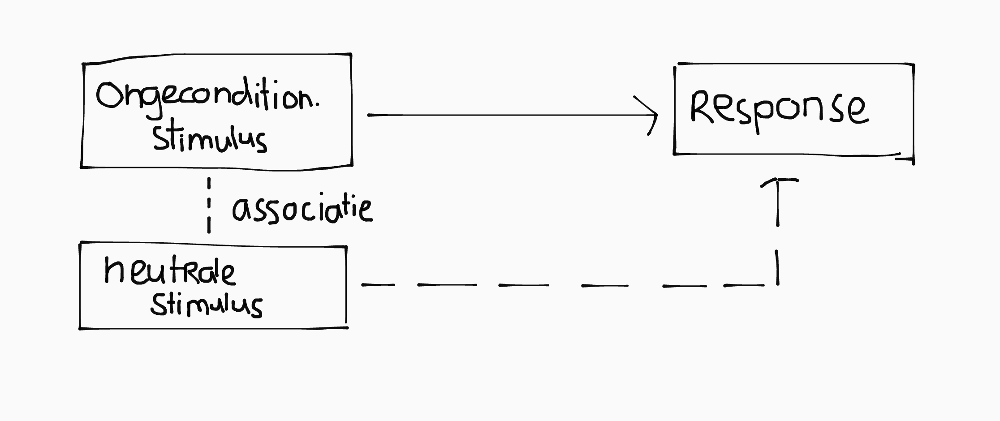

## Referentiekader

Het onderwijs is een complex samenhangend systeem. Om hier orde in aan te brengen maken we gebruik van het referentiekader van Valcke (2018).

Dit referentiekader maakt onderscheidt tussen actoren, dimensies, en processen, en geeft deze invulling op verschillende aggregatieniveaus.

### Actoren, processen & variabelen

Actoren (of stakeholders) zijn concrete personen, groepen, vertegenwoordigers van groepen of organisaties, of de organisaties zelf, die belang hebben bij het onderwijs.

Hoe actoren zich opstellen hangt af hun rolpositie en hun belangen.

  
Twee belangrijke actoren op elk aggregatieniveau zijn:

  <ul>
    <li>Instructieverantwoordelijke biedt het onderwijs aan.</li>
    <li>Lerenden nemen het onderwijs af.</li>
  </ul>

Processen zijn zaken die over de tijd heen verlopen. Bijvoorbeeld, leer- en instructieprocessen, of schoolverbetering.

Variabelen zijn kenmerken (van actoren, organisatie, gedrag, interventies etc.) die verschillende waarden kunnen aannemen.

### Aggregatieniveau's

- **Micro**: concrete leer- en instructiesituatie, of individuele lerende; directe interactie tussen lerende en instructieverantwoordelijke.
- **Meso**: organisatie-eenheid zoals school, scholengroep, faculteit, vereniging, of bedrijf.
- **Macro**: compleet onderwijssysteem; maatschappij, politiek, beleid, wetgeving, en bestuur.

### Dimensies

In het onderwijs staat het primaire leer- en instructieproces centraal. Dit wordt vervolgens beïnvloed door een aantal dimensies:

- **Actorkenmerken & begeleiding**: Actoren hebben kenmerken die hun rol en de invulling daarvan bepalen. Daarnaast krijgen ze begeleiding, in de vorm van informele en formele voorzieningen die hen helpen in het vervullen van die rol.

- **Organisatie**: randzakelijke en voorwaardelijke aspecten die nodig zijn voor het primaire leer- en instructieproces, zoals beschikbare tijd, fysieke ruimte, budget, infrastructuur etc.

- **Leeractiviteiten**: gedrag dat de leerlingen vertonen om leerstof eigen te maken.

- **Didactisch handelen** (of instructieactiviteiten): beslissingen die de instructieverantwoordelijken (of andere actoren) maken om leeractiviteiten uit te lokken bij leerlingen.

#### Didactisch handelen

Didactisch handelen kan verder worden ondergebracht in vijf onderdelen:

- **Leerdoelen**: wat wil je bereiken en hoe meet je dit?
- **Lesstof** (of curriculum): wat wordt er inhoudelijk geleerd?
- **Werkvormen**: handelingen waarmee leeractiviteiten uitgelokt worden.
- **Media**: hoe wordt de lesstof aangeboden? (bijv: boek, audio, video, digitaal etc.)
- **Toetsing**: hoe controlleer je of de leerdoelen bereikt zijn?

  
Leeractiviteiten

  Er zijn drie soorten leeractiviteiten:
  <ul>
    <li><b>Cognitief</b>: structureren, analyseren, relateren, reproduceren en toepassen van stof.</li>
    <li><b>Metacognitief</b>: oriënteren, plannen, bijsturen, etc.</li>
    <li><b>Affectief</b>: attribueren, waarderen, motiveren, etc.</li>
  </ul>

  
Toetsingsvormen

  <ul>
    <li>Toetsing is <b>formatief</b> als het een diagnostisch instrument is <em>voor de leerling</em> te checken waar je staat.</li>
    <li>Toetsing is <b>summatief</b> als het een cijfermatige beoordeling geeft om leerlingen onderling te vergelijken.</li>
  </ul>

### Voorbeelden op verschillende aggregatieniveau's

Concreet vind je op elk aggregatie de volgende aspecten terug:

- Instructieverantwoordelijke & lerenden
- Begeleiding van de instructieverantwoordelijke
- Begeleiding van de lerenden
- Kenmerken van de actoren (lerenden en instructieverantwoordelijke)
- Organisatie en context

#### Microniveau

Op microniveau zijn actoren meestal individuele personen. De instructieverantwoordelijke is een leraar, trainer of coach, en de lerende is een leerling, trainee, of deelnemer.

Kenmerken van actoren zijn persoonskenmerken zoals leeftijd, geslacht, afkomst. Voor lerenden: mate van extraversie, mate van voorkennis, aanwezigheid, doorzettingsvermogen, perceptie van eigen academische capaciteiten, en inkomen en opleidingsniveau van ouders.

De begeleiding van de instructieverantwoordelijke bestaat uit mentoren, onderwijsleerteams, samenwerking tussen leraren, bij- of nascholing, studiedagen, en trainingen.

Organisatie op microniveau is heel concreet en heeft direct invloed op de instructie en leeractiviteiten. Denk bijvoorbeeld aan beschikbare lestijd, aanwezige materialen, aantal computers.

De context is het geheel aan andere niet-instructiegerelateerde variabelen en processen die het primaire instructie- en leerproces beïnvloeden.

#### Mesoniveau

Op mesoniveau zijn actoren minder concreet (vaak groepen): klassen, directie, vaksecties, leerjaren, cohort. De kenmerken van actoren zijn ook breder: de samenstelling van de klas, de denominatie van de school.

De organisatie gaat op mesoniveau over bredere zaken, zoals het budget van de school, het aantal beschikbare lokalen, beschikbaar personeel. Begeleiding is op mesoniveau bijvoorbeeld in de vorm ondersteuning vanuit het schoolbestuur of pedagogische centra.

#### Macroniveau

Op macroniveau zijn de meeste actoren organisaties (zoals de onderwijsvakbond, de vo-raad, belangenverenigingen), of individuen die organisaties vertegenwoordigen (zoals de minister als vertegenwoordiger van het ministerie, of een lijstrekker als vertegenwoordiger van een fractie).

Kenmerken van actoren zijn nóg breder: bijvoorbeeld demografische opbouw van de algehele leerling- of leekrachtpopulatie.

Organisatie duidt de inrichting van het onderwijssysteem (basisonderwijs, vmbo, havo, vwo, mbo, hbo, wo) als geheel. Begeleiding op macroniveau komt voornamelijk van adviesorganen (zoals de vo-raad) en belangenverenigingen (zoals de vakbond of LAKS).

De context omvat de politieke situatie (welke partijen zitten in de kamer en  in het kabinet?), de economie, afspraken in het regeerakkoord en de rijksbegroting, en de huidige staat van het onderwijs (bijvoorbeeld PISA-scores).

<!--
## Leertheoriën

Één van de belangrijkste doelstellingen van het leerproces is **transfer**. Transfer is de mogelijkheid om het geleerde in een nieuwe situatie of context toe te kunnen passen. Om transfer te bewerkstelligen hebben we drie leerhtheoriën.

Er zijn drie perspectieven op hoe mensen leren.

> Het is goed om te beseffen dat deze theoriën *geen wetmatigheden* zijn, en dus *niet universeel gelden*. In de onderwijswetenschappen geldt: niet alles werkt, en niets werkt altijd.

Instructional design is het raakvlak tussen de leerheoriën en de praktijk.-->

## Behaviorisme

Behaviorisme is een gedrags-georienteerd perspectief op leren. <!--Het wordt daarom ook wel een 'black box' theorie genoemd: het gaat ervanuit dat we geen inzicht hebben in wat er in het brein gebeurd; we kunnen alleen het uitkomstige gedrag observeren.--> Leren is een vorm van gedragsverandering, die kan worden bewerkstelligt door **conditionering**.

### Klassieke conditionering

Klassieke conditionering is gebaseerd op Pavlov's onderzoek naar reflexen. Een reflex is een instinctieve reactie op bepaalde prikkels. Die prikkels noemen we de **stimulus**, en de reactie een **response**.

Door **associatie** op te bouwen tussen de stimulus die van nature de response opwekt, en een neutrale stimulus, kan je een stimulus 'vervangen.' Dit doe je door beide gelijktijdig toe te dienen. Na verloop van tijd zal de response ook optreden als je alleen de neutrale stimulus toedient. Dit process noemen we **stimulus-substitutie**.

Een voormalig neutrale stimulus die door conditionering de response ook opwekt noemen we **geconditioneerd**. De stimulus dit van nature doet noemen we **ongeconditioneerd**.

<!--Als een geconditoneerde response voor lange tijd niet 'gebruikt' wordt, kan deze **uitdoven**. De geconditoneerde stimulus wordt dan weer neutraal.-->

Omdat de response een bestaand reflex moet zijn, is klassieke conditionering moeilijk toe te passen in de onderwijspraktijk, waar veelal nieuwe dingen moeten worden geleerd.

### Operante conditionering

Operante conditionering is gebaseerd op Skinner's onderzoek naar het **bekrachtigen** van gedrag. Het idee is dat door positieve of negatieve prikkels met gedrag te associëren, de frequentie van gewenst of juist ongewenst gedrag kan worden beïnvloed.

| <small>↓ gewenste uitkomst ↓</small> | **stimulus toevoegen** | **stimulus wegnemen** |
| **toename van gedrag** | positive reinforcement | negative reinforcement |
| **afname van gedrag** | positive punishment | negative punishment |

Bij reinforcement moedig je gewenst gedrag aan door te belonen. Bij punishment moedig je ongewenst gedrag af door te straffen. Dit doe je door prikkels toe te voegen (positive) of weg te nemen (negative).

<!--

  
Let op!

  
"positive" en "negative" zeggen dus <em>niks</em> over of het gedrag gewenst of ongewenst is, of dat de beloning of straf wel of niet fijn is voor de leerling. Het betekent puur en alleen of er een prikkel wordt <strong>toegevoegd</strong> of <strong>weggenomen</strong>!

-->

Op de lange termijn is reinforcement een effectievere manier om gedragsverandering te bewerkstelligen. Met andere woorden: als je stop met belonen blijven leerlingen positief gedrag vertonen, maar als je stop met straffen vallen mensen snel terug op negatief gedrag.

  
Concreet voorbeeld

  <table>
    <tr>
      <td></td>
      <td><strong>stimulus toevoegen</strong></td>
      <td><strong>stimulus wegnemen</strong></td>
    </tr>
    <tr>
      <td><strong>toename van gedrag</strong></td>
      <td>sticker geven</td>
      <td>geen huiswerk meer</td>
    </tr>
    <tr>
      <td><strong>afname van gedrag</strong></td>
      <td>strafwerk geven</td>
      <td>kortere pauze</td>
    </tr>
  </table>

## Cognitivisme

Het cognitivisme (of cognitieve psychologie) legt de nadruk op wat er in je hoofd gebeurt, en stelt dat leren het verwerken van informatie is.

Het actief verwerken van informatie gebeurt in het **werkgeheugen**. Dit werkgeheugen heeft een beperkte capaciteit van 5 tot 9 elementen of 'chunks' (afhankelijk van de persoon).

Kennis wordt voor langere tijd opgeslagen in het **langetermijngeheugen**, dat voor zover we weten onbeperkt is. Echter, om kennis op te slaan in het langetermijngeheugen moet het eerst door het beperkte werkgeheugen, dat dus een soort 'flessenhals' is.

**Cognitive load theory** stelt dat het werkgeheugen wordt 'belast' door:

- **Intrinsic load**: de compexiteit van de informatie; uit hoeveel elementen bestaat de informatie en wat is de onderlinge samenhang ('element interactivity')?
- **Extraneous load**: hoe moeilijk het is de informatie op te nemen; heeft te maken met de manier waarop informatie wordt gepresenteerd of aangeboden.

Bij hoge **element interactivity** moeten alle elementen tegelijk in het werkgeheugen gehouden worden, waardoor de cognitive load hoger is, terwijl materiaal met lage element interactivity sequentieel, in isolatie, geleerd kan worden, en daardoor een lagere cognitive load heeft.

Als het werkgeheugen wordt **overbelast** kan er geen nieuwe informatie in het langetermijn-geheugen worden opgenomen, en wordt er dus niks geleerd.

  
Effectieve instructie houdt rekening met de cognitive load:

  <ul>
    <li>Je kan intrisic load niet verminderen (want het is inherent aan de lesstof), maar het materiaal wel in kleinere stapjes aanbieden.</li>
    <li>Je kan extraneous load verminderen door afleidingen weg te halen, het verhogen van voorkennis (omdat je makkelijker herkent wat relevant is), en automatiseren (omdat je niet meer hoeft na te denken wat je doet).</li>
  </ul>

### Geheugen & leerstrategiën

De **vergeetcurve** van Ebbinghaus visualiseert voor hoe lang informatie in het langetermijn-geheugen blijft opgeslagen als het niet herhaald wordt. Door herhaling blijft kennis beter hangen.

Uit onderzoek blijkt ook dat gespreid leren ('spaced practise') effectiever is dan alles in één keer leren ('massed practise').

## Constructivisme

WIP.

## Effect sizes

We hebben inmiddels bij [KOM](/OWW1/KOM/Samenvatting) geleerd wat effect sizes & p-waardes inhouden, dus dat laat in hier achterwege.

Echter, binnen de onderwijswetenchappen stelt Hattie (2009) dat effect sizes pas relevant zijn boven de \\(.40\\), want:

- **Ontwikkelingseffecten** (of maturiteitseffecten): leerlingen leren 'van nature'; dat betekent dat ook zonder (effectieve) instructie over tijd voortgang te meten is.

- **Leerkrachteffecten**: als leerkrachten de aanpak aanpassen aan de experimentele conditie wordt er beter opgelet, omdat leerlingen zich moeten aanpassen aan een andere situatie.

Negatieve effect sizes ('reverse effects') worden altijd als relevant beschouwd.

Het is belangrijk te blijven realiseren dat een effect size een *gemiddelde* is, dat niet per defintie in elke willekeurige context kan worden toegepast.
