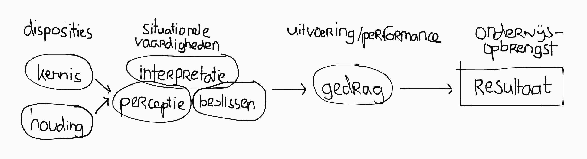
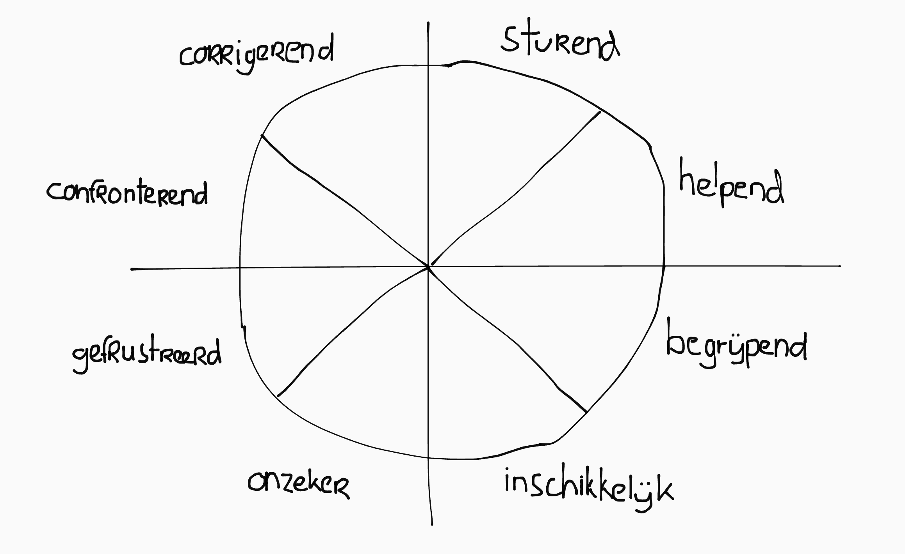

## Referentiekader

Het onderwijs is een complex samenhangend systeem. Om hier orde in aan te brengen maken we gebruik van het referentiekader van Valcke (2018).

Dit referentiekader maakt onderscheidt tussen actoren, dimensies, en processen, en geeft deze invulling op verschillende aggregatieniveaus.

### Actoren, processen & variabelen

Actoren (of stakeholders) zijn concrete personen, groepen, vertegenwoordigers van groepen of organisaties, of de organisaties zelf, die belang hebben bij het onderwijs.

Hoe actoren zich opstellen hangt af hun rolpositie en hun belangen.

  
Twee belangrijke actoren op elk aggregatieniveau zijn:

  <ul>
    <li>Instructieverantwoordelijke biedt het onderwijs aan.</li>
    <li>Lerenden nemen het onderwijs af.</li>
  </ul>

Processen zijn zaken die over de tijd heen verlopen. Bijvoorbeeld, leer- en instructieprocessen, of schoolverbetering.

Variabelen zijn kenmerken (van actoren, organisatie, gedrag, interventies etc.) die verschillende waarden kunnen aannemen.

### Aggregatieniveau's

- **Micro**: concrete leer- en instructiesituatie, of individuele lerende; directe interactie tussen lerende en instructieverantwoordelijke.
- **Meso**: organisatie-eenheid zoals school, scholengroep, faculteit, vereniging, of bedrijf.
- **Macro**: compleet onderwijssysteem; maatschappij, politiek, beleid, wetgeving, en bestuur.

### Dimensies

In het onderwijs staat het primaire leer- en instructieproces centraal. Dit wordt vervolgens beïnvloed door een aantal dimensies:

- **Actorkenmerken & begeleiding**: Actoren hebben kenmerken die hun rol en de invulling daarvan bepalen. Daarnaast krijgen ze begeleiding, in de vorm van informele en formele voorzieningen die hen helpen in het vervullen van die rol.

- **Organisatie**: randzakelijke en voorwaardelijke aspecten die nodig zijn voor het primaire leer- en instructieproces, zoals beschikbare tijd, fysieke ruimte, budget, infrastructuur etc.

- **Leeractiviteiten**: gedrag dat de leerlingen vertonen om leerstof eigen te maken.

- **Didactisch handelen** (of instructieactiviteiten): beslissingen die de instructieverantwoordelijken (of andere actoren) maken om leeractiviteiten uit te lokken bij leerlingen.

  
Didactisch handelen

  
Kan verder worden ondergebracht in vijf onderdelen:

  <ul>
    <li><strong>Leerdoelen</strong>: wat wil je bereiken en hoe meet je dit?</li>
    <li><strong>Lesstof</strong> (of curriculum): wat wordt er inhoudelijk geleerd?</li>
    <li><strong>Werkvormen</strong>: handelingen waarmee leeractiviteiten uitgelokt worden.</li>
    <li><strong>Media</strong>: hoe wordt de lesstof aangeboden? (bijv: boek, audio, video, digitaal etc.)</li>
    <li><strong>Toetsing</strong>: hoe controlleer je of de leerdoelen bereikt zijn?</li>
  </ul>

  
Leeractiviteiten

  Er zijn drie soorten leeractiviteiten:
  <ul>
    <li><b>Cognitief</b>: structureren, analyseren, relateren, reproduceren, toepassen etc.</li>
    <li><b>Metacognitief</b>: oriënteren, plannen, bijsturen, etc.</li>
    <li><b>Affectief</b>: attribueren, waarderen, motiveren, etc.</li>
  </ul>

  
Toetsingsvormen

  <ul>
    <li>Toetsing is <b>formatief</b> als het een diagnostisch instrument is <em>voor de leerling</em> te checken waar je staat.</li>
    <li>Toetsing is <b>summatief</b> als het een cijfermatige beoordeling geeft om leerlingen onderling te vergelijken.</li>
  </ul>

<!--
### Voorbeelden op verschillende aggregatieniveau's

Concreet vind je op elk aggregatie de volgende aspecten terug:

- Instructieverantwoordelijke & lerenden
- Begeleiding van de instructieverantwoordelijke
- Begeleiding van de lerenden
- Kenmerken van de actoren (lerenden en instructieverantwoordelijke)
- Organisatie en context

#### Microniveau

Op microniveau zijn actoren meestal individuele personen. De instructieverantwoordelijke is een leraar, trainer of coach, en de lerende is een leerling, trainee, of deelnemer.

Kenmerken van actoren zijn persoonskenmerken zoals leeftijd, geslacht, afkomst. Voor lerenden: mate van extraversie, mate van voorkennis, aanwezigheid, doorzettingsvermogen, perceptie van eigen academische capaciteiten, en inkomen en opleidingsniveau van ouders.

De begeleiding van de instructieverantwoordelijke bestaat uit mentoren, onderwijsleerteams, samenwerking tussen leraren, bij- of nascholing, studiedagen, en trainingen.

Organisatie op microniveau is heel concreet en heeft direct invloed op de instructie en leeractiviteiten. Denk bijvoorbeeld aan beschikbare lestijd, aanwezige materialen, aantal computers.

De context is het geheel aan andere niet-instructiegerelateerde variabelen en processen die het primaire instructie- en leerproces beïnvloeden.

#### Mesoniveau

Op mesoniveau zijn actoren minder concreet (vaak groepen): klassen, directie, vaksecties, leerjaren, cohort. De kenmerken van actoren zijn ook breder: de samenstelling van de klas, de denominatie van de school.

De organisatie gaat op mesoniveau over bredere zaken, zoals het budget van de school, het aantal beschikbare lokalen, beschikbaar personeel. Begeleiding is op mesoniveau bijvoorbeeld in de vorm ondersteuning vanuit het schoolbestuur of pedagogische centra.

#### Macroniveau

Op macroniveau zijn de meeste actoren organisaties (zoals de onderwijsvakbond, de vo-raad, belangenverenigingen), of individuen die organisaties vertegenwoordigen (zoals de minister als vertegenwoordiger van het ministerie, of een lijstrekker als vertegenwoordiger van een fractie).

Kenmerken van actoren zijn nóg breder: bijvoorbeeld demografische opbouw van de algehele leerling- of leekrachtpopulatie.

Organisatie duidt de inrichting van het onderwijssysteem (basisonderwijs, vmbo, havo, vwo, mbo, hbo, wo) als geheel. Begeleiding op macroniveau komt voornamelijk van adviesorganen (zoals de vo-raad) en belangenverenigingen (zoals de vakbond of LAKS).

De context omvat de politieke situatie (welke partijen zitten in de kamer en  in het kabinet?), de economie, afspraken in het regeerakkoord en de rijksbegroting, en de huidige staat van het onderwijs (bijvoorbeeld PISA-scores).

-->

### Effect sizes

Om de de effectiviteit van verschillende variabelen en interventies in het referentiekader te kwantificeren gebruiken we effect sizes (\\(d\\)). We hebben inmiddels bij [KOM](/OWW1/KOM/Samenvatting) geleerd wat effect sizes & \\(p\\)-waardes inhouden, dus dat laat ik hier achterwege.

Echter, binnen de onderwijswetenchappen stelt Hattie (2009) dat effect sizes pas relevant zijn bij \\(d > .40\\), door:

- **Ontwikkelingseffecten** (of maturiteitseffecten): leerlingen leren 'van nature'; dat betekent dat ook zonder (effectieve) instructie over tijd voortgang te meten is.

- **Leerkrachteffecten**: als leerkrachten de aanpak aanpassen aan de experimentele conditie wordt er beter opgelet, omdat leerlingen zich moeten aanpassen aan een andere situatie.

Negatieve effect sizes ('reverse effects') worden altijd als relevant beschouwd.

Het is belangrijk te blijven realiseren dat een effect size een *gemiddelde* is, dat niet per defintie in elke willekeurige context kan worden toegepast.

<!--
## Leertheoriën

Er zijn drie perspectieven op hoe mensen leren.

> Het is goed om te beseffen dat deze theoriën *geen wetmatigheden* zijn, en dus *niet universeel gelden*. In de onderwijswetenschappen geldt: niet alles werkt, en niets werkt altijd.

Instructional design is het raakvlak tussen de leerheoriën en de praktijk.-->

<!-- Één van de belangrijkste doelstellingen van het leerproces is **transfer**. Transfer is de mogelijkheid om het geleerde in een nieuwe situatie of context toe te kunnen passen. Om transfer te bewerkstelligen hebben we drie leerhtheoriën. -->

## Behaviorisme

Behaviorisme is een gedrags-georienteerd perspectief op leren. <!--Het wordt daarom ook wel een 'black box' theorie genoemd: het gaat ervanuit dat we geen inzicht hebben in wat er in het brein gebeurd; we kunnen alleen het uitkomstige gedrag observeren.--> Leren is een vorm van gedragsverandering, die kan worden bewerkstelligt door **conditionering**.

### Klassieke conditionering

Klassieke conditionering is gebaseerd op Pavlov's onderzoek naar reflexen. Een reflex is een instinctieve reactie op bepaalde prikkels. Die prikkels noemen we de **stimulus**, en de reactie een **response**.

Door **associatie** op te bouwen tussen de stimulus die van nature de response opwekt, en een neutrale stimulus, kan je een stimulus 'vervangen.' Dit doe je door beide gelijktijdig toe te dienen. Na verloop van tijd zal de response ook optreden als je alleen de neutrale stimulus toedient. Dit process noemen we **stimulus-substitutie**.

Een voormalig neutrale stimulus die door conditionering de response ook opwekt noemen we **geconditioneerd**. De stimulus dit van nature doet noemen we **ongeconditioneerd**.

<!--Als een geconditoneerde response voor lange tijd niet 'gebruikt' wordt, kan deze **uitdoven**. De geconditoneerde stimulus wordt dan weer neutraal.-->

Omdat de response een bestaand reflex moet zijn, is klassieke conditionering moeilijk toe te passen in de onderwijspraktijk, waar veelal nieuwe dingen moeten worden geleerd.

### Operante conditionering

Operante conditionering is gebaseerd op Skinner's onderzoek naar het **bekrachtigen** van gedrag. Het idee is dat door positieve of negatieve prikkels met gedrag te associëren, de frequentie van gewenst of juist ongewenst gedrag kan worden beïnvloed.

| <small>↓ gewenste uitkomst ↓</small> | **stimulus toevoegen** | **stimulus wegnemen** |
| **toename van gedrag** | positive reinforcement | negative reinforcement |
| **afname van gedrag** | positive punishment | negative punishment |

Bij reinforcement moedig je gewenst gedrag aan door te belonen. Bij punishment moedig je ongewenst gedrag af door te straffen. Dit doe je door prikkels toe te voegen (positive) of weg te nemen (negative).

<!--

  
Let op!

  
"positive" en "negative" zeggen dus <em>niks</em> over of het gedrag gewenst of ongewenst is, of dat de beloning of straf wel of niet fijn is voor de leerling. Het betekent puur en alleen of er een prikkel wordt <strong>toegevoegd</strong> of <strong>weggenomen</strong>!

-->

Op de lange termijn is reinforcement een effectievere manier om gedragsverandering te bewerkstelligen. Met andere woorden: als je stopt met belonen blijven leerlingen positief gedrag vertonen, maar als je stopt met straffen vallen mensen snel terug op negatief gedrag.

  
Concreet voorbeeld

  <table>
    <tr>
      <td></td>
      <td><strong>stimulus toevoegen</strong></td>
      <td><strong>stimulus wegnemen</strong></td>
    </tr>
    <tr>
      <td><strong>toename van gedrag</strong></td>
      <td>sticker geven</td>
      <td>geen huiswerk meer</td>
    </tr>
    <tr>
      <td><strong>afname van gedrag</strong></td>
      <td>strafwerk geven</td>
      <td>kortere pauze</td>
    </tr>
  </table>

## Cognitivisme

Het cognitivisme (of cognitieve psychologie) legt de nadruk op wat er in je hoofd gebeurt, en stelt dat leren het verwerken van informatie is.

Het actief verwerken van informatie gebeurt in het **werkgeheugen**. Dit werkgeheugen heeft een beperkte capaciteit van 5 tot 9 elementen of 'chunks' (afhankelijk van de persoon).

Kennis wordt voor langere tijd opgeslagen in het **langetermijngeheugen**, dat voor zover we weten onbeperkt is. Echter, om kennis op te slaan in het langetermijngeheugen moet het eerst door het beperkte werkgeheugen, dat dus een soort 'flessenhals' is.

**Cognitive load theory** stelt dat het werkgeheugen wordt 'belast' door:

- **Intrinsic load**: de compexiteit van de informatie; uit hoeveel elementen bestaat de informatie en wat is de onderlinge samenhang ('element interactivity')?
- **Extraneous load**: hoe moeilijk het is de informatie op te nemen; heeft te maken met de manier waarop informatie wordt gepresenteerd of aangeboden.

Bij hoge **element interactivity** moeten alle elementen tegelijk in het werkgeheugen gehouden worden, waardoor de cognitive load hoger is, terwijl materiaal met lage element interactivity sequentieel, in isolatie, geleerd kan worden, en daardoor een lagere cognitive load heeft.

Als het werkgeheugen wordt **overbelast** kan er geen nieuwe informatie in het langetermijn-geheugen worden opgenomen, en wordt er dus niks geleerd.

  
Effectieve instructie houdt rekening met de cognitive load:

  <ul>
    <li>Je kan intrisic load niet verminderen (want het is inherent aan de lesstof), maar het materiaal wel in kleinere stapjes aanbieden.</li>
    <li>Je kan extraneous load verminderen door afleidingen weg te halen, het verhogen van voorkennis (omdat je makkelijker herkent wat relevant is), en automatiseren (omdat je niet meer hoeft na te denken wat je doet).</li>
  </ul>

### Geheugen & leerstrategiën

**Chunking** is een manier om meer informatie tegelijk in het werkgeheugen vast te houden, door elementen te groeperen in chunks.

> Bijvoorbeeld, de getallen 7, 1, 0, 2 nemen vier van de 5-9 slots van het werkgeheugen in beslag, maar 'het jaartal 2017, maar dan andersom', neemt maar 1 slot in beslag.

De **vergeetcurve** van Ebbinghaus visualiseert voor hoe lang informatie in het langetermijn-geheugen blijft opgeslagen als het niet herhaald wordt. Door herhaling blijft kennis beter hangen.

Uit onderzoek blijkt ook dat gespreid leren ('spaced practise') effectiever is dan alles in één keer leren ('massed practise').

Tenslotte kan informatie met 'trucjes' (mnemonics) worden onthouden. Dit doe je vooral zodat je de informatie later makkelijker weer *uit* je langetermijngeheugen kan vissen.

## Constructivisme

Het constructivische perspectief is dat kennis een model (of constructie) van de werkelijkheid is, en dat iedereen dat model zelf construeert:

- Kennis is **niet één-op-één overdraagbaar**, het is een constructief proces.
- Kennis is **contextgebonden**, dus moet plaatsvinden in betekenisvolle context.
- Kennis is **een sociale constructie**, dus leren moet plaatsvinden in interactie met anderen.

De lerende heeft binnen het constructivisme een *actieve rol* (door zelfstandigheid, zelfsturing, metacognitie). Daarnaast moet onderwijs realistisch zijn / koppeling met de praktijk hebben.

Binnen het constructivisme zijn twee stromingen te onderscheiden:

- **Cognitief constructivisme** gaat in op de cognitieve processen die bijdragen aan kennisconstructie, en zoomt in op het individu en de rol van voorkennis.

- **Sociaal constructivisme** gaat in op leren in sociaal verband, de co-constructie van kennis, en de rol van de leeromgeving bij kennisconstructie.

<!--In bepaalde opzichten kan constructivisme worden beschouwd meer als een filosofische theorie van kennis, dan een onderwijskundige leertheorie. Toch heeft het toepassingen binnen de onderwijspraktijk.-->

## Onderwijseffectiviteit

**Onderwijsopbrengst** bestaat uit drie componenten: de resultaten (cijfers), de mate waarin leerlingen gemotiveerd en geïnteresseerd zijn, en de mate waarin leerlingen op persoonlijk vlak verder geholpen worden.

**Leerlingkenmerken** verklaren gemiddeld voor 80-90% alle verschillen in onderwijsopbrengst tussen leerlingen. Onder leerlingkenmerken vallen:

- **Demografisch**: geslacht, leeftijd
- **Begaafdheid**: intelligentie, creativiteit
- **Persoonlijkheid**: zorgvuldigheid, openheid, vriendelijkheid, stabiliteit, extraversie
- **Achtergrond**: etniciteit, cultuur, (moeder)taal, sociaal-economische status, ambitie, verwachtingen, startniveau

**Onderwijseffectiviteit** is de variatie in de spreiding verklaard door onderwijsvariabelen (aka de overige 20%). Uit onderzoek blijkt dat dit vooral per klas verschilt \\(\implies\\) de leraar maakt het verschil.

| | Leerwinst <small>(gem. toename prestaties / jaar)</small> |
|--|--|
| Geen leraar (maturiteitseffecten) | 6% |
| Minst effectieve leraar | 14% |
| Gemiddelde leraar | 34% |
| Meest effectieve leraar | 53% |

De invloed van de school is indirect, via de leraren. Op effectieve scholen doen alle leraren hetzelfde, en zijn alle leraren effectief; er is een intolerantie voor slechte leraren.

Effectief onderwijs verkleint de spreiding in leerprestaties; het compenseert als het ware voor verschillen in leerlingkenmerken. We noemen dit het **compenserend vermogen** van scholen.

<!--Schooleffectiviteit is moeilijk te definiëren, omdat het afhankelijk is van het beoogde doel van het onderwijs, en daarnaast moeilijk meetbaar te maken is. De schoolinspectie hanteert hiervoor het landelijke inspectiekader.-->

## Didactiek & beroep

### Competentiemodel van de leraar

Effectiviteit van een leraar kan worden verklaard aan de hand van het volgende competentiemodel:

**Disposities** is de kennisbasis, ervaring en houding die jij als leraar hebt. **Expertise** is kunnen toepassen in een specifieke situatie, en **competentie** is het vermogen daar ook uitvoering aan te geven.

### Perspectieven op de leraar

Afgelopen eeuw zijn er verschillende perspectieven geweest op de rol van de leraar:

- **Pedagogisch** (~1950): leraar is een pedagoog met een voorbeeldfunctie en verzorgt morele opvoeding; vooral houding was belangrijk.

- **Gedragsgericht** (~1965): leraar beheerst didactische routines; welk gedrag vertoont een leraar en tot welk resultaat leidt dat?

- **Praktijkgericht** (~1985): leraar heeft onderwijsexpertise; brede kennisbasis helpt om juiste beslissingen te nemen in veranderende situaties, want didactische routines zijn contextafhankelijk en kunnen dus niet universeel toegepast worden.

  Hierin wordt onderscheidt gemaakt tussen vakinhoudelijke kennis ('content knowledge') en didactische kennis ('pedagogical content knowledge'), dus kennis over hoe je onderwijs vormgeeft voor een bepaalde groep leerlingen.

- **Evidence-based** (~2000): leraar is uitvoerder van didactische routines, waarvan effectiviteit in onderzoek is vastgesteld.  

  Eigenlijk dus terugvallen op het simplistische perspectief---gedrag leidt tot resultaat. Leraren mogen alleen gedrag vertonen dat aantoonbaar tot resultaten leidt.

Voor lange tijd werd de leraar ook vooral gezien als 'iemand die veel weet'. Echter, in recente jaren is dit beeld verzwakt, mogelijk mede door de bredere toegankelijkheid van kennis<!-- (maar ook omdat in het constructivisische perspectief geen sprake van kennisoverdacht is) -->.

### Beroepsbeeld & status van de leraar

XXX

## Interpersoonlijke theorie

Leerkrachtgedrag kan worden verklaard vanuit het interpersoonlijk perspectief: de manier waarop de leerkracht en de leerlingen met elkaar omgaan. Daaronder vallen:

- **Gedrag**: observeerbare handelingen; wat iemand op een bepaald moment doet.
- 
<strong>Interacties</strong>: een reeks aan opeenvolgende gedragingen, bestaand uit actie-reactie.

  
Interacties kunnen plaatsvinden tussen leerkracht en leerling, met groepen leerlingen, de klas als geheel, of leerlingen onderling.

- **Leerkracht-leerlingrelatie**: hoe de leerkracht en leerling zich verhouden; hoe ze met elkaar omgaan en hoe ze elkaar over het algemeen zien.

- **Leerkracht-klasrelatie** (of sfeer in de klas): alle leerkracht-leerling relaties en onderlinge leerlingrelaties samen leiden tot de sfeer of het klimaat van de klas.

- **Interpersoonlijke stijl**: het gewoonlijke gedrag dat een leraar in al zijn klassen vertoont, en hoe hij bij de meeste leerlingen overkomt of bekend staat.

- **Klassenmanagement**: alles dat de leerkracht doet om een leeromgeving te creeëren die aansluit op het intellectuele en sociaal-emotionele niveau van de leerlingen.

  
Er zijn drie belangrijke vuistregels binnen klassenmanagement:

  <ul>
    <li>Perceptie die anderen van gedrag hebben is leidend in hun reactie, niet het gedrag zelf.</li>
    <li>De leerkracht heeft alleen eigen gedrag als aangrijping om interacties te verbeteren.</li>
    <li>Je kunt niet niet communiceren.</li>
  </ul>

Elke vorm van gedrag bevat twee aspecten: **inhoudelijk**: de expliciete, letterlijke boodschap, en **betrekkelijk**: hoe de inhoud moet worden opgevat.

De inhoudelijke aspecten brengen we vooral over met behulp van taal. De interpersoonlijke boodschappen volgen echter vooral uit non-verbaal gedrag (gezichtsuitdrukking, intonatie, lichaamstaal). <!-- Je kunt inhoudelijke communicatie vermijden door niets te zeggen, maar het is onmogelijk om je niet non-verbaal te gedragen -->

### Interpersoonlijke cirkel

Mensen presteren beter in een vriendelijke en positieve omgeving. Dit geldt niet alleen voor de leerlingen, maar ook voor de leerkracht. <!-- Ook is er vanuit leerlingen behoefte aan sturing en duidelijke verwachtingen. --> Er is daarom een goede balans nodig tussen sturing (invloed) en vriendelijkheid (nabijheid).

De **interpersoonlijke cirkel** is een instrument dat gebruikt kan worden om leerkrachtgedrag te duiden. De cirkel bestaat uit een assenstelsel met daarin twee **dimensies** (invloed en nabijheid) en acht **sectoren**<!-- (sturend, helpend, begrijpend, inschikkelijk, onzeker, gefrustreerd, confronterend, corrigerend)-->. De afstand tot het midden bepaald de intensiteit van het gedrag.

<small>
Voor invloed noemen we de uitersten <b>boven</b> en <b>onder</b>, en voor nabijheid <b>samen</b> en <b>tegen</b>.
</small>

### Complimentariteit

Voor interpersoonlijk gedrag geldt het concept van complementariteit:

- Op de **invloed-as** geldt **oppositeness**: de natuurlijke reactie op autorairiteit is een terughoudendere houding.

- Op de **nabijheid-as** geldt **sameness**: de natuurlijke reactie op vriendelijkheid is vriendelijkheid, en de natuurlijke reactie op aggressie is agressie.

  
Let op:

  <ul>
    <li>
      
De dimensies invloed en nabijheid zijn onafhankelijk, maar sommige gedragingen gaan wel beter samen, vooral in de extremen. Daarom staan de gedragingen op een cirkel, en niet een vierkant.

    </li>
    <li>
      
Beide kanten van de cirkel kunnen zowel functioneel als disfunctioneel zijn. Echter, tegengedrag stelt hoge eisen aan de professionaliteit van de leerkracht, en vereist achteraf herstel van de relatie.

    </li>
    <li>
      
Sommige leerkrachten verwarren confronterend gedrag met een erg lage nabijheid nog weleens met streng gedrag waarbij het veel meer om invloed draait.

    </li>
    <li>
      
Beginnende leerkrachten zien gedrag vaker als een ééndimensionale lijn (‘streng’ vs ‘aardig’), dan als een tweedimensionale cirkel.

    </li>
  </ul>

## Schoolorganisatie & -verbetering

**Schoolcultuur** zijn de overtuigingen, normen, en waarden van het schoolpersoneel en de leerlingpopulatie. Het **schoolklimaat** is het observeerbare gedrag dat zij vertonen, en is een uiting van de cultuur.

**Schoolverbetering** is het vergroten van vaardigheden om verandering te realiseren met als doel het verbeteren van de onderwijseffectiviteit. Daarvoor is goede coördinatie zeer belangrijk.

<!--Een goed schoolklimaat draagt bij aan betere leerprestaties. Voor schoolverbetering is het klimaat dus ook van belang.-->

### Coördinatie

Coördinatie is het afstemmen van acties om doelstellingen te bereiken. Daaronder vallen:

- **Structurele organisatie**: coördinatie met betrekking tot de formele kenmerken van een organisatie; hiërarchisch systeem waarin verdeling van taken en bevoegdheden wordt geregeld en vastgelegd (wie stuurt wie aan?)

- **Procuderele organisatie**: coördinatie met betrekking tot datgene dat feitelijk wordt gedaan om afstemming en integratie te bereiken (wie doet wat?)

Een **organogram** is een diagram dat de hiërarchie van een organisatie inzichtelijk maakt.

  
Coördinatiemechanismes

  
Procuderele coördinatie kan vervolgens worden gesplitst in 6 coördinatiemechanismes:

  <ul>
    <li>
      
<strong>Direct leiding geven</strong>

    </li>
    <li>
      
<strong>Standaardisatie van werkprocessen</strong>: afspraken over hoe werkzaamheden moeten worden uitgevoerd.

    </li>
    <li>
      
<strong>Standaardisatie van kennis en vaardigheden</strong>: gemeenschappelijke kennisbasis verzorgen, bijvoorbeeld door onboarding, trainingen, informeel leren etc.

    </li>
    <li>
      
<strong>Standaardisatie van doelen</strong>: XXX

    </li>
    <li>
      
<strong>Wederzijds afstemmen</strong>: tijdige informatieverstrekking, overleg- en beslisbevoegdheid voor medewerkers.

    </li>
    <li>
      
<strong>Ideologie</strong>: gemeenschappelijke visie, opvattingen, normen en waarden.

    </li>
  </ul>

### Dichotoom karakter

Een school is een professionele bureaucratie, verdeeld in twee domeinen/invloedssferen. Dit noemen we het **dichotome karakter** van scholen.

- **Beheersdomein**: randvoorwaardelijke zaken en voorwaarden voor het verzorgen van het primaire instructie en leerproces.

- **Onderwijsdomein**: onderwijsexpertise en inhoudelijke kennis voor het daadwerkelijk geven van onderwijs.

Volgens sommige onderwijskundigen is er ook sprake van een derde (tussen)domein, het 'betwist gebied', op het raakvlak van de domeinen. <!--Het bestuur oefent door middel van beleid invloed uit op de onderwijspraktijk, en de onderwijspraktijk omzeilt het bestuur door collegiale besluiten.--> Dit domein draait om communicatie, onderhandeling, en conflictbeheersing.

Scholen functioneren dus als losjes gekoppelde systemen met veel autonomie (leerkrachten, collegiale besluitvorming), weinig centrale autoriteit en veel gedeelde verantwoordlijkheid tussen actoren.

### Schoolverbetering

- **Mechanistische benadering**: een planmatige, kenmerkgerichte aanpak van school&shy;verbetering, gecentreerd rond sterke leiding van bovenaf (top-down). De aanpak is gericht op het reproduceren van kenmerken van schooleffectiviteit.

  Coördinatiemechanismes zijn directe leiding, en standaardisatie van werkprocessen, kennis, vaardigheden en doelen. Leraren zijn hierin uitvoerder. <small>(Dit past in bepaalde opzichten bij het evidence-based perspectief op didactiek.)</small>

- **Organische benadering**: een flexibele aanpak van schoolverbetering, waarin rekening wordt gehouden met de rol van veranderprocessen. De schoolverbetering is gericht op het creëren van omstandigheden (condities) die de leraren in staat stellen om vanuit de praktijk (bottom-up) het onderwijs te verbeteren.

  Coördinatiemechanismes zijn wederzijdse afstemming en ideologie. Leerbereidheid, motivatie en betrokkenheid van leraren zijn belangrijk en docenten spelen een actieve rol via participatie in beleidsvorming.

  
Verschillen tussen mechanistische en organistische benaderingen:

  
De mechanistische benadering gaat uit van het bovenaf <em>reproduceren</em> van een stabiele schoolcultuur. De organistische benadering gaat uit van een flexibele schoolcultuur die leraren instaat stelt van onderaf het onderwijs <em>om te vormen</em> tot een stabiele schoolcultuur.

### Transformatief leiderschap

De rol van de schoolleider in schoolverbetering is die van **transformatief leiderschap**. Dat houdt in dat hij moet zorgen voor **condities** die de veranderkracht van de school vergroten, en daarmee leiden tot schoolverbetering, zoals het vergroten van betrokkenheid of versterken van de professionele capaciteiten van het personeel.

Hiervoor zijn een aantal belangrijke punten:

- Ontwikkelen van een visie
- Consensus over doelen
- Hoge verwachtingen van docenten
- Individuele ondersteuning & laagdrempelige communicatie
- Instellectuele stimulans
- Voorbeeldfunctie ('modelleren')

## Curriculum

Het curriculum is een plan ter ondersteuning van het leren, bestaand uit doelen, en manieren om ze te bereiken. Curriculum maakt beslissingen over:

- **Inhouden** (leerdoelen): wat wordt behandeld en in welke volgorde?
- **Leerervaringen**: welke leerervaringen willen we uitlokken?
- **Leercondities**: planning met de optimale omstandigheden om leren mogelijk te maken.

  
Soorten leercondities

  <ul>
    <li><b>Fysiek</b>: de ruimte, materialen, middelen.</li>
    <li><b>Sociaal</b>: de klassamenstelling, schoolklimaat, sfeer.</li>
    <li><b>Psychologisch</b>: motiviatie, stress, sociale veiligheid.</li>
  </ul>

### Instructional design

Curriculum staat los van instructional design. Curriculumontwikkeling heeft betrekking tot de doelen van het onderwijs, en draait om *wat* wordt aangeboden. Instructional design gaat meer over *hoe* het wordt aangeboden.

| | Curriculumontwikkeling | Instructional design |
|--|--|--|
| **Focus** | Wat leren, en waarom? | Hoe leren? |
| **Niveaus** | macro & meso | meso & micro |
| **Actoren** | Overheid, school | Docenten, ontwerpers |
| **Product** | Beleid, leerplan, opleidingsplan | Lesplan, leeractiviteit, cursusontwerp |

### Ideologiën over curriculum <small>(Kliebard)</small>

Er zijn volgens Kliebard (1989), vier stromingen betreft curriculumdenken. Deze geven antwoord op de vraag 'Waarom leren we en wat leren we?'

- **Humanisme** (of 'mentale discipline'): onderwijs is overdracht van kennis en cultuur, met als doel behoud van traditie en cultuur. Er zijn twee stromingen:

  - **Colonial curriculum**: focus op klassieke kennisbasis, zoals basisvaardigheden, normen, waarden, en de Nederlandse cultuur.
  - **Humanistische benadering**: focus op versneld state-of-the art kennis overbrengen naar de nieuwe generatie.

- **Developmentalisme** (of 'studie van het kind'): onderwijs is afgestemd op de natuurlijke ontwikkeling van kinderen, en heeft als doel hen verder te helpen. Er is focus op ervaring, groei, en kritische periodes waarin bepaalde stof het best kan worden aangeboden.

- **Sociale efficiëntie**: onderwijs is een voorbereiding op een rol in de samenleving, en heeft als doel een efficiënte samenleving realiseren. De focus ligt op praktisch bruikbare kennis, relevant voor de toekomst en de arbeidsmarkt.

- **Sociaal meliorisme** (of 'activistisch'): onderwijs is een motor voor sociale verandering, met als doel het verbeteren van de samenleving. De focus ligt op emancipatie en kritisch denken; lerenden moeten worden opgevoed tot kritische burgers die vaardigheden en kennis hebben om hun leefsituatie te verbeteren, en een rechtvaardige wereld te realiseren.

### Perspectieven van instructional design <small>(Posner)</small>

Er zijn volgens Posner (1994) vijf perspectieven die verband leggen met instructional design. Deze geven antwoord op de vraag 'Hoe organiseren we het leren?'

<!--
Dit model is ontwikkeld omdat Posner vond dat curriculumdiscussies te abstract en ideologisch waren. Het geeft docenten en ontwerpers handvatten om te begrijpen, analyseren, en verbeteren wat een curriculum doet, aan de hand van twee vragen:

- Wat is het onderliggende *idee* van een curriculum?
- Wat betekent dit voor de *praktijk* van lesgeven?
-->

- **Traditioneel perspectief**: overdracht van essentiële kennis en vaardigheden. Kennis is vaststaand, en de rol van de lerenden is ontvanger van kennis. Belangrijk zijn:

  - Beheersing van basisvaardigheden (lezen en schrijven).
  - Kerncurriculum of canon: basale kennis of terminologie die iedereen moet kennen.

- **Experiental perspectief**: ontwikkelen door doen en ervaren. Onderwijs moet aansluiten bij ervaringen van lerenden. <!-- Voorbeelden zijn projectonderwijs en ontdekkend leren. -->

- **Structure of the disciplines**: leren hoe de wetenschap werkt. Schoolvakken moeten beter aansluiten bij wetenschapsdisciplines. Lerenden moeten leren denken als weten&shy;schappers, en zelf kennis ontwikkelen met de wetenschappelijke methode. <!-- Voorbeelden zijn inquiry learning en onderzoekend leren. -->

- **Behavioristisch perspectief**: leren is gedragsverandering door herhaling en oefening, gestimuleerd door bekrachtiging; leerdoelen moeten observeerbaar en meetbaar zijn. Onderwijs bestaat uit kleine stappen, in lineare volgorde ('sequencing').<!-- Voorbeelden zijn mastery learning en 'drill and practice'. -->

- **Cognitief perspectief** (eigenlijk constructivistisch): aandacht voor begrip in plaats van kennisreproductie. Onderwijs moet aansluiten op voorkennis en er moet sprake zijn van betekenisvol leren. Kennis wordt geconstrueerd, niet overgedragen.<!--Voorbeeld is probleemgestuurd onderwijs.-->
