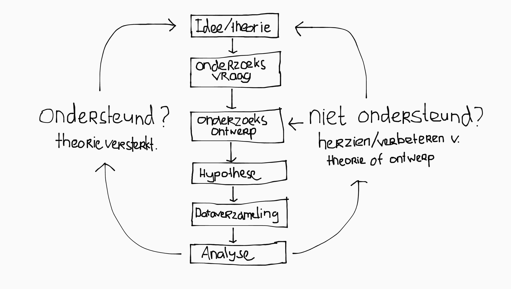
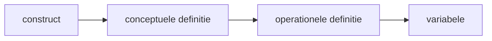
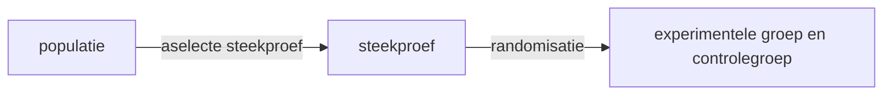
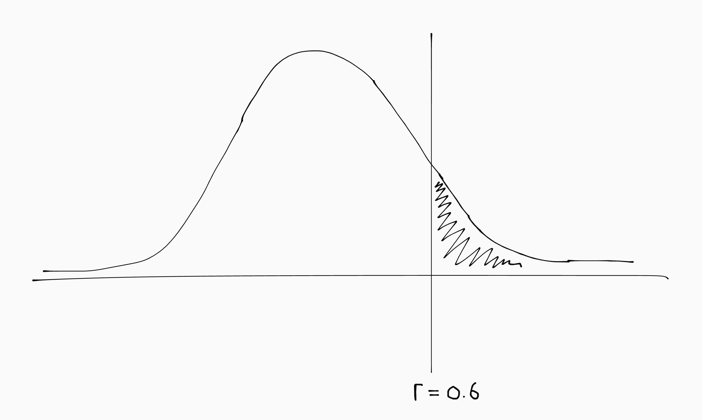
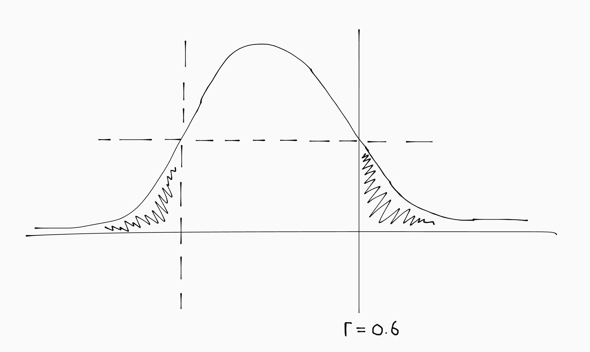
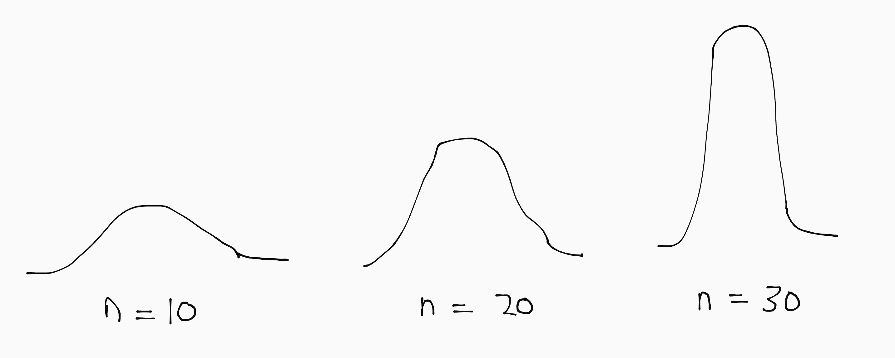
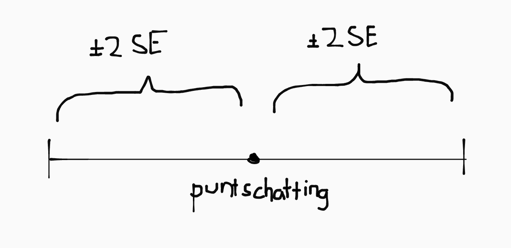

## Wetenschappelijk onderzoek

Een **producent** voert onderzoek uit. Een **consument** evalueert en interpreteert onderzoek. <!-- Als consument is het belangrijk om altijd kritisch te blijven. De interpretatie van data is afhankelijk van de gemaakte keuzes tijdes het dataverzamlingsproces (zeker bij kwalitatief onderzoek). -->

<!-- Een onderzoeker is consument tijdens de voorbereidende fase, en producent tijdens uitvoering en analyse. -->

Er zijn drie soorten bronnen:

- Ervaring of intuïtie
- Autoriteit
- Emperische observaties

Wetenschappelijk onderzoek gaat uit van **empirisme**: observaties op basis van de zintuigen of instrumenten (thermometer, timer, fotografie, weegschaal, survey). Het is:

- **Systematisch**: gebaseerd op herhaalde, consistente waarnemingen.
- **Controleerbaar**: repliceerbaar en gereviewed door een anonieme, onafhankelijke collega.
- **Probabilistisch**: houdt rekening met onzekerheid in de resultaten.

Wetenschappelijk onderzoek *ondersteund* een theorie, maar *bewijst* nooit iets. Daarvoor moet *alles* geobserveerd zijn en dat is onmogelijk. Het doet uitspraak in onzekerheden (kans, risico etc.) en probeert vervolgens de onzekerheid zo klein mogelijk te maken.

### Theorie

De werkelijkheid bestaat en is complex. Een theorie is een set aan statements/claims/veronderstellingen dat een (versimpeld) model geeft om de werkelijkheid te interpreteren, voorspellen, of manipuleren.

Een goede theorie heeft XXX kenmerken:

- **Falsifiseerbaar**: kan worden weerlegt aan de hand van tegenstrijdig bewijs.
- **Spaarzaam** (parsimonious): een eenvoudige theorie die volstaat is beter dan een complexere theorie.

Een theorie begint als een idee en wordt door middel van data uit (gepubliceerd) onderzoek ondersteund of herzien. Dit is de theorie-data-cyslus:

<!--Op basis van de theorie hebben we **hypotheses** (voorspellingen) van hoe de werkelijkheid in elkaar steekt. Deze toetsen we aan de hand van onderzoek.-->Als de resultaten **inconsistent** zijn met de theorie betekent dit dat óf the theorie fout is, óf het onderzoek zelf. De theorie wordt alleen herzien als de het bewijs daartoe voldoende aanleiding geeft ('the weight of evidence'). Met andere woorden: als slechts één studie de theorie tegenspreekt, is dit een ander verhaal dan als tientallen studies de theorie tegenspreken.<!--Om de kans zo klein mogelijk te maken dat het onderzoek fout is, gebruiken we **betrouwbaarheid** en **validiteit**.-->

Een **replicatie** is het opnieuw uitvoeren van een studie om te controlleren of je op dezelfde resultaten uit komt. Theoriën toets je met meer studies, studies toets je met meer replicaties.

Hoe de theorie tot stand komt ligt aan het type onderzoek:

- **Inductief**: specifieke observaties → patronen → theorie.
- **Deductief**: theorie → hypotheses → specifieke situaties.

Kwalitatief onderzoek is inductief, kwantitatief onderzoek is deductief.

### Onderzoeksvraag

Een onderzoeksvraag is het startpunt van wetenschappelijk onderzoek en stelt vragen bij gaten of onduidelijkheden in de theorie. Er zijn drie types:

<ul>
  <li><b>Fundamenteel</b> (basic): kennisgericht; het antwoord op de vraag is een feit.</li>
  <li><b>Toegepast</b> (applied): praktijkgericht; het antwoord op de vraag is een oplossing.</li>
  <li style="opacity: 0.3"><b>Translation</b>: tussenvorm die we niet hoeven te kennen maar wel voorkomt in literatuur.</li>
</ul>

### Onderzoeksontwerp

Het onderzoek kan in één van twee categoriën vallen:

- **Kwantitatief**: cijfermatig (correlationeel of experimenteel)
- **Kwalitatief**: niet-cijfermatig.

### Onderzoekshypothese

Vooraf hebben onderzoekers een vermoeden van de onderzoeksuitkomsten op basis van de theorie. Deze voorspelling noemen we de hypothese.<!--We toetsen de hypothese, en dit leidt tot het versterken van vertrouwen in de theorie of het (deels) herzien van óf het onderzoeksontwerp, óf de theorie.--> De theorie moet **preregistered** (= vooraf vastgelegd) zijn.

# Kwalitatief onderzoek

<!--In sociaal-wetenschappelijk onderzoek is vaak de context zeer relevant. Denk bijvoorbeeld aan culturele verschillen, motieven en interpersoonlijke relaties binnen de samenhang van de doelgroep.-->
Kwalitatief onderzoek draait om het begrijpen van sociale fenomenen in hun natuurlijke context (in contrast met een streng gecontroleerde lab-setting).

<!-- Kenmerken uit hoorcollege: 
- natuurlijke omgeving respondent
- contextuele benadering
- perspectief van respondent centraal
-->

<!--Kwantitatief onderzoek reduceert ervaringen tot een datapunt. Kwalitatief onderzoek beschrijft de sociale werkelijkheid en al haar diversiteit in zijn totaliteit neemt belangrijke context zoals omgevingsfactoren, interpersoonlijke relaties binnen een groep, etc. mee.-->

Het is een iteratief/cyclish proces, waarbij bevindingen leiden tot nieuwe vragen, die leiden tot aanpassingen, die gelijk weer leiden tot nieuwe bevindingen.

<!--

Voorbeelden van het iteratieve proces

-->

<!--
## Relatie tot theorie

In kwalitatief onderzoek zijn er twee aanpakken voor het ontwikkelen van theoriën:

- **Grounded theory**: het onderzoek begint 'open'. De theorie volgt uit patronen in de data; de data spreekt voor zich.

  De locatie of doelgroep wordt gekozen vanwege sociologische relevantie; bijvoorbeeld door sociale onrust, door afwijkende of juist typische kenmerken of vanwege omgevingsfactoren.

  Het nadeel is dat er soms niks interessants gevonden wordt, of dat de onderzoeker in een 'blind alley' terecht komt. Je weet niet altijd of je de *juiste* vragen stelt, of dat een richting een dead-end is.

  Daarnaast loop je ook tegen academische bureaucratie aan. Je kan geen financiering aanvragen als vooraf (een deel van) de hypothese, de looptijd, of steekproefgroottes van het onderzoek nog niet bekend zijn. Ethisch gezien is informed constent moeilijk.

- **Extended case study**: het onderzoek begint met een theorie, en er wordt gezocht naar een situatie ('case') die inconsistent is. Onderzoek zal de theorie verbeteren.
-->

Er zijn twee stromingen binnen kwalitatief onderzoek:

- **Positivistisch**: zo objectief mogelijk de werkelijkheid beschrijven.
- **Interpretivistisch**: zo accuraat mogelijk beschrijven hoe mensen de werkelijkheid ervaren. (Met andere woorden: de subjectiviteit van mensen objectief beschrijven.)

Er wordt ook nog onderscheidt gemaakt in perspectief:

- **Etic**: vanuit het perspectief van de onderzoeker (van buitenaf) beschreven.
- **Emic**: vanuit het perspectief van de respondenten (in hun eigen taal) beschreven.

Positivitisch onderzoek is meestal etic, en interpretivistisch is meestal emic.

## SPI(C)E

Een goede onderzoeksvraag in kwalitatief onderzoek moet in ieder geval de volgende vier elementen bevatten:

- **Setting**: in welke sociaal-economische context voer je het onderzoek uit?
  <small>(bijv. wijk/stad/regio/land etc.)</small>
- **Perspective** (of populatie): welke doelgroep wordt onderzocht?
  <small>(bijv. subcultuur, leeftijdsgroep, etnische groep etc.)</small>
- **Interest**: welk specifiek fenomeen, sociaal patroon of onderwerp wil je onderzoeken?
- **(C)omparison**: welke vergelijking willen we trekken?
- **Evaluation**: hoe meet je de interest? Je meet I indirect via E. <small>(Tip: meestal een werkwoord.)</small>

De vergelijking is optioneel, daarom staat hij tussen haakjes.

> Houd in gedachten dat SPICE enkel een handvat biedt voor het begrijpen en formuleren van onderzoeksvragen. Er zijn ook goede niet-SPICE onderzoeksvragen <small>(en omgekeerd: niet iedere SPICE-onderzoeksvraag is automatisch goed)</small>.

## Selecte steekproefmethodes

<!-- Een **steekproef** is een subset van de populatie die onderzocht wordt, omdat het onderzoeken van de voltallige populatie onmogelijk is. -->

Kwalitatief onderzoek is geïntereseerd in ervaringen, niet in cijfermatige uitspraken. Daarom is de ideale steekproef is dus niet representatief, maar optimaliseert voor een zo breed mogelijk **scala aan ervaringen** ('sample for range').

<!-- Hiervoor gebruik je een **selecte steekproef** (aka niet-willekeurig) , zoals: -->

- **Gemakssteekproef**: deelnemers zijn makkelijk te bereiken, al bekend bij de onderzoeker, of geografisch/fysiek dichtbij.

- **Gerichte steekproef**: één kenmerk of eigenschap is zeer relevant, dus er wordt actief gezocht naar deelnemers met deze eigenschap.

- **Quotasteekproef**: er wordt vantevoren bepaald dat er een bepaald aantal mensen met per specifieke eigenschap of kenmerk moet worden opgenomen (bijv. geslacht of leeftijd).

- **Sneeuwbalsteekproef**: elke respondent draagt nieuwe respondenten aan. Handig als de doelgroep moeilijk (van buitenaf) te bereiken is, maar onderling wél hecht is.

- **Sequentiële steekproef**: begint als een gemakssteekproef, maar gedurende de dataverzameling worden selectiecriteria duidelijk, en wordt het een gerichte steekproef.

<!-- ^^ past zeer goed bij het iteratieve karakter van kwalitatief onderzoek -->

## Dataverzamelingsmethoden

Er zijn vier methodes om data te verzamelen voor een kwalitatief onderzoek:

- Kwalitatief interview
- Focusgroep
- Observatieonderzoek (etnografie)
- Bestaande gegevens

De keuze van methode hangt af van de doelen van het onderzoek, omdat elke methode voor- en nadelen heeft. Een gesprek is bijvoorbeeld geschikt als je geinteresseerd bent in ervaringen<!-- (houding/standpunten/motieven)-->, maar vormt een slechte informatiebron betreft gedrag<!-- (social desirability bias; mensen doen zich mooier voor dan ze zijn)-->. Omgekeerd kan observatieonderzoek veel inzicht geven in gedrag, maar geeft het weinig informatie over intenties/beweegredenen.

<!--

<h3>Overtuigingen</h3>

Er zijn twee soorten overtuigingingen: <b>bewust</b> en <b>onbewust</b>. Bewuste overtuigingen zijn reactiever en vindt je in interviews; onderbewuste overtuigingen zijn beter te meten met zwart-wit vragen in surveys.

<ul>
<li>houding/overtuiging? ⟹ survey</li>
<li>ervaring/perspectief? ⟹ interview</li>
<li>gedrag? ⟹ observatieonderzoek</li>
</ul>

-->

**Triangulatie** (mixed methods) is het combineren van verschillende dataverzamelingsmethodes. Overeenkomsten in resultaten versterkt het vertrouwen in de data en geeft daarnaast ook een breder beeld. Het combineren van kwalitatief en kwantitatief onderzoek is ook triangulatie.

Tijdens de dataverzameling is de onderzoeker aanwezig, en oefent ook invloed uit op het proces. In kwalitatief onderzoek wordt dit als waardevol beschouwd. Dit is een verschil met kwantitatief onderzoek, dat zo juist objectief mogelijk moet worden uitgevoerd.

Om bias tegen te gaan in kwalitatief onderzoek wordt gebruik gemaakt van een **inconvience sample**. Dat betekent dat je actief op zoek gaat naar personen of gedrag dat *zwaar kut* inconsistent is met de theorie. Daarmee sluit je uit dat de resultaten overeenkomen met de theorie *vanwege biases*.

Als nieuwe gegevens (extra interviews/observaties) geen nieuwe inzichten of abnormaliteiten meer opleveren, heb je **saturatie** bereikt en kan je stoppen met de dataverzameling.

### Kwalitatief interview & focusgroep

Bij het kwalitatieve interview of de focusgroep ga je met mensen in gesprek. Geinterviewden vallen in één van twee categoriën:

- **Respondenten** zijn deel van de onderzochte doelgroep <small>(bijvoorbeeld leerlingen, ouderen etc.)</small>
- **Informanten** staan dicht bij de onderzochte doelgroep<!--, hebben informatie door sociale of professionele positie--> <small>(bijv. leraren, ouders, mantelzorgers)</small>

Afhankelijk van de situatie is de respondent zelf, of juist een informant, een betere informatiebron.

De **onderzoeker** hoeft niet per definitie ook de **interviewer** te zijn. Afhankelijk van de context is het soms praktischer dat een ander (leeftijdsgenoot, begeleider etc.) de interviews afneemt, omdat de identiteit en het gedrag van de interviewer. De onderzoeker is meestal wel aanwezig, maar ook dit is contextgebonden. <!-- Kwalitatief onderzoek is erg contextafhankelijk, zoals je misschien al gemerkt hebt. -->

#### Focusgroepen

In een focusgroep is het gespreksonderwerp vaak specifieker, omdat in een groep het gesprek anders sneller off-topic gaat. De interviewer is **moderator** met een neutrale houding, die bewaakt dat iedereen aan de beurt komt en het gesprek on-topic blijft.

- **Groepsverband** in een focusgroep kan positieve of negatieve invloed hebben op de resultaten. Respondenten kunnen bijvoorbeeld meer durven vertellen, maar het kan ook juist zijn dat ze bepaalde dingen achterwege laten of niet durven te delen die één-op-één wel ter sprake zouden zijn gekomen.

- **Groepssamenstelling** kan ook invloed hebben op de resultaten. Idealiter is de groep homogeen in achtergrond, maar heterogeen in ervaring (dus wél een breed scala aan ervaringen).

#### Structuur van interviews

- **Gestructureerd** (aka survey): stelt identieke vragen aan alle respondenten, waarbij ze worden verzocht een kort antwoord te geven.

- **Semi-gestructureerd**: er is een **interview schedule** (lijst met vragen en follow-ups), maar de volgorde staat niet vast, en het gesprek mag op natuurlijke wijze afwijken van het 'script'.

- **Ongestructureerd**: er is wel een lijst met topics, maar verder is het een 'open' gesprek.

<!-- #### Speciale interviews

- **Informeel interview**: een gesprek met de key informant om de site en sociale context te leren begrijpen. Vaak wordt het niet opgenomen of getranscribeerd, maar worden bevindingen wel verwerkt in de field notes.

- **Oral histories**: een onbewerkt relaas, zonder verdere analyse, van een gebeurtenis of periode van historische significantie.

  **Recall bias** kan problematisch zijn. Perceptie en herinnering zijn onbetrouwbaar, en herinneringen kunnen ook getint worden door de (hedendaagse) sociale context.

- **Life histories**: onderzoek naar de levensloop en XXX van invloedrijke personen.

- **Cognitieve interviews**: participanten vragen te reflecteren op het denkproces bij het beantwoorden van surveyvragen, met als doel betere vragen ontwerpen. (Bijvoorbeeld: missen er multiple-choice opties, interpreteren en beantwoorden participanten vragen zoals de onderzoekrs hadden verwacht?)

-->

#### Afnemen van interviews

Het vraag-antwoordproces van interviews is complex. Respondenten zijn niet altijd helemaal eerlijk of delen niet alles. Interviews bestaan uit twee lagen: **inhoudelijk** en **relationeel**. De interviewer stuurt hierin inhoudelijk door vragen te stellen en door te vragen, en relationeel door te motiveren tot antwoorden.

De **verstandhouding** (rapport) tussen de onderzoeker en respondent is daarom erg belangrijk om goede resultaten te krijgen. Ook de context en verloop van het interview, de toon en lichaamstaal van de respondent, en andere **non-verbale signalen** zijn erg belangrijk.

Om te voorkomen dat de interviewer *teveel* stuurt is het belangrijk dat deze zich bewust is van zijn eigen invloed en biases. **Zelfinzicht** ('reflexivity') hebben is belangrijk, dit kan bijvoorbeeld door vantevoren op te schrijven hoe je ergens in staat. Dit is extra belangrijk als de interviewer (persoonlijk) belang heeft bij een bepaald onderzoeksresultaat.

#### Field notes

Tijdens gesprekken maakt de onderzoeker field notes, waarin aantekeningen worden gemaakt die tijdens analyse waardevol kunnen zijn, zoals:

- wie/waar wordt gesproken? wie neemt het interview af?
- gezichtsuitdrukking en lichaamstaal van de respondent
- gevoelens en interpretatie van de interviewer
- bij een focusgroep: de interacties tussen respondenten

### Etnografie

Bij observatieonderzoek ga je niet met mensen in gesprek, maar doe je observaties van hun gedrag. (Dit verschilt van onderzoeksjournalisme, omdat er bij etnografie specifiek een sociale theorie getoetst wordt.) Dit kan op een aantal manieren:

- **Participerend** vs **niet-participerend**: doe je mee met de groep die je observeert?
- **Verhuld** vs **onverhuld**: weten mensen dat ze geobserveerd worden?
- **Systematisch** vs **niet-systematisch**: is vooraf vastgelegd aan welke gedragingen aandacht wordt besteed?

> Systematisch betekent hier 'gestructureerd,' en staat los van het kenmerk van wetenschappelijk onderzoek, dat eerder 'consistent' betekent. Onderzoek is dus altijd systematisch op globaal niveau (als in, herhaald en consistent), maar de aanpak kan systematischer of minder systematisch zijn (als in, gestructureerd of 'go with the flow').

In de literatuur werden de volgende rollen benoemd:

<ul>
<li><b>Complete participant</b> (undercover): verhuld/participerend</li>
<li><b>Participant observer</b>: onverhuld/participerend</li>
<li><b>Observer</b>: onverhuld/niet-participerend</li>
<li><b>Covert observer</b>: verhuld/niet-participerend</li>
</ul>

Het voordeel van participerend observatieonderzoek is dat de onderzoeker dicht op de doelgroep zit en daardoor veel informatie kan verzamelen<!-- (niet alleen acties, maar ook sociale context, interacties met anderen en emotioneel/psychologische kenmerken)-->. Er is wel een risico dat de onderzoeker té betrokken raakt bij de doelgroep en zichzelf in het onderzoek verliest ('going native'). Aan de andere kant kan niet-participerend onderzoek tot objectievere observaties, met het risico ze verkeerd te interpreteren (omdat de onderzoeker minder context heeft).

<!--
Het is mogelijk om etnografiën te combineren met andere technologiën of methoden. **Video-etnografie** is het doen van observatieonderzoek aan de hand van video-opnames. **Teametnografie** wordt door meerdere onderzoekers uitgevoerd. Beide zijn vormen van triangulatie.

Etnografie heeft ook toepassingen naast socialogisch onderzoek. Zo wordt het in het bedrijfsleven veel toegepast om de markt of consument beter te begrijpen (marktonderzoek), en op nationaal niveau door de regering om beleidsbeslissingen te nemen (bevolkingsonderzoek).

Bij etnografie is de interne validiteit zeer hoog, omdat (door proximity) de kans op misinterpretatie klein is, en alternatieve verklaringen vrijwel volledig kunnen wordne uitgesloten. De externe validiteit is juist uitermate laag, omdat de bevindingen zelden te generaliseren zijn buiten de specifieke context/case die het onderzoek behandeld.
-->

Bij het doen van etnografisch onderzoek zijn twee personen zeer belangrijk:

- De **gatekeeper** is een persoon die toegang verleend tot de sociale context die onderzocht wordt. Een **formele autoriteit** (directeur etc.) kan op juridische grond toegang geven of ontzeggen. Een **informele autoriteit** (populairste etc.) kan dit op sociale grond doen.

- De **key informant** is een insider met kennis van de sociale context die de onderzoeker informeert (bijv. over wie/waar te observeren, ongeschreven regels etc.) Vaak heeft deze persoon een centrale positie in de sociale context.<!--In sommige gevallen wordt de key informant 'geupgrade' tot een medeonderzoeker.-->

Soms overlappen deze rollen, maar vaak ook niet. De verstandhouding met zowel de gatekeeper als de key informant is cruciaal.<!-- Je moet hen overtuigen dat het onderzoek hun niet zal schaden/benadelen.-->

#### Field notes

De field notes zijn de data die verzameled en geanalyseerd wordt in observatieonderzoek. Deze bestaat uit:

- **Objectieve observaties**, waaronder fysieke beschrijvingen, transcripten van gesprekken, chronologische volgorde van gebeurtenissen.
- **Interpretaties** van geobserveerd gedrag.
- **Gevoelens** van de onderzoeker.
- **Analyse**, waaronder koppeling met de literatuur.

In het begin van het onderzoek is alles nog nieuw, pas later wordt duidelijk wat wel en niet belangrijk is. Daarom schrijven onderzoekes in de beginfase zo veel mogelijk op, en wordt dit later minder. Het schrijven van de field notes duurt doorgaans twee keer zo lang als het field work zelf.

### Bestaande gegevens

Als mensen weten dat ze onderzocht of geobserveerd worden passen ze vaak (al dan niet onbewust) hun gedrag aan, waardoor de onderzoeksresultaten niet betrouwbaar zijn. Dit noemen we **reactiviteit** (of het 'hawnthorne effect').

Een alternatief voor het afnemen van interviews of het doen van observatieonderzoek is het gebruiken van bestaande datasets, zoals:

- **Geproduceerd voor onderzoek**: deze data is wél reactief met het (primaire) onderzoek waarvoor het geproduceerd is, maar niet met ons (secondaire) onderzoek.
- **Niet specifiek voor onderzoek**: bijvoorbeeld nieuws, kunst, architectuur, boeken, kaarten, afval, of sporen van online gedrag.

<h4>Redenen voor het gebruiken van een bestaande dataset</h4>

<ul>
<li>hergebruik is goedkoper en er is data beschikbaar over veel grotere groepen<!--Niet elke onderzoeker heeft genoeg geld en tijd voor het aanleggen van een nationale dataset. (En het zou ook niet efficiënt zijn als iedereen dat zou doen; dan doen we dubbel werk.)
--></li>
<li>individuele interviews zijn geen goede bron voor samenlevingbreed onderzoek.</li>
<li>respondenten leven niet meer of de herinneringen zijn vaag/weg.</li>
<li>respondenten vertonen reactiviteit en geven sociaal wenselijke antwoorden.</li>
<li>societal blind spots: sommige zaken liggen zo vast in cultuur/socialisatie dat we het niet eens opmerken.</li>
</ul>

<h4>Limitaties van het gebruiken van een bestaande dataset</h4>

Bestaande datasets komen wel met hun eigen limitaties, zoals toegang, bruikbaarheid, misinterpretatie en ethische bezwaren.

<ul>
<li>privacygevoelige informatie is niet zomaar beschikbaar.</li>
<li>er rusten vaak auteursrechten en intellectueel eigendom op de data.</li>
<li>kosten: data waar adverteerders ook in geinteresseerd zijn heeft een prijskaartje.</li>
<li>data kan moeilijk bruikbaar zijn door een verkeerde/niet-passende structuur.</li>
<li>soms is data onleesbaar door een taalbarrière of een obscuur bestandsformaat.</li>
<li>sociale context ontbreekt dus er is kans op misinterpretatie.</li>
<li>data kan incompleet zijn (bijv. vrouwen missen in medisch onderzoek)</li>
<li>beslissingen tijdens dataverzameling zijn niet altijd goed gedocumenteerd, dus kan je er geen rekening mee houden/op corrigeren.</li>
</ul>

Triangulatie van verschillende databronnen of combinatie met andere methoden kan helpen.

## Data-analyse

Tijdens de data-analyse worden de verzamelde gegevens opgesplitst in hanteerbare fragmenten, die kunnen worden doorzocht, herschikt, en gesorteerd om patronen te vinden die tot een theorie kunnen leiden.

In kwalitatief onderzoek gebeurt dit vaak *tijdens het verzamelingsproces*. Daardoor kan je op basis van de analyse aanpassingen aan de verzameling doen.<!-- Soms is heranalyse van eerdere gegevens nodig als er een nieuw patroon of inzicht naar voren komt.-->

### Datamanagement

Datamanagement heeft betrekking op de opslag van gegevens tijdens en na het onderzoek, en het delen van gegevens met andere onderzoekers. Er zijn twee typen onderzoek:

- **Anoniem onderzoek** verzamelt geen persoonsgegevens.
- **Vertrouwelijk onderzoek** verzamelt wel persoonsgegevens, maar voorkomt dat deze bekend worden.
  **De-identificatie** houdt in dat persoonsgegevens los of versleuteld worden opgeslagen.

Datamanagement is belangrijk voor de transparantie, controleerbaarheid, en reproduceerbaarheid van onderzoek.

### Herstructureren

Na het verzamelen heeft de onderzoeker een hele hoop ongestructureerde data. De eerste stap is orde brengen in deze data (digitaliseren, transcriberen etc.) Dit kost gemiddeld acht uur per uur verzameld materiaal.

Deze stap kunnen we outsourcen, als we dit zelf doen kunnen we gelijk "de data leren kennen."
Tijdens transcriberen kan je al patronen vinden, fragmenten samenvatten en belangrijke informatie highlighten of bookmarken. 

### Coderen

Coderen is het labelen van betekenisvolle fragmenten in field notes of interviews. Er zijn drie soorten codes:

- **Attribute codes** geven informatie over achtergrondkenmerken van de participant.
- **Index codes** zijn bookmarks voor brede onderwerpen, bedoeld om de data makkelijk doorzoekbaar te maken. Vaak op basis van het interview schedule.
- **Analytische codes** labelen inhoudelijke informatie, bedoeld om patronen in de data te vinden (bijvoorbeeld: participanten vinden X of Y).

Een speciaal soort code is de **typologie**: een analytische code die de gehele case beschrijft, en dus ook een attribute code is.

<!--Tijdens het coderen wordt continu afgewogen of informatie antwoord geeft op de onderzoeksvraag of relevant is in verband met de theorie. De codes moeten zo dicht mogelijk bij de inhoud blijven, en niks interpreteren of analyseren. Een fragment kan meer dan één code krijgen, maar houdt het overzichtelijk. -->

<!--
De grootste challenges tijdens het coderen zijn:

- Met welke codes begin je? (spoiler: gebaseerd op de literatuur)
- Hoe breed zijn de codes?
- Wanneer merge/split je codes?
-->

### Causaliteit aantonen

#### Qualitative comparitive analysis (QCA)

Deze aanpak toont causaliteit aan door het isoleren van variabelen over cases heen en te zoeken naar patronen. Er is sprake van een mogelijk causaal verband bij de volgende condities:

- **Necessary**: komt B *alleen* voor als A ook voorkomt? (is A *nodig* om B te krijgen?)
- **Sufficient**: komt B *altijd* voor als A ook voorkomt? (is A *genoeg* om B te krijgen?)

Grote range aan cases nodig, zowel positief (B kwam wel voor) als negatief (B kwam niet voor). Je vat alle cases samen in een **truth table**, waarin per case alle variabelen staan.

<!--
Echter: kan niet het mechanisme (de 'waarom?') van de causaliteit uitleggen, en houdt ook geen rekening met tijdsvolgorde.
-->

#### Mechanismes / processen

Deze aanpak stelt dat kwalitatief onderzoek geen causaliteit kan aantonen (daar is ander onderzoek voor nodig), maar wel het onderliggende mechanisme (de 'waarom?') van een eerder aangetoond causaal verband kan uitleggen. Aan de hand van de volgende vragen:

- Wat doen mensen? wat is hun doel?
- Hoe doen ze het? Welke technieken/strategiën gebruiken ze?
- Hoe begrijpen/praten mensen over hun eigen situatie?
- Welke veronderstellingen maken mensen?
- Wat zie ik (als onderzoeker)? Wat heb ik geleerd?
- Waarom heb ik dit (als onderzoeker) wel/niet opgeschreven?

### Memo's

Tijdens dataverzameling en -analyse documenteer je beslissingen in de **onderzoeksmemo's**.

> Memo's verschillen van field notes. Field notes zijn specifiek aan de dataverzameling in etnografisch onderzoek. Memo's worden geschreven in elk kwalitatief onderzoek, ongeacht dataverzamelingsmethode.

Deze memo's zijn belangrijk voor de transparantie van het onderzoek, omdat interpretatie van de resultaten veelal afhankelijk is van de manier waarop de data verzameld en geanalyseerd is.

### Theoretisch verklaringsmodel

<!--Nadat de data geanalyseerd is zijn er hopelijk patronen in de data gevonden die bijdragen aan het begrip van de theorie, of de basis leggen voor een nieuwe theorie.-->

Een model is een visueel inzichtelijke representatie van de conclusie, waarin alle variabelen en hun onderlinge relaties staan.

Om zeker te zijn van de conclusie

<ul>
<li>nul-hypothese uitgesloten</li>
<li>sterke basis in emperische gegevens</li>
<li>geen onverklaarbare uitschieters</li>
<li>geen afwijkende data weggooien</li>
<li>tunnelvisie voorkomen met inconvience sample</li>
</ul>

Ook alternatieve verklaringen moeten worden geevalueerd (interne validiteit). Dit doe je door actief te zoeken naar **inconviences** in de data; patronen die *zwaar kut* uit te leggen zijn aan de hand van het ontwikkelde verklaringsmodel zouden een indicatie kunnen zijn dat het model niet (volledig) klopt.

De resultaten kunnen gedeeld worden als **matrix**: een tabel met frequenties van bepaalde codes. In (geanonimiseerd) etnografisch onderzoek noemen we dit een **etnoarray**, en in biologisch onderzoek een **microarray**.

# Correlationeel onderzoek

Fysieke kenmerken, zoals lengte, gewicht, reactietijd, kan je eenvoudig meten. **Theoretische begrippen** (constructs) moeten meetbaar gemaakt worden. Dit noemen we **operationaliseren**, en gaat in twee stappen:

- **Conceptuele definitie**: wat bedoelen we precies?
- **Operationele definitie**: hoe gaan we dit meten?

<!--Na het **operationaliseren** is het **construct** veranderd in een meetbare **variabele**.-->

## CAPS

Een goede onderzoeksvraag in correlationeel onderzoek moet in ieder geval de volgende vier elementen bevatten:

- **Constructs**: tussen welke variabelen verwacht je een verband?
- **Association**: wat voor soort verband verwacht je te vinden?
- **Populatie**: welke doelgroep wordt onderzocht?
- **Setting**: in welke sociaal-economische context voer je het onderzoek uit?

> Wederom, CAPS biedt enkel een handvat voor het herkennen en formuleren van correlationele onderzoeksvragen. Een een CAPS-vraag is niet automatisch goed en een niet&#8209;CAPS vraag is niet per definitie fout.

## Aselecte steekproefmethoden

In kwantitatief onderzoek is het belangrijk een representatieve, **aselecte steekproef** te gebruiken, omdat dit verzekerd dat resultaten onderling onafhankelijk zijn, en met redelijke zekerheid kunnen worden gegeneraliseerd (inferentie).

- **Enkelvoudige aselect steekproef**: er is een lijst van de gehele populatie, en uit die lijst worden met behulp van een computerprogramma willekeurige participanten gekozen.

- **Gestratificeerde steekproef**: de populatie wordt verdeeld in **strata** met een bepaald kenmerk, en binnen elk stratum wordt een enkelvoudig aselecte steekproef uitgevoerd.

- **Clustersteekproef**: er is een lijst met clusters, aaruit willekeurig clusters gekozen worden.; de gehele cluster doet vervolgens mee aan de steekproef.

- **Getrapte steekproef**: er is een lijst met clusters, waaruit willekeurig clusters gekozen worden. en binnen de cluster wordt een aselecte enkelvoudige steekproef uitgevoerd.

<!--
- **Systematische steekproef**: XXX
-->

Met willekeurig ('random') wordt bedoeld dat elke deelnemer en elke combinatie van deelnemers, een gelijke kans heeft gekozen te worden.

Nadelen van een enkelvoudige aselecte steekproef

<ul>
<li>Lijst incompleet kan zijn: het steekproefkader dekt niet de volledige populatie. Dit noemen we de <b>dekkingsfout</b> (hoe groot deze is altijd een schatting).</li>
<li>De gekozen proefpersonen kunnen niet antwoorden, of weigeren mee te doen aan het onderzoek. Dat noemen we <b>non-response</b>.</li>
</ul>

Beide zijn vormen van vertekening: de resultaten zijn minder representatief en dit schaadt de externe validiteit.

## Causaliteit

- **Correlatie**: er is een samenhang.
- **Causatie**: er is ook sprake van oorzaak gevolg.

Een causaal verband moet aan de volgende drie kenmerken voldoen:

- **Covariantie**: de variabelen moeten gecorreleerd zijn.
- **Temporal precedence**: de tijdsvolgorde moet kloppen (oorzaak voor gevolg).
- **Interne validiteit**: alternatieve verklaringen moeten zijn uitgesloten.

Met behulp van correlationeel onderzoek alleen kan je geen uitspraak doen over causaliteit, omdat je geen informatie hebt over tijdsvolgorde, en interne validiteit laag is.

# Experimenteel onderzoek

In correlationeel onderzoek meet de samenhang in natuurlijke variatie van variabelen. In experimenteel onderzoek manipuleert de onderzoeker variabelen in een gecontrolleerde labsetting.

- **Onafhankelijke variabele**: wordt gemanipuleerd.
- **Afhankelijke variabele**: wordt gemeten.

In een experiment kan je causaliteit aantonen. Er is invloed op volgorde van meten, en daarmee **temporal precedence**. De resultaten worden verzameld in een gecontrolleerde omgeving, waarin alle andere variabele zoveel mogelijk constant gehouden kunnen worden, wat zorgt voor hoge **interne validiteit**.

## PICO

Een goede onderzoeksvraag in experimenteel onderzoek moet in ieder geval de volgende vier elementen bevatten:

- **Populatie**: welke doelgroep wordt onderzocht?
- **Intervention**: hoe onafhankelijke variabele manipuleren?
- **Comparison**: wat doet de controlegroep?
- **Output**: wat is de onafhankelijke variabele?

> PICO biedt weer enkel een handvat voor het herkennen en formuleren van experimentele onderzoeksvragen. Een een PICO-vraag is niet automatisch goed en een niet&#8209;PICO vraag is niet per definitie fout.

## Interne validiteit

In experimenteel onderzoek wordt de interne validiteit bedreigd door **confounding variables**: extra variabelen die onvoorzien verschillen tussen de experimentele conditie en controlegroep veroorzaken.

- **Design confounds**: de onafhankelijke variabele is niet het *enige* verschil in de *behandeling* van de groepen; fout in het onderzoeksontwerp.

- **Selectie-effecten**: groepen zijn überhaupt niet vergelijkbaar bij aanvang; er is een verschil veroorzaakt door een verschil in de samenstelling van de groepen.

Er is sprake van **contaminatie** als de groepen in een experiment informatie met elkaar delen waardoor het experiment mislukt, omdat er geen verschil meer is tussen de groepen. Dit is een vorm van design confounds.

### Randomisatie

Selectie-effecten voorkom je door middel van **randomisatie**: de steekproef willekeurig in twee groepen verdelen, waarbij elke deelnemer een gelijke kans heeft in beide groepen te komen.

<small>De steekproef heeft betrekking op de externe validiteit; de randomsatie op de interne validiteit.</small>

Het doel is gelijke groepen bij aanvang, met ongeveer gelijke gemiddelde en spreiding op alle variabelen (zowel gemeten als ongemeten).

> Het is niet voldoende twee groepen in te delen op basis van kenmerken waarvan we *weten* dat ze invloed hebben op de afhankelijke variabele, omdat er ook vele kenmerken zijn waarvan we *niet weten* dat ze invloed hebben; die moeten ook allemaal gelijk verdeeld zijn.

Een **quasi-experiment** is een experiment waarbij (wegens omstandigheden), de groepen niet gerandomiseerd kunnen worden, maar wel manipulatie van een onafhankelijke variabele plaatsvindt.

<!-- > Er is statistisch gezien geen verschil tussen twee aselecte steekproeven trekken en één aselecte steekproef trekken en daarbinnen twee groepen te maken door middel van randomisatie. Dat tweede is gewoon logistiek gezien makkelijker. -->

<!-- Andere manieren van indelen zijn:

- **Natuurlijke indeling: toevallige plekken bij binnenkomen, eigen keuze deelnemers etc.
- **Explicite selectie** op basis van persoonskenmerken
- **Willekeurige toewijzing** (aka randomisatie)
-->

# Statistiek

## Voorkennis

### Centrummaten

Onderzoekers willen graag iets kunnen zeggen over de dataset. Dit doen ze aan de hand van een van de drie centrummaten:

- **Modus**: meest voorkomende score.
- **Mediaan**: middelste score.
- **Gemiddelde**: som gedeeld door aantal.

De mediaan van de mediaan is een **kwartiel**, van Q1 tot Q3. De **interkwartielafstand** (IQR) is het verschil tussen Q1 en Q3, en bevat precies de helft van de datapunten.

### Boxplot

Het **boxplot** is een manier om het centrum en de verdeling van de dataset te visualiseren. De 'box' loopt van Q1 tot Q3, en heeft een lijntje voor Q2 (de mediaan).

De 'snorharen' laten het bereik (hoogste en laagste waarde) van de data zien. Eventuele uitschieters die niet zijn meegenomen in de dataset kunnen worden weergegeven met puntjes.

### Standaarddeviatie & andere termen

- **Gemiddelde**: \\(M = \frac{\Sigma(X)}{n}\\)
- **Deviatiescore**: \\(X - M\\)
- **Gemiddeld verschil**: \\(\frac{\Sigma(X - M)}{n}\\)<!-- &nbsp;&nbsp;&nbsp;<small>← niet praktisch want + en - verschillen cancellen uit</small>-->
- **Sum-of-squares**: \\(SS = \Sigma((X- M)^2)\\)
- **Variantie** (spreiding): \\(s^2 = \frac{SS}{n - 1}\\)
- **Standaardeviatie**: \\(s = \sqrt{s^2}\\) &nbsp;&nbsp;&nbsp;&nbsp;&nbsp;&nbsp;&nbsp;&nbsp;&nbsp;&nbsp;&nbsp;<small>← wiskundig gezien zou dit \\(\left\| s \right\|\\) moeten zijn</small>

\\[s = \sqrt{\frac{\Sigma((X-M)^2)}{n-1}}\\]

> Op **populatieniveau** gelden net andere regels dan op **steekproefniveau**. Daarom gebruiken we op populatieniveau Griekse letters, in plaats van het normale Romeinse alfabet:
>
> - \\(M = \mu\\)
> - \\(s = \sigma\\)
> - \\(r = \rho\\)
> - \\(n = N\\)&nbsp;&nbsp;&nbsp;<small>← dit is dan weer een uitzondering; het kan ook nooit gwn logisch zijn</small>

### Meetniveaus <small>(NOIR)</small>

- **Nominaal**: categorisch, met woorden.
- **Ordinaal**: rangorde; wel een volgorde maar geen schaal.
- **Interval**: een schaal zonder betekenisvol nulpunt (bijv. IQ of &deg;C).
- **Ratio**: een schaal met een betekenisvol nulpunt (bijv. euro's of Kelvin).

<!--De laatste drie zijn kwantitatief: uitgedrukt in getallen. Nominaal meetniveau is categorisch: uitgedrukt in woorden.-->

Ondanks de naam meet de **Likert-schaal** (zeer eens, eens, neutraal, oneens, zeer oneens) op *ordinaal* meetniveau. Echter, als uit deze scores een **schaalscore** wordt berekend, is die wel op *interval* meetniveau.

## Statistische toetsen

Een **statistische toets** is een methode om een correlatie vast te stellen. De vier die we voor nu moeten kennen zijn:

- Pearson-correlatie (\\(r\\))
- Spearman-correlatie (\\(r_s\\))
- Reguliere \\(t\\)-toets <small>(voor onafhankelijke groepen)</small>
- Welsch's \\(t\\)-toets

> Een correlatie noteren we in 3 decimalen, beginnend met de punt ('leading zero' weglaten).

### Pearson-correlatie

Een **Pearson-correlatiecoëfficient** (\\(r\\)) is een maat voor de gemiddelde afwijking van datapunten tenopzichte van het gemiddelde, en geeft informatie over de sterkte en richting van een linear verband.

\\[r = \frac{\text{covariantie}}{\text{variantie}} = \frac{\text{Cov}(X)}{\sqrt{\text{Var}(X)\text{Var}(Y)}}\\]

\\[-1 < r < 1\\]

<small>(hoe verder van nul, hoe sterker het verband; teken geeft richting van de correlatie aan)</small>

Voor het gebruik van een Pearson-correlatiecoëfficient moet aan de volgende drie voorwaarden voldaan zijn (geschiktheid):

- De steekproef moet aselect zijn.
- De variabelen moeten op interval of ratio meetniveau zijn.
- Het verband moet linear zijn.

### Spearman-correlatie

Voor variabelen op ordinaal meetniveau, of niet-lineare verbanden wordt de **Spearman-correlatiecoëfficient** (\\(r_s\\)) gebruikt. Daarvoor moet aan de volgende voorwaarden voldaan zijn:

- Het verband moet **monotoon** zijn (alleen stijgend of alleen dalend).
- De variabelen zijn oorspronkelijk ordinaal gemeten; of
- de variabelen zijn ordinaal gemaakt met behulp van **rangscores**.

**Rangscores** trekken een kromme lijn recht door alle datapunten een rangnummer te geven, ongeacht numerieke waarde.

### Reguliere \\(t\\)-toets <small>(voor onafhankelijke groepen)</small>

> In experimenteel onderzoek bereken je het verschil in gemiddelden tussen twee condities. Dat betekent dat waar de correlatiecoëfficient in correlationeel onderzoek binnen \\([-1,1]\\) lag, de schaalverdeling in experimenteel onderzoek per experiment verschilt.

De \\(t\\)-toets is een manier om een verschil uit te drukken relatief aan de standaardfout. Met andere woorden: de \\(t\\)-waarde is het aantal keer dat de standaardfout in \\(M_1 - M_2\\) past.

\\[t = \frac{M_1 - M_2}{SE}\\]

\\[-\infty < t < \infty\\]

<small>(in de praktijk ligt de waarde meestal op \([-3, 3]\))</small>

De normaalverdeling bij de \\(t\\)-toets heeft een asymptoot op \\(y = 0\\), beginnend, afhankelijk van de steekproefgrootte (\\(n\\)), rond ongeveer \\(t = 3\\).

Voor het gebruik van de \\(t\\)-toets voor onafhankelijke groepen, moet aan de volgende drie voorwaarden voldaan zijn (geschiktheid):

- De groepen moeten onafhankelijk zijn
- 

### Welsch's \\(t\\)-toets

XXX

## Steekproeven

De gevonden waarde in een steekproef wijkt *altijd een beetje af* van de populatiewaarde. Dit verschil noemen we de **steekproeffout**.

De waarde van de steekproeffout weten we niet, want we weten niet wat de populatiewaarde is. We kunnen wel het gemiddelde van de steekproeffouten schatten: de **standaardfout** (\\(SE\\)).

\\[\text{SE} = \sqrt{\frac{SD^ 2\_{\text{pooled}}}{n\_1}+\frac{SD^ 2\_{\text{pooled}}}{n\_2}}\\]

Het bereik van \\(r\\) of \\(t\\) bij herhaald steekproef trekken noemen we de **steekproefspreiding**. De variatie, geplot in een histogram noemen we de **steekproevenverdeling**.

> De steekproevenverdeling wordt, als er geen relatie of effect is in de populatie als geheel, een normaalverdeling rond de nul.

## NHST: null-hypothesis significance testing

NHST probeert uit te sluiten dat de gevonden correlatie (bij correlationeel) of het gevonden verschil (bij experimenteel) uit toeval volgt, door te berekenen hoe aannemelijk het zou zijn het effect te vinden onder de nulhypothese.

De **nulhypothese** (\\(r = 0 \vee t = 0\\)) is de hypothese dat er *geen* relatie/effect is in de populatie.

De **alternatieve hypothese** is de hypothese dat er *wel* een relatie/effect is in de populatie. Deze hypothese kan éénzijdig of tweezijdig zijn:

- **Eenzijdig**: je verwacht een verband en een specifieke richting.
- **Tweezijdig**: je verwacht een verband maar geen specifieke richting.

Op basis van statistiek die hierna wordt uitgelegd, besluit je om of de nulhypothese aan te houden of te verwerpen (en de alternatieve hypothese aan te nemen). Het kan zijn dat je het fout hebt:

<table>
  <tr>
    <th></th>
    <th>geen effect (\(H_0\) waar)</th>
    <th>wel effect (\(H_0\) fout)</th>
  </tr>
  <tr>
    <th>niet gevonden</th>
    <td>betrouwbaarheid &nbsp;<small>(\(1 - \alpha\))</small></td>
    <td>type II: miss &nbsp;<small>(\(\beta\))</small></td>
  </tr>
  <tr>
    <th>wel gevonden</th>
    <td>type I: false positive &nbsp;<small>(\(\alpha\))</small></td>
    <td>power &nbsp;<small>(\(1 - \beta\))</small></td>
  </tr>
</table>

<!--
De hypotheses kunnen worden genoteerd in statistische vorm:

| \\(H_0\\) | \\(\rho = 0\\) | \\(\mu_1 = \mu_2\\) |
| \\(H_{A,ongericht}\\) | \\(\rho \neq 0\\) | \\(\mu_1 \neq \mu_2\\) |
| \\(H_{A,eenzijdig}\\) | \\(\rho > 0\\) | \\(\mu_1 > \mu_2\\) |
| \\(H_{A,eenzijdig}\\) | \\(\rho < 0\\) | \\(\mu_1 < \mu_2\\) |
-->

### Power

De power (\\(1 - \beta\\)) van een statistische toets is het vermogen een effect te vinden dat ook daadwerkelijk aanwezig is in de populatie. De power is afhankelijk van een groot aantal factoren, en kan niet direct 'ingesteld' worden:

Binnen de sociale wetenschappen streeft men voor een power van 80%.

### Overschrijdingskans

De **overschrijdingskans** (\\(p\\)) is de kans om onder \\(H_0\\) een bepaald effect of extremer te vinden. Dit kan gevisualiseerd worden als de oppervlakte onder een normaalverdeling:

| Eenzijdig | Tweezijdig |
|--|--|
|  |  |

<small>De complete oppervlakte onder de diagram is gelijk aan 1.</small>

  
Eenzijdig vs tweezijdig toetsen

  
Bij éénzijdig toetsen check je alleen extremere waarden aan één kant van de normaalverdeling. Bij tweezijdig toetsen doe je geen aannamens over de richting van het verband, en check je dus beide kanten van de normaalverdeling.

  <blockquote>
De \(p\)-waarde is dan dus twee keer zo groot (bij dezelfde \(r\)- of \(t\)-waarde).
</blockquote>

De gekozen normaalverdeling hangt af van de steekproefgrootte (\\(n\\)). Hoe groter de steekproef, hoe smaller en hoger de piek:

Een lage \\(p\\)-waarde betekent dat er een kleine kans is dat het effect aan toeval toegeschreven kan worden. Een kleine \\(p\\) is dus beter.

> Dus: hoe groter je steekproef, hoe kleiner de \\(p\\)-waarde bij dezelfde \\(r\\)- of \\(t\\)-waarde. Of andersom: hoe minder groot de \\(r\\)- of \\(t\\)-waarde hoeft te zijn voor dezelfde \\(p\\)-waarde.

### Significantie

Het **significantieniveau** (\\(\alpha\\)) is de grenswaarde voor \\(p\\). Met andere woorden: de maximale kans op type I fouten (overschrijdingskans) die we tolereren.

We noemen een resultaat statistisch **significant**, als \\(p < \alpha\\). Dat betekent dat we met enige zekerheid kunnen stellen dat het geen toevalsbevinding is.

Binnen de sociale wetenschappen wordt over het algemeen \\(\alpha = .05\\) als norm aangehouden.

### Nauwkeurigheid

Het effect dat terugkomt uit het onderzoek is een **puntschatting**, die bijna zeker afwijkt van de populatiewaarde. Echter, de populatiewaarde ligt hoogstwaarschijnlijk wel *in de buurt* van het gevonden effect.

Met een **betrouwbaarheidsinterval** kunnen we een schatting geven tussen welke waarden de populatiewaarde zou kunnen liggen. De breedte van het interval hangt af van:

- **Het betrouwbaarheidsniveau** (\\(1 - \alpha\\)): hoe groter, hoe breder.
- **De steekproefgrootte** (\\(n\\)): hoe groter, hoe smaller.
- **De spreiding (standaarddeviatie)**: hoe kleiner, hoe smaller.

Het midden van het interval is altijd de puntschatting, met twee 'voelsprieten' die de intervalbreedte aangeven. De breedte is gelijk aan ongeveer \\(\pm 2 \cdot \text{SE}\\), afhankelijk van het gekozen betrouwbaarheidsniveau.

Bij een groter betrouwbaarheidsniveau is het interval breder, dus is de kans dat de populatiewaarde erin ligt ook groter. Echter, is een breder interval ook minder informatief.

> De kans dat in een breder interval de 0 ligt is groter, en dan kan \\(H_0\\) niet verworpen worden. Dit is logisch, want bij een grotere betrouwbaarheid is de grenswaarde voor \\(p\\) ook kleiner.

### Relevantie

Relevantie heeft betrekking op de grootte van een effect. Dat een effect significant is, wil niet gelijk betekenen dat het ook groot is.

Om de grootte van een effect te duiden en effecten tussen onderzoeken te vergelijken, wordt gebruik gemaakt van Cohen's **effect size** (\\(d\\)).

\\[d = \frac{M_1 - M_2}{SD}\\]

Voor de interpretatie van effect sizes en correlaties geldt binnen de sociale wetenschappen:

| \\(d\\) | \\(r\\) | interpretatie |
|-----------|-------------|---------|
| \\(0.2\\) | \\(0.1\\)   | klein   |
| \\(0.5\\) | \\(0.3\\)   | matig   |
| \\(0.8\\) | \\(0.5\\)   | sterk   |

### Stappenplan

1. Formuleren nulhypotheses (\\(H_0\\)) alternatieve hypothese (\\(H_A\\)).
2. Keuze & berekenen toetsingsgrootheid (\\(r\\) of \\(t\\)).
3. Overschrijdingskans (\\(p\\)) berekenen.
4. Nulhypothese (\\(H_0\\)) wél of niét verwerpen.
5. Conclusie schrijven &nbsp;&nbsp;<small>← deze stap is extra</small>

## Betrouwbaarheid

Betrouwbaarheid draait om de consistentie van de meetresultaten, en gaat vooral om het minimaliseren van meetfouten. Er zijn vijf manieren om betrouwbaarheid te testen:

- **Test-hertest**: als je dezelfde test met dezelfde experimentele groep op een later moment herhaalt, levert dit dan dezelfde resultaten op? (Alleen toepasselijk bij theoretische begrippen die relatief stabiel zijn door de tijd, zoals intelligentie, ambitie, empathie etc; dit zou niet werken voor zeer variabele begrippen, zoals emotie of pijn.)

- **Interbeoordelaar**: als dezelfde test op dezelfde experimentele groep door twee verschillende onderzoekers wordt afgenomen, levert dit dan nog steeds dezelfde resultaten op? (Zo nee, zullen waarschijnlijk de instructies voor de afnemer nader gespecificeerd moeten worden.)

- **Paralleltest**: als twee vergelijkbare versies van de test op dezelfde experimentele groep worden afgenomen, geeft dit dan dezelfde resultaten?

- **Split-halftest**: als de test door tweeën gesplitst wordt, en beide helften op dezelfde experimentele groep worden afgenomen, levert dit dan vergelijkbare resultaten op?

- **Interne betrouwbaarheid**: binnen een instrument moeten meerdere componenten (lees: vragen) die hetzelfde theoretische begrip/aspect testen, dezelfde resultaten opleveren.

Bij de eerste vier testen wordt de Pearson-correlatie tussen de resultaten van de afnames berekent, waarbij \\(r > .500\\) als voldoende wordt beschouwd.

Voor interne betrouwbaarheid gebruiken we **Cronbach's alfa**. Dat is een maat (\\(0 \leq \alpha \leq 1\\)) om samenhang van vragen binnen een survey te meten (hoger is beter).

## Validiteit

Validiteit draait om de bruikbaarheid van resultaten. Er kan geen validiteit zijn als er geen betrouwbaarheid is.

- **Interne validiteit**: zijn alternatieve verklaringen uitgesloten?

- **Externe validiteit**: zijn de meetresultaten te generaliseren worden naar een grotere populatie (inferentie)?

  - **Ecologische validiteit**: mate van overeenkomst tussen de experimentele setting en de werkelijkheid.

- **Begripsvaliditeit**: meet je wat je wil meten?

  - **Subjectief** (vooraf):

    - **Indruksvaliditeit**: klopt de conceptuele definitie die we hanteren van het theoretische begrip? (Wat vinden experts op het eerste gezicht van het meetinstrument?)

    - **Inhoudsvaliditeit**: sluit de operationele definite aan op de conceptuele definitie? Meten we het theoretische begrip in zijn totaliteit? Missen we geen aspecten?

  - **Emperisch** (achteraf):

    - **Convergent validiteit**: het instrument moet vergelijkbare resultaten geven als bestaande instrumenten die hetzelfde theoretische begrip testen.

      Gemeten met het Pearson-correlatiecoëfficient. We verwachten een hoge samenhang.

    - **Divergente/discriminante validiteit**: kan het meetinstrument onderscheid maken tussen verschillende theoretische begrippen? Het instrument mag niet per ongeluk (ook) een ander theoretisch begrip meten (bijv. leesvaardigheid in plaats van intelligentie meten).

      Gemeten met het Pearson-correlatiecoëfficient. We verwachten een hele zwakke samenhang.

    - **Criteriumvaliditeit**: de resultaten van het instrument moeten aan een voorwaarde voldoen.

      - In het geval het instrument voorspellend van aard is, zeggen de meetresultaten iets over de verwachte toekomstige waarde de criteriumvariabele; de voorspelling moet (tot op zekere hoogte) kloppen.

      - In het geval er vanuit de literatuur bekend verschil tussen twee groepen is, verwachten we dit ook terug te zien in de resultaten. We spreken dan van **groepsparadigma's**.

- **Statistische validiteit**:

  - **Significantie**: is de nulhypothese uitgesloten (\\(p < \alpha\\))?
  - **Relevantie**: is het effect groot of klein (Cohen's \\(d\\))?
  - **Nauwkeurigheid**: hoe breed is het betrouwbaarheidsinterval?
  - **Geschiktheid**:
    - is de juiste statistische toets gekozen?
    - zijn de voorwaarden voor de toets niet geschonden?
    - zijn de resultaten op de juiste manier geinterpreteerd?

# Ethiek & Integriteit

## Wetenschappelijke normen

- **Universalisme**: elk onderzoek is gelijk, ongeacht maatschappelijke positie, reputatie of voorgaand werk; iedereen mag en kan onderzoek doen.

- **Communality**: onderzoek is open, transparent, en toegankelijk voor iedereen.

- **Objectiviteit**: bevindingen worden objectief en onpartijdig verzameld en geinterpreteerd; er mogen geen persoonlijke belangen meespelen.

- **Georganiseerd skepticisme**: wetenschappers trekken alles en iedereen in twijfel, en accepteren niks zonder bewijs.

## Ethiek

Voordat een onderzoek mag worden afgenomen moet het **onderzoeksprotocol** worden goedgekeurd door de **ethische commissie** (IRB), die het toetsen aan de volgende voorwaarden.

Deze drie ethische richtlijnen uit het Belmont Report gelden voor elk onderzoek:

<!--

Consent is niet nodig bij:

<ul style="margin-top:0;padding-left:1.2em">
  <li>anonieme vragenlijst</li>
  <li>educatieve setting</li>
  <li>openbare setting waarin mensen verwachten bekeken te worden (bijv. winkelcentrum, station, museum etc.)</li>
</ul>

-->

- **Autonomie** (respect for persons): deelnemers moeten  **informed consent** geven voor deelname aan het onderzoek.
  - Vooraf duidelijk zijn over eventuele risico's en voordelen, hoe lang het onderzoek zal lopen, welke data verzameld wordt, en hoe privacy wordt gewaarborgd.
  - Deelname moet vrijwillig zijn. Er mag geen sprake zijn van misleiding, dwang of oneigen druk (bijvoorbeeld een onweerstaanbare hoeveelheid geld).  
  - Deelnemers moeten zich op elk moment kunnen terugtrekken uit het onderzoek.
  - Speciale bescherming voor bepaalde (kwetsbare) groepen, waaronder gehandicapten, kinderen, gevangenen en etnische minderheden.  

- **Beneficence**: deelnemers beschermen tegen schade (fysiek, mentaal, financieel, reputationeel); balans vinden tussen risico's en voordelen.
  - Betere behandeling mag niet worden achtergehouden voor onderzoeksdoeleinden.
  - Beschermen van privacy van de deelnemers (zie [datamanagement](#datamanagement)).  

- **Rechtvaardigheid** (justice): deelnemers moeten kunnen profiteren van de onderzoeksresultaten.
  - Het mag niet zo zijn dat één (sub)groep 'take one for the team' doet.

De APA heeft hier drie toevoegingen aan gedaan, specifiek voor sociologisch onderzoek:

- **Vertrouwensrelatie** (fidelity) en **verantwoordelijkheid** (responsibility):
  - geen belangenverstrengeling
  - geen persoonlijke relaties etc.
  - geen misbruik van machtspositie
  - geen sexueel grensoverschrijdend gedrag  

- **Integriteit** (integrity): nauwkeurig, waarheidsgetrouw, en eerlijk tegenover het onderzoek, het beroep, en de deelnemers.

Soms is misleiding door omission (verhullen) of comission (liegen) nodig. In dat geval is **debriefing**  voor het herstellen van de vertrouwensrelatie verplicht, waarin wordt uitgelegd wat het onderzoek inhoudt en waarom de misleiding noodzakelijk was.<!--Debriefing kan ook nuttig zijn als er geen sprake was van misleiding, bijvoorbeeld omdat het leerzaam kan zijn voor studenten etc.-->

<!--In het geval van verhuld onderzoek moet er óf achteraf toestemming worden gevraagd, óf moet een gemachtigde (bijvoorbeeld ouder/verzorger) vooraf toestemming hebben gegeven.-->

## Publicatie

Onderzoek wordt gepubliceerd in wetenschappelijke tijdschriften ('journals'), bedoeld voor onderzoekers, studenten etc. Maar omdat onderzoek zowel XXX, is het niet altijd even geschikt voor het publiek.

Journalisme is een versimpeld nieuwsverslag  dat wetenschappelijk onderzoek voor iedereen toegankelijk maakt. Dit is positief, maar ook negatief. Journalisten doen **secondaire rapportage** van onderzoek, en kunnen oa. de studie misinterpreteren, verkeerd uitleggen of opdikken voor engagement en clicks.
