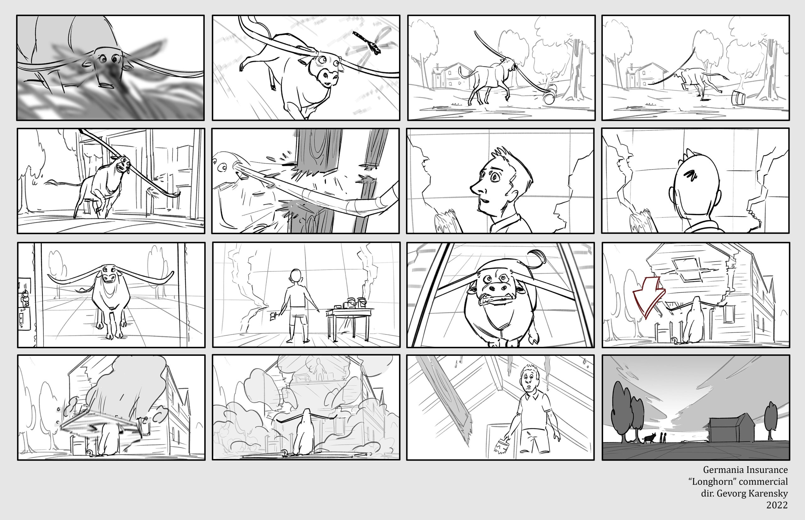
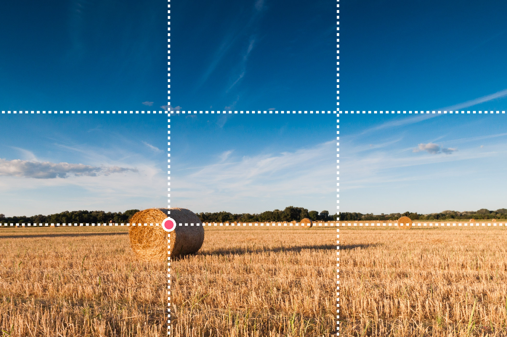
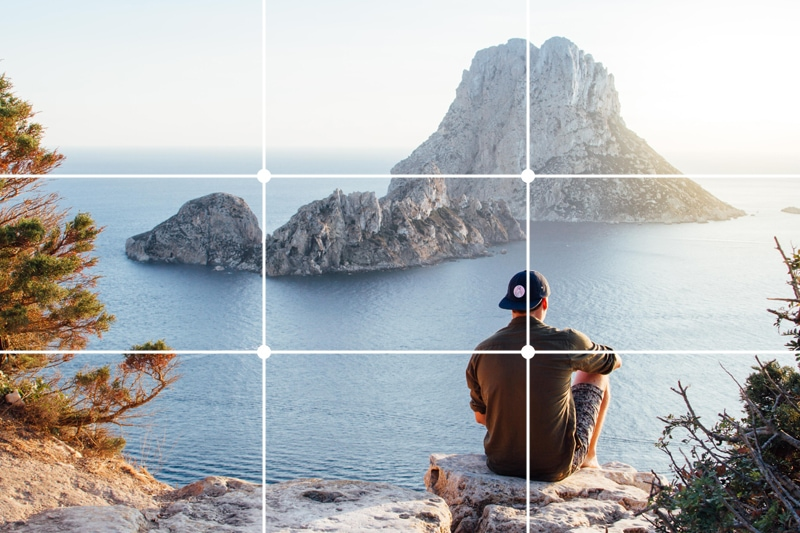
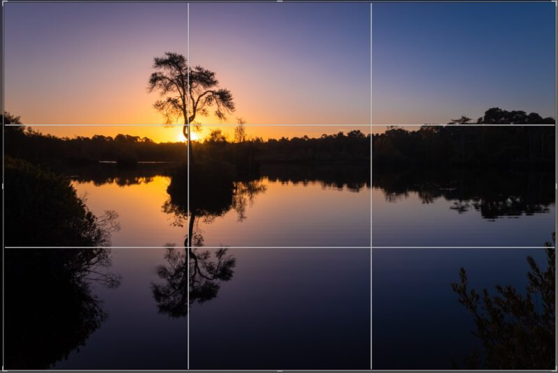
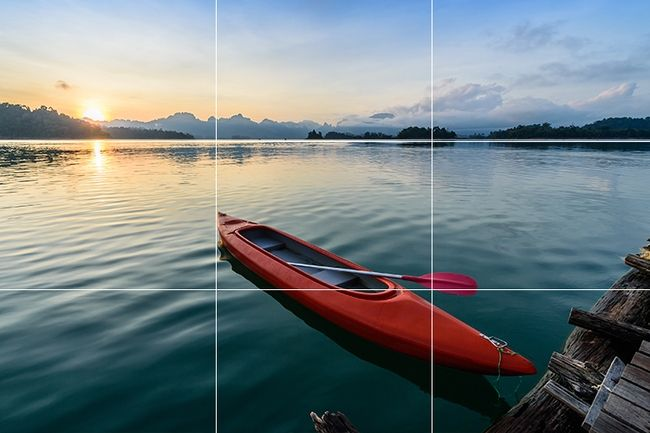

A

<aside>
  <h2>Bestanden bij deze kaart:</h2>

  <ul>
    <li><a href="RubricA.docx" download>Beoordelingscriteria</a></li>
    <li><a href="Storyboard.docx" download>Bijlage storyboard</a></li>
    <li><a href="Screenplay.docx" download>Template screenplay</a></li>
    <li><a href="Presenteren.docx" download>Richtlijnen presenteren</a></li>
  </ul>
</aside>

## Introductie

*Mr. Bean is een tijdloos karakter, bedacht en gespeeld door Rowan Sebastian Atkinson (1955 - heden). Rowan is een welbekende Britse acteur, comedian en scriptsschrijver, die ook heeft gespeeld in Blackadder en Johnny English. Rowan brengt een vorm van fysieke humor naar zijn rollen. Met de serie Mr. Bean kan zichzelf zelfs tot de top 50 grappigste acteurs (2003) en comedians (2005) rekenen. Maar ook cinematografische elementen versterken het humoristische karakter van zijn werk. Zo blijven zijn creaties aantrekkelijk voor jong en oud.*

### Mr. Bean

De serie Mr. Bean verscheen voor het eerst op TV op 1 januari 1990, en er zijn tot 1995 in totaal 15 officiële afleveringen uitgebracht. De serie is vernoemd naar de hoofdrol, het fictieve personage Mr. Bean, bedacht en gespeeld door Rowan Atkinson. Mr. Bean is een onhandig, kinderachtig, egoïstisch, narcistisch, maar toch ook vindingrijk personage, dat door zijn onaangepaste gedrag vaak in allerlei problemen komt. Wat hem grappig maakt is zijn hele overdreven (hyperbolische) gedrag, in combinatie met fysieke humor en een gebrek aan gesproken dialoog, vergelijkbaar met stille films van begin 20e eeuw.

  Toen film pas net werd uitgevonden, was het nog niet mogelijk om beeld en geluid tegelijkertijd op te nemen en weer af te spelen. Daarom hadden films uit die tijd geen dialoog of geluidseffecten. We noemen dit soort films stille films. Het verhaal moest dus helemaal duidelijk zijn uit de bewegingen en handelingen van de acteurs. Latere stille films hadden soms wel een live-orkest dat een soort ‘soundtrack’ speelde terwijl de film werd afgespeeld, soms zelfs met geluidseffecten.

### Johnny English

Johnny English is een ander fictief karakter gespeeld door Rowan Atkinson. Waar Mr. Bean hyperbolisch kinderachtig is, is Johnny hyperbolisch dom. Het karakter komt in de gekste en meest onhandige situaties terecht, maar weet zich daar iedere keer per toeval op een hilarisch creatieve manier toch weer uit te werken. Wederom is de combinatie van hyperbolische karakterkenmerken en fysieke humor de sleutel tot succes.

## Opdrachtomschrijving

In een groepje van 3 of 4 mensen gaan jullie een minimovie van enkele minuten maken, waarin jullie je eigen Mr. Bean-achtige karakter tot leven wekken. Je bedenkt een kort verhaal, leert hoe je een script schrijft, een storyboard maakt, een camera hanteert, de film bewerkt, en presenteert deze vervolgens aan de klas.

### Is deze opdracht iets voor jou?

Een groepsopdracht vraagt om een harmonieuze samenwerking tussen verschillende personen die elkaar kunnen helpen en aanvullen. Iedereen heeft hetzelfde einddoel voor ogen en draagt zijn eigen steentje bij. 

Als je voor deze opdracht kiest:

- Maak je deel uit van een groep en is jouw bijdrage evenredig aan dat van een andere groepsgenoot
- Ben je in staat te plannen en vooruit te kijken en waar nodig het tempo op te voeren
- Ben je er niet vies van grenzen te verleggen en te durven experimenteren

## Stappenplan

### Stap 1: onderwerp & verhaal

Bedenk een onderwerp voor jullie minimovie en zorg ervoor dat je in grote lijnen weet waar het verhaal over gaat. Probeer in je verhaal het model van de dramatische boog toe te passen. Maak een storyboard en een script.

#### Dramatische boog

In een verhaal spreek je vaak van het <b>conflictmodel</b> of <b>dramatische boog</b>. Het verhaal begint met een evenwicht. Dat wordt verstoord door een conflict waarmee het hoofdpersonage wat moet. Dit probleem wordt opgelost of het personage ontwikkelt zich, en er ontstaat een voorlopig nieuw evenwicht. Vaak bevat het conflict ook sub-conflicten.

#### Storyboard

Een <b>storyboard</b> is een collectie schetsen van shots/scenes (en verschillende camera-perspectieven) zoals de regisseur ze voor zich ziet. Ze geven een beeld van hoe de uiteindelijke film er ongeveer uit zal komen te zien.

Een storyboard bevat doorgaans per shot een beschrijving van wat er in het shot gebeurt en gezegd wordt, welke acteurs in het shot voorkomen, hoelang het shot duurt, en welke cinematografische technieken gebruikt worden.

Hieronder zie je een voorbeeld van een storyboard:

Je maakt het storyboard in je dummy, en vult vervolgens een lijst in waar je per shot schat hoelang je denkt dat het shot gaat duren, en wie erin voorkomen.

<a class="btn" href="Storyboard.docx" download>Bijlage storyboard</a>

#### Script

Het <b>script</b> (of <b>screenplay</b>) is een blauwdruk voor je film. Het is een zo geschreven dat iedereen die meewerkt aan een filmproductie precies weet wat ze op ieder moment moeten doen.

Een script bestaat uit een soort hoofdstukken, die we <b>acts</b> noemen. Een act bestaat vervolgens uit verschillende scènes. Een <b>scène</b> is een gebeurtenis die zich op een specifieke locatie afspeelt, en bestaat uit interacties tussen personages. Dit kan via gesproken taal (dialoog), of fysieke handelingen.

Een scène moet bijdragen aan de loop van het verhaal. Als dat niet zo is, leidt de scène af en kan je hem beter verwijderen.

De meeste filmscripts volgen een <b>drie-act structuur</b>, overeenkomend met het conflictmodel:

-	**Setup**: de personages en wereld/settings in evenwichtssituatie worden geïntroduceerd. Zet de toon van het verhaal (actie, romantiek, komiek etc.), en introduceer de hoofdpersonen.
-	**Confrontatie/ontwikkeling**: de conflicten en uitdagingen waarmee personages worden geconfronteerd worden duidelijk. De hoofdpersonen lopen tegen allemaal obstakels aan. Als er subconflicten zijn worden die hier geïntroduceerd. Het is de bedoeling dat de personages zichzelf in deze act ontwikkelen. We noemen dat de karakterboog.
-	**Ontknoping/resolutie**: vlak voor het einde van het verhaal is er vaak nog één onverwachte draai of wending: de plottwist. De personages hebben hun laatste confrontatie met het conflict, waarna het wordt opgelost. Er ontstaat een voorlopig nieuw evenwicht.

In jullie minimovie is één of twee scènes per act voldoende. Je mag ook de volledige film af laten spelen op één locatie. Zorg er dan wel voor dat je nog steeds het conflictmodel op de juiste manier toepast.

<a class="btn" href="Screenplay.docx" download>Template screenplay</a>

### Stap 2: camera’s & opnames

Aan de hand van het storyboard en het script gaan jullie je film opnemen. Hierbij moet je de rollen verdelen en goed samenwerken. Zoek een goede plek om je film op te nemen of maak zelf een decor. Denk na over rekwisieten en kostuums. Tijdens het filmen pas je cinematografische elementen toe.

#### Rollen

Afhankelijk van de grootte van jullie groep zijn er verschillende rollen die ieder van jullie op zich kan nemen:

-	Cameraman
-	Acteur
-	Decorontwerper
-	Kostuumontwerper

Je mag ook meerdere rollen hebben. Bijvoorbeeld dat je zowel kostuum- als decorontwerper bent. Of om de beurt cameraman en acteur bent. Of een andere combinatie. Zorg er in ieder geval voor dat je een eerlijke verdeling maakt en dat iedereen iets bijdraagt aan jullie eindproduct. Je moet dit in je presentatie ook kunnen verantwoorden naar de docent.

#### Cinematografie

Er zijn een aantal cinematografische elementen die je kan inzetten om een goede film te maken: compositie, belichting, kleurgebruik en perspectief.

**Compositie** gaat over hoe je personages en objecten in je frame positioneert. Een goede compositie maakt je shot aangenamer om naar te kijken en ziet er ook nog eens professioneler uit.

In fotografie en film wordt meestal de **regel van derden** gebruikt. Je verdeelt het frame dan met twee verticale en twee horizontale lijnen in negen gelijke vlakken. De horizon komt op een horizontale lijn, en het onderwerp van het shot komt op een kruising.

  
  
  
  

  Je kan dit op de camera van je telefoon ook aanzetten. Op iOS doe je dat bij Instellingen > Camera > Raster. Op Android doe je dit bij Camera > Instellingen > Grid lines of Camera > Instellingen > Compositie > Grid Type > 3x3.

<!-- Als je nog meer inspiratie zoekt voor je compositie of het gewoon interessant vindt, kan je deze video bekijken: -->

<iframe class="video" style="margin-top: -10px" src="https://www.youtube-nocookie.com/embed/ANdLOY4rW04" frameborder="0" allow="accelerometer; autoplay; clipboard-write; encrypted-media; gyroscope; picture-in-picture; web-share" referrerpolicy="strict-origin-when-cross-origin" allowfullscreen></iframe>

**Belichting en kleurgebruik** kunnen beïnvloeden hoe een kijker een shot ervaart. Felle kleuren trekken de aandacht van de kijker. Je kan ook gebruikmaken van contrasten, zoals licht-donker, warm-koud of complementair, om bepaalde personages of objecten uit te lichten. Of gewoon omdat het je shot er mooi uit laat zien.

**Perspectief** heeft te maken met hoe dichtbij of ver weg je de camera houdt van de personages in je shot, en waar de horizon ligt. En ook met de lens van je camera.

Kikvorperspectief | Ooghoogteperspectief | Vogelperspectief
--|--|--
Camera laag | Camera op ooghoogte van personages | Camera hoog
Personages van onder | Personages van voor/achter | Personages van boven
Horizon ligt hoog | Horizon ligt in het midden | Horizon ligt laag

Hoe dichtbij of ver weg je de camera bepaalt hoe veel of weinig je van de personages ziet. We noemen wat je kan zien het **kader**:

-	Long shot: personages zijn volledig in beeld
-	Knee shot: personages zijn vanaf hun knieën naar boven in beeld
-	Medium shot: personages zijn vanaf hun middel in beeld
-	Close-up: alleen een deel van het personage is zichtbaar

  Een knee shot noemen we ookwel een American shot, omdat het vooral werd gebruikt in Amerikaanse westerns.

#### Decor en rekwisieten

Misschien hebben jullie al de perfecte setting gevonden voor jullie verhaal. Maar misschien ook niet. Het is altijd mogelijk om zelf decor en rekwisieten te bouwen. Hij zijn een aantal ideeën die je kan overwegen:

-	Je kan delen van je decor zelf knutselen van kartonnen cutouts en beschilderde doeken. Houdt er wel rekening mee dat dit relatief veel tijd kost. Houd zelf je tijdsplanning in de gaten.
-	Met een beamer kan je het decor projecteren op een muur of doek. Maar dan moet je tijdens de opnames niet voor de beamer langs lopen!
-	Met behulp van een green screen kan je jezelf in digitale wereld teleporteren. Dit kan een gedownloade afbeelding zijn, een gefotografeerde tekening, of een 3D-omgeving gemaakt in bijvoorbeeld Blender. Doe wel eerst een test om te kijken of het je lukt om met een green screen te werken. Belichting is heel belangrijk voor een goed green screen!
-	Voor rekwisieten kan je misschien langsgaan bij een kringloopwinkel. Daar kan je vaak de meest uiteenlopende spullen op de kop tikken voor een paar euro.

Bij het maken van decor is het belangrijk te focussen op de meest kenmerkende aspecten van de omgeving die je probeert na te maken. Wil je een supermarkt maken? Zorg dan bijvoorbeeld voor winkelmandjes, een schap met producten (kan gewoon een kast zijn met oude verpakkingen) en een logo aan de muur. Bij een museum zorg je voor een hekje en een schilderij aan de muur. Wees vooral creatief.

### Stap 3: editten

Als laatste stap in het maken van je minimovie ga je de film monteren. Je mag daarvoor een videobewerkingsprogramma naar keus gebruiken. Op een Mac vind je bijvoorbeeld vaak iMovie. Op een Windows-computer kan je Kdenlive, Adobe Première of Davinci Resolve installeren. Of je gaat op je telefoon of tablet aan de slag met CapCut.

#### Soundtrack en geluidseffecten

Een belangrijk aspect van je film is natuurlijk de soundtrack en geluidseffecten. Je kan online super veel geluidseffecten vinden en downloaden. Of misschien bevat jouw videobewerkingsprogramma ook al wel effecten. Tip: als je een YouTube kanaal hebt kan je in YouTube Studio gratis muziek downloaden uit een hele grote catalogus:

<a class="btn" href="https://youtube.com/audiolibrary">YouTube Studio &rarr;</a>

Als je geen ervaring hebt met videobewerkingsprogramma’s, kan je hulp vragen aan je docent of aan een klasgenoot. Of je kan online een tutorial opzoeken, bijvoorbeeld op YouTube.

### Stap 4: presenteren

Als je je minimovie af hebt is het tijd deze te presenteren. Je legt samen met je groepje in 1 tot 3 minuten (of meer als je groepje groter is) kort uit waar je film over gaat, welke keuzes je hebt gemaakt en waarom. Tenslotte mag je de film aan de klas laten zien (als je wil).

<a class="btn" href="RubricA.docx" download>Beoordelingscriteria</a>
