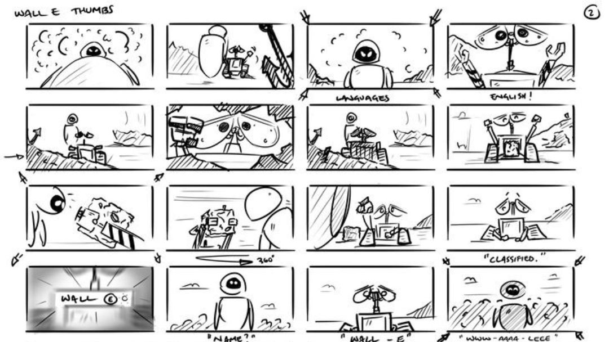

B

<aside>
  <h2>Bestanden bij deze kaart:</h2>

  <ul>
    <li><a href="Rubric.docx" download>Beoordelingscriteria</a></li>
    <li><a href="Screenplay.docx" download>Template screenplay</a></li>
  </ul>
</aside>

## Introductie

*Rowan Sebastian Atkinson (1955 - heden) is een welbekende Britse acteur, comedian en scriptsschrijver, bekend van klassiekers zoals Mr. Bean, Blackadder, en Johnny English. Hij brengt een vorm van fysieke humor naar zijn rollen. Met zijn zelfverzonnen Mr. Bean karakter, kan hij zichzelf zelfs tot de top 50 grappigste acteurs (2003) en comedians (2005) rekenen. Maar ook cinematografische elementen versterken het humoristische karakter van zijn werk. Zo blijven zijn creaties aantrekkelijk voor jong en oud.*

### Mr. Bean

Mr. Bean is een fictief personage bedacht door Rowan Atkinson. Hij is een onhandig, kinderachtig, egoïstisch, narcistisch, maar toch ook vindingrijk personage, dat door zijn onaangepaste gedrag vaak in allerlei problemen komt. Wat Mr. Bean grappig maakt is zijn hele overdreven (hyperbolische) gedrag, in combinatie met fysieke humor en een gebrek aan gesproken dialoog.

### Animatieserie

Naast de originele live-action serie van Mr. Bean wordt er sinds 2002 ook een animatieserie met dezelfde naam gemaakt, met wederom Rowan Atkinson in de hoofdrol. De animatieserie maakt een aantal aanpassingen aan het klassieke Mr. Bean karakter: hij is minder dom en praat zelfs in volledige zinnen met andere personages. Daarnaast introduceert de animatieserie extra karakters zoals Mrs. Wicket. Een ander voordeel van animatie is dat het situaties toestaat die in film onmogelijk geweest zouden zijn.

## Opdrachtomschrijving

Je gaat een humoristische animatie of stopmotion ongeveer een minuut maken, waarin je aan de slag gaat met humor. Je bedenkt een kort verhaal, leert hoe je een script schrijft, een storyboard maakt, een animatie of stopmotion maakt, en presenteert deze vervolgens aan de klas.

## Stappenplan

Kies eerst een techniek om deze opdracht uit te voeren. Je mag of een animatie maken, of een stop-motion maken. De eerste aantal stappen is voor beide technieken gelijk. Daarna kan je zelf kiezen wat jij het leukst vindt.

### Stap 1: onderwerp & verhaal

Bedenk daarna een onderwerp voor jouw animatie of stopmotion en zorg ervoor dat je in grote lijnen weet waar het verhaal over gaat. Kies een vorm van humor en werk de grappen en humoristische elementen uit in een lopende verhaallijn. Probeer in het verhaal het model van de dramatische boog toe te passen. Maak een storyboard en script.

#### Humor

<b>Situatiehumor</b> is de klassieke Bean-humor. Het is en vorm van fysieke humor, grappig vanwege overdreven gedrag in specifieke situaties. Het is meestal ook non-verbaal.

<b>Taalhumor</b> maakt gebruik van woordspelingen, bijvoorbeeld door het slim gebruiken van homoniemen of spreekwoorden (dubbelzinnigheid), en het letterlijk interpreteren van figuurlijk taalgebruik en andersom.

<b>Absurde humor</b> is grappig omdat het tegen alle logica ingaat, een beetje zoals de kunststromingen van het absurdisme en surrealisme. Het is grappig omdat. Het is grappig omdat het niet lijkt op een grap. Het beste voorbeeld is misschien nog wel ‘67’. Het is grappig omdat het grappig is, niet omdat het grappig is. Snap je het nog?

<b>Zwarte humor</b> speelt met thema’s die normaal taboe zijn. Bijvoorbeeld ernstige ziektes, misbruik, de dood, de tweede wereldoorlog etc. Het is grappig omdat het eigenlijk net niet kan. 

<b>Een parodie</b> is een grappige interpretatie van een bestaand werk. Het maakt het origineel belachelijk door het op een idiote manier na te doen. 

<b>Een satire</b> geeft op een grappige manier kritiek op de samenleving, politiek of religie. Het zijn maatschappijkritische grappen, die vooral kritiek uiten op mensen in machtsposities of hen belachelijk maken.

<b>Spot</b> maakt iets of iemand belachelijk. Dit kan op een aantal manieren:

-	Bij <b>ironie</b> zeg je precies het tegenovergestelde van wat je bedoelt, en je maakt er vooral jezelf belachelijk mee. Dit noemen we <b>zelfspot</b>.
-	Een andere vorm van spot is <b>sarcasme</b>. Je zegt dan ook precies het tegenovergestelde van wat je bedoelt, maar in plaats van jezelf maar je hiermee juist een ander belachelijk, vaak op een persoonlijke of kwetsende manier.
-	De laatste vorm van spot is <b>cynisme</b>. Daarbij zeg je precies wat je bedoelt, op een vrij gemene manier.

#### Dramatische boog

In een verhaal spreek je vaak van het <b>conflictmodel</b> of <b>dramatische boog</b>. Het verhaal begint met een evenwicht. Dat wordt verstoord door een conflict waarmee het hoofdpersonage wat moet. Dit probleem wordt opgelost of het personage ontwikkelt zich, en er ontstaat een voorlopig nieuw evenwicht. Vaak bevat het conflict ook sub-conflicten.

#### Storyboard

Een <b>storyboard</b> is een collectie schetsen van shots zoals de animator ze voor zich ziet. Ze geven een beeld van hoe de uiteindelijke animatie of stopmotion er ongeveer uit zal komen te zien.

Een storyboard bevat doorgaans per shot een beschrijving van wat er in het shot gebeurt en gezegd wordt, welke personages in het shot voorkomen en hoelang het shot duurt.

Hieronder zie je een voorbeeld van een storyboard:

Je maakt het storyboard in je dummy, en vult vervolgens een lijst in waar je per shot schat hoelang je denkt dat het shot gaat duren, en welke personages erin voorkomen.

#### Script

Het <b>script</b> (of <b>screenplay</b>) is een blauwdruk voor je animatie of stopmotion. Het zorgt ervoor dat je verhaallijn duidelijk op papier staat en dat je goed voor je hebt wat je precies moet doen tijdens het opnemen of animeren.

Een script bestaat uit een soort hoofdstukken, die we <b>acts</b> noemen. Een act bestaat vervolgens uit verschillende scènes. Een <b>scène</b> is een gebeurtenis die zich op een specifieke locatie afspeelt, en bestaat uit interacties tussen personages. Dit kan via gesproken taal (dialoog), of fysieke handelingen.

Een scène moet bijdragen aan de loop van het verhaal. Als dat niet zo is, leidt de scène af en kan je hem beter verwijderen.

De meeste scripts volgen een <b>drie-act structuur</b>, overeenkomend met het conflictmodel:

-	**Setup**: de personages en wereld/settings in evenwichtssituatie worden geïntroduceerd. Zet de toon van het verhaal (actie, romantiek, komiek etc.), en introduceer de hoofdpersonen.
-	**Confrontatie/ontwikkeling**: de conflicten en uitdagingen waarmee personages worden geconfronteerd worden duidelijk. De hoofdpersonen lopen tegen allemaal obstakels aan. Als er subconflicten zijn worden die hier geïntroduceerd. Het is de bedoeling dat de personages zichzelf in deze act ontwikkelen. We noemen dat de karakterboog.
-	**Ontknoping/resolutie**: vlak voor het einde van het verhaal is er vaak nog één onverwachte draai of wending: de plottwist. De personages hebben hun laatste confrontatie met het conflict, waarna het wordt opgelost. Er ontstaat een voorlopig nieuw evenwicht.

In jouw animatie of stopmotion is één of twee scènes per act voldoende. Zorg er dan wel voor dat je nog steeds het conflictmodel op de juiste manier toepast.

<a class="btn" href="Screenplay.docx" download>Template script</a>

### Stap 2 (optie 1): animeren

Aan de hand van het storyboard en het script gaan je nu jouw animatie maken.

...

#### Soundtrack en geluidseffecten

Een belangrijk aspect van je animatie is natuurlijk de soundtrack en geluidseffecten. Je kan online super veel geluidseffecten vinden en downloaden. Of misschien bevat jouw animatieprogramma ook al wel effecten. Tip: als je een YouTube kanaal hebt kan je in YouTube Studio gratis muziek downloaden uit een hele grote catalogus:

<a class="btn" href="https://youtube.com/audiolibrary">YouTube Studio &rarr;</a>

### Stap 2 (optie 2): stop-motion

Aan de hand van het storyboard en het script gaan je nu jouw stop-motion maken.

...

#### Soundtrack en geluidseffecten

Een belangrijk aspect van je stopmotion is natuurlijk de soundtrack en geluidseffecten. Je kan online super veel geluidseffecten vinden en downloaden. Of misschien bevat jouw animatieprogramma ook al wel effecten. Tip: als je een YouTube kanaal hebt kan je in YouTube Studio gratis muziek downloaden uit een hele grote catalogus:

<a class="btn" href="https://youtube.com/audiolibrary">YouTube Studio &rarr;</a>

### Stap 3: presenteren

Als je jouw animatie of stopmotion af hebt is het tijd deze te presenteren. Je legt in ongeveer een minuut kort uit wat het verhaal achter je filmpje is en welke keuzes jij gemaakt hebt tijdens het animeren. Tenslotte laat je het eindresultaat zien aan de klas.

<a class="btn" href="Rubric.docx" download>Beoordelingscriteria</a>
