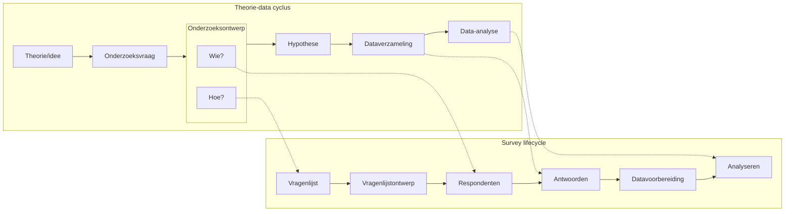
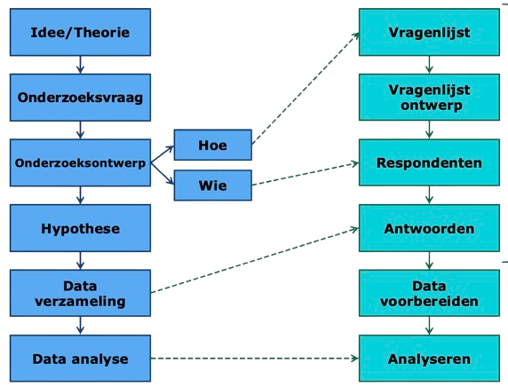
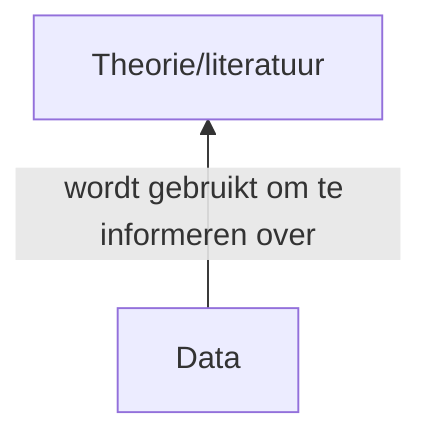
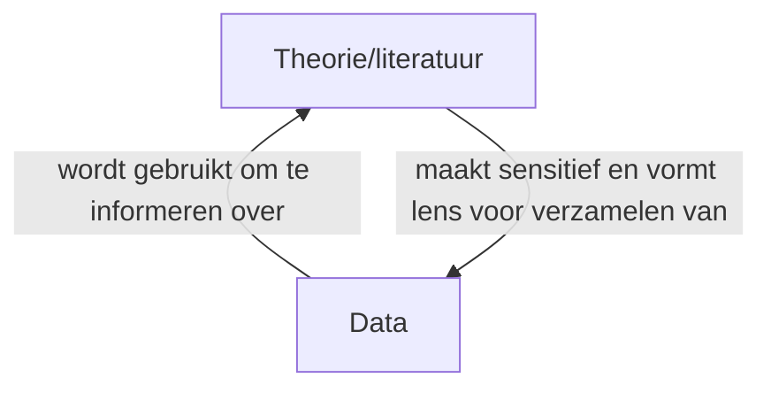
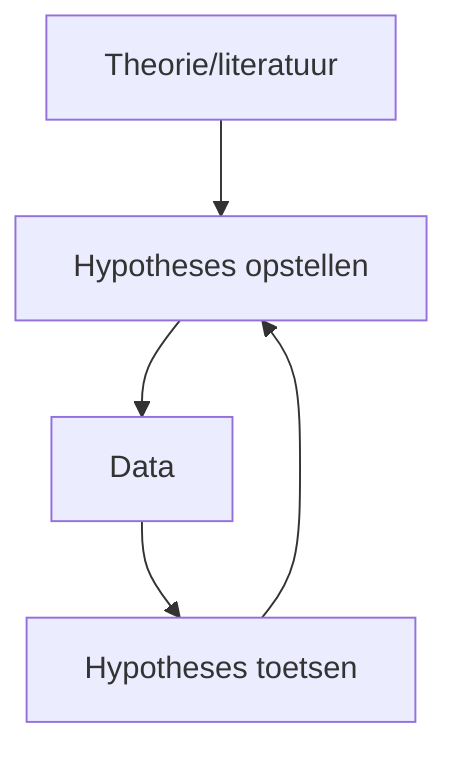

> Deze samenvatting veronderstelt voorkennis van [KOM](../KOM/Samenvatting.md) en [Wetenschapsfilosofie](../WETFIL/Samenvatting.md).

<br>

<style>
  main p > span, main li > span, main details > span {
    font-family: sans-serif;
    font-size: 0.9em;
    display: inline-block;
    padding: 0px 5px;
    border: 1px solid #737373;
    border-radius: 4px;
  }
  main span.sub::before {
    content: "› ";
  }
  main span.root::before {
    content: "☰ ";
  }
  main span.current::before {
    content: "▼ ";
  }
  main span.check::before,
  main span.input::before,
  main span.opt::before {
    content: "☐ ";
  }
  .box {
    position: relative;
  }
  .box h4 {
    margin-top: 0;
    text-transform: uppercase;
    font-family: sans-serif;
    font-size: 0.7em;
  }
  .box h4.inline {
    display: inline-block;
    margin-right: 0.25em;
  }
  .box h4.inline::after {
    content: ":";
  }
  .box h4:not(.inline) {
    position: absolute;
    left: 15px;
    top: 15px;
  }
  .box h4 + ul {
    margin-top: 1.75em;
    margin-bottom: 0.5em;
    margin-left: 5px;
    padding-left: 0;
    list-style: none;
  }
</style>

## Dataverzameling

<!--
Correlationeel onderzoek verschilt van experimenteel onderzoek omdat er geen manipulatie plaatsvind. Je meet gegevens zoals ze zijn. Er zijn twee soorten data:

- Ontworpen (bijv. survey)
- Organisch (bijv. bestaande data)
-->

### Modes

<details>
  <summary>Modes van een vragenlijst</summary>
  <ul>
  <li>online</li>
  <li>face-to-face</li>
  <li>telefonisch</li>
  <li>via de post</li>
  <li>op papier</li>
  </ul>
</details>

<details>
  <summary>Modes van een interview</summary>
  <ul>
  <li>face-to-face</li>
  <li>telefonisch</li>
  <li>online</li>
  <li>go-along</li>
  <li>etnografisch</li>
  </ul>
</details>

<details>
  <summary>Modes van een focusgroep</summary>
  <ul>
  <li><strong>Dual-moderator</strong>: er zijn twee moderators die ieder een eigen taak hebben.</li>
  <li><strong>Two-way</strong>: twee groepen wisselen elkaar af; luisteren en discussiëren om en om.</li>
  <li><strong>Dueling moderators</strong>: er zijn twee moderators die een voorbeelddiscussie houden.</li>
  <li><strong>Response moderator</strong>: één van de respondenten is de moderator.</li>
  <li><strong>Online chat room</strong>: online meeting waar respondenten real-time communiceren.</li>
  <li><strong>Online bulletin board</strong>: online forum waar respondenten asynchroon communiceren.</li>
  </ul>
</details>

<!--
> Een focusgroep is <strong>geen groepsinterview</strong>! Het is een geplande discussie waarbij interactie tussen participanten data genereert.
-->

#### Eigenschappen van modes

- mate van betrokkenheid van de onderzoeker
- mate van interactie met de respondent
- hoeveelheid privacy
- vereisde technologie
- kosten
- drempel van deelname

#### Mixed-modes designs

- verschillende modes voor verschillende leeftijsgroepen
- verschillende modes voor werving en afname
- een andere mode voor gevoelige vragen
- herinneringen of follow-ups in een andere mode
- bij een lage response-rate opnieuw afnemen in een andere mode

### Vragenlijst

Een vragenlijst bestaat uit vragen ('items'), die worden uitgevraagd als meerkeuze (nominaal) of Likert-schaal (ordinaal). Samenvoegen van itemscores geeft een [schaalscore](#schaalscores) (interval).

> De Likert-schaal kan een even of oneven aantal opties hebben; even voorkomt dat respondenten overal 'neutraal' invullen, maar forceert wel een dichotome keuze die mogelijk onterecht is.

<details open>
  <summary>Criteria voor goede vragen</summary>
  <p>Er zijn een aantal kenmerken waaraan vragen moeten voldoen:</p>
  <ul>
    <li><p><strong>Uitputtend</strong>: er moet een juiste optie voor iedereen zijn, het mag niet zo zijn dat de juiste antwoordoptie er niet tussen staat. Oplossingen: "Overig" of "Anders" optie met vrije tekstinvoer.</p>
    </li>
    <li><p><strong>Uitsluitend</strong>: er moet maximaal één juiste optie zijn, het mag niet zo zijn dat twee antwoordopties beide juist zijn. Oplossingen: zorgen dat antwoordopties niet overlappen.</p>
    </li>
  </ul>
  <p>Het is ook belangrijk om geen (statistisch) vakjaron in de vraagstelling te gebruiken.</p>
</details>

#### Survey lifecycle

<style class="p0">
  .p0 + pre {
    display: none;
  }
</style>





### Interviews & focusgroepen

<details open>
  <summary>Elliciteren</summary>
  <p>In interviews en focusgroepen kan je elliciteren: antwoorden uitlokken.</p>
  <ul>
  <li><p><strong>Probes</strong>: meer informatie over het huidige onderwerp.</p>
  <ul>
  <li>Bewuste stilte laten vallen <small>(&nbsp;&nbsp;&nbsp;&nbsp;&nbsp;&nbsp;&nbsp;...&nbsp;&nbsp;&nbsp;&nbsp;&nbsp;&nbsp;&nbsp;)</small></li>
  <li>Ongerichte aanmoediging <small>(eheuh, yes, oke, ja, hmmm)</small></li>
  <li>Vragen naar uitwijding <small>(kan je daarover meer vertellen?)</small></li>
  <li>Vragen naar uitleg <small>(kan je dat verder toelichten?)</small></li>
  <li>Reflectie, interpretatie samenvatten <small>(begrijp ik goed dat ...?)</small></li>
  </ul>
  </li>
  <li><p><strong>Prompts</strong>: nieuwe onderwerpen aansnijden.</p>
  </li>
  </ul>
  <p>Je kan elliciterende materialen gebruiken, zoals vignetten. Dat zijn korte impressies of casusen, gemaakt voor het onderzoek of uit bestaande data.</p>
</details>

### Observaties

<details open>
  <summary>Manieren van observatieonderzoek</summary>
  <ul>
  <li>Participerend vs niet-participerend</li>
  <li>Verhuld ("covert") vs onverhuld ("overt")</li>
  <li>Systematisch vs niet-systematisch</li>
  </ul>
  <table style="margin-left: 1em; width: 90%">
  <thead>
  <tr>
  <th>term</th>
  <th>betekenis</th>
  </tr>
  </thead>
  <tbody><tr>
  <td>Complete participant</td>
  <td>verhuld &mdash; participerend</td>
  </tr>
  <tr>
  <td>Participant observer</td>
  <td>onverhuld &mdash; participerend</td>
  </tr>
  <tr>
  <td>Observer</td>
  <td>onverhuld &mdash; niet-participerend</td>
  </tr>
  <tr>
  <td>Covert observer</td>
  <td>verhuld &mdash; niet-participerend</td>
  </tr>
  </tbody></table>
</details>

<details open>
  <summary>Soorten observaties</summary>
  <ul>
  <li><strong>Primary</strong>: dag, tijd, locatie, aanwezigen, gebeurtenissen.</li>
  <li><strong>Secondary</strong>: opmerkingen <em>van anderen</em> over de gebeurtenissen.</li>
  <li><strong>Experiental</strong>: eigen gevoelens, emoties, reflectie.</li>
  <li><strong>Circumstantial</strong>: logistiek en organisatie.</li>
  </ul>
</details>

<details open>
  <summary>Etnografie</summary>
  <p>Etnografie is onderzoekstype dat veel wordt gebruikt voor culturele en medische antropologie. Het is een vorm van methode-triangulatie, waarbij participerende observaties gecombineerd worden met interviews, focusgroepen en bestaande data.</p>
  <p>Er is vaak sprake van een <em>gatekeeper</em> die toegang geeft tot de populatie en een <em>key informant</em> die een centrale positie met veel kennis en aanzien heeft binnen de populatie.</p>
</details>

### Bestaande data

<style class="t0">
  .t0 + table td, .t0 + table th {
    text-align: center
  }
</style>

| Manifest | Latent |
|--|--|
| beschrijvend | interpretatief |
| objectief | subjectief |
| direct zichtbaar | onderliggende betekenis |

<details style="margin-top: 1em">
  <summary>Voorbeeld</summary>
  <table style="margin-top: 1em">
  <thead>
  <tr>
  <th>Manifest</th>
  <th>Latent</th>
  </tr>
  </thead>
  <tbody><tr>
  <td>Aantal keer dat woord \(x\) voorkomt.</td>
  <td>Context van het woord \(x\).</td>
  </tr>
  <tr>
  <td>Hoeveelheid minuten \(y\) zichtbaar.</td>
  <td>Manier van afbeelden van \(y\).</td>
  </tr>
  <tr>
  <td>Aantal afbeeldingen van \(z\).</td>
  <td>Positionering van afbeeldingen van \(z\).</td>
  </tr>
  </tbody></table>
</details>

### Fouten, effecten & bias

#### Fouten bij het gebruik van vragenlijsten

- **Dekkingsfout**: niet alle mensen uit de populatie staan op de lijst (het steekproefkader) die gebruikt wordt bij een aselecte steekproef. Je kan per definitie niet weten of er een dekkingsfout gemaakt wordt en hoe groot die is.

- **Steekproeffout**: de steekproef is niet representatief voor de populatie. Je kan de grootte van de steekproeffout niet weten, maar wel uitspraak doen over het gemiddelde van de steekproeffouten (de standaardfout). Waarbij grotere steekproef \\(\implies\\) kleinere \\(\text{SE}\\).

- **Nonresponsefout**: je krijgt geen antwoord van mensen die geselecteerd zijn in de steekproef. Twee soorten: bij een unit-nonresponse weigert een respondent de volledige vragenlijst, bij een item-nonresponse weigert de respondent een enkele vraag.

  Redenen kunnen zijn: technische problemen, gebrek aan motivatie, of gevoelige vragen.

- **Response- of meetfout**: vragen zijn verkeerd beantwoord door de respondent. Aantal oorzaken: mode van de vragenlijst ('mode effect'), de vraagstelling ('question bias'), de respondent ('response bias'), de interviewer, of de omgeving.

  Er gaat ergens iets fout in het vraag-antwoordproces:

  ```mermaid
  flowchart LR
    Comprehension --> Retrieval
    Retrieval --> Judgement
    Judgement --> Response
  ```

  <!--<small>De rol van de onderzoeker is het faciliteren van dit proces op twee manieren: vragen stellen en motiveren tot antwoorden door rapport op te bouwen.</small>-->

  Veel voorkomende effecten:

  - **Telescoopeffect**<!--(retrieval & judgement)-->: mensen hebben onbewust de neiging om de gevraagde periode iets te verlengen aan beide kanten. Wordt veroorzaakt door onzekerheid over terughalen van informatie uit het verleden; hoe langer geleden, hoe sterker het effect.

  - **Volgorde-effect**<!--(comprehension & retrieval)-->: eerdere vragen kunnen het antwoord op latere vragen beïnvloeden, doordat ze een bepaalde context creeëren. Oplossingen: het randomiseren van de volgorde ('counterbalancing').

  - **Doorknob-effect**<!--(comprehension & retrieval)-->: de respondent deelt belangrijke informatie als het interview nét klaar is (bij de deurknop op weg naar buiten). Oplossingen: opnameapparatuur aan laten staan tot respondenten zijn vertrokken.

  Vormen van 'question bias':

  - **Leading questions**: vragen die bepaalde woorden of context bevatten waardoor de respondent naar een bepaald antwoord gestuurd wordt.

  - **Double barreled questions**: vragen waarin twee dingen uitgevraagd worden, waardoor ze niet eenduidig beantwoord kunnen worden.

  Vormen van 'response bias':

  - **Toegevendheid** ('acquiescence bias'): respondenten weten niet goed wat ze vinden, en beantwoorden de stellingen daarom maar met ja ('yes-saying').

  - **Fence sitting**: respondenten vermijden de extreme antwoordopties, ookal passen die eigenlijk wel goed, vooral als er veel opties zijn.

  - **Straightlining**: respondenten hebben geen zin meer om de vragenlijst in te vullen, en vullen daarom overal dezelfde optie in, vooral bij lange vragenlijsten.

  - **Primacy effects**: respondenten hebben de neiging om de opties bovenaan de lijst te kiezen, omdat ze deze het eerst en best lezen, vooral bij schriftelijke vragenlijsten.

  - **Recency effects**: respondenten hebben de neiging om de opties onderaan de lijst te kiezen, omdat ze deze het recents gehoord hebben en dus nog niet vergeten zijn, vooral bij telefonische vragenlijsten.
  
  - **Sociale wenselijkheid**: respondenten zijn niet bereid om eerlijk te antwoorden omdat ze bang zijn dat de onderzoeker of anderen slecht over ze gaan denken.

- **Aanpassingsfout**: de onderzoeker maakt een fout bij het opschonen van de data. De onderzoeker kan verkeerde correcties toepassen, verkeerde wegingen aan antwoorden toewijzen (bijv. bij een ondergerepresenteerde groep), of een fout maken bij imputatie.

  Bij imputatie worden ontbrekende gegevens geschat met een statistisch model, op basis van de antwoorden die wel gegeven zijn.

- **Verwerkingsfout**: de onderzoeker maakt een fout tijdens de data-analyse. De onderzoeker kan gegevens verkeerd invoeren of overnemen, fouten maken bij (her)coderen, of de verkeerde toets uitvoeren.

  Onder deze categorie vallen ook ethische fouten, zoals slecht omgaan met vertrouwelijke gegevens.

> Fouten hoeven niet altijd een gevaar te vormen voor het onderzoek. Als er sprake is van een willekeurige fout ('random error'), zal dat weinig invloed hebben op de resultaten. Echter, systematische fouten zorgen voor vertekening, en dan komt de validiteit in het geding.

#### Bedreigingen bij observartieonderzoek

- **Reactiviteit** ('Hawthorne-effect'): door de aanwezigheid van de onderzoeker vertonen deelnemers geen normaal gedrag meer.

- **Naturalisatie**: door gewenning aan de aanwezigheid van de onderzoeker vertonen deelnemers weer normaal gedrag, ondanks aanwezigheid van de onderzoeker.

- **Going native**: door langdurige participatie verliest de onderzoeker diens rol uit het oog.

#### Bedreigingen voor interne validiteit

- **Selectie-effecten**: groepen zijn niet vergelijkbaar bij aanvang van het experiment; er zijn bestaande verschillen. Opgelost door randomisatie middels een aselecte steekproef.

- **Leereffecten** ('maturation threat'): prestatie verbetert over tijd, los van manipulatie. Opgelost door het toevoegen van een controlegroep, of randomisatie van de volgorde ('counterbalancing').

- **Volgorde-effecten**: eerdere vragen kunnen het antwoord op latere vragen beïnvloeden, doordat ze een bepaalde context creeëren. Opgelost door randomisatie van de volgorde ('counterbalancing').

- **History threat**: externe gebeurtenissen beïnvloeden meting, los van manipulatie. Opgelost door het toevoegen van een controlegroep, of randomisatie van de volgorde ('counterbalancing').

- **Regression to the mean**: extremen waarden schuiven bij een tweede meting meestal richting het gemiddelde. Geen eenduidige oplossing, maar een effect waarvan je je bewust dient te zijn.

- **Placebo**: respondenten ervaren verandering door verwachtingen of de onderzoekscontext, los van manipulatie. Opgelost met een blind experiment, waarbij de respondent niet weet in welke conditie hij zit, en de controlegroep een 'nepbehandeling' krijgt.

- **Demand characteristics**: respondenten 'willen' dat het onderzoek slaagt en gedragen zich daardoor anders zodat de hypothese wordt bevestigd. Opgelost met een blind experiment, waarbij de respondent niet weet in welke conditie die zit.

- **Observer bias**: de onderzoeker 'wil' dat het onderzoek slaagt en doet daardoor bewust of onbewust subjectieve rapportage. Opgelost met een dubbelblind experiment, waarbij zowel de onderzoeker als de respondent niet weet in welke conditie die zit.

- **Testing-effect**: respondenten kennen soms het meetinstrument al (bijv. bij gepaarde of herhaalde metingen), en vullen antwoorden in uit hun geheugen. Geen eenduidige oplossing, maar een effect waarvan je je bewust dient te zijn.

- **Instrumentation-effect**: als je een ander instrument gebruikt zijn de pre- en posttest mogelijk niet vergelijkbaar. Geen eenduidige oplossing, maar een effect waarvan je je bewust dient te zijn.

### Onderzoeksontwerpen

- **Between-subjects** (dwarsdoorsnede<!--/cross-sectioneel--> panel): proefpersonen worden met elkaar vergeleken.

  <div class="box">
  <h4>Voordelen</h4>
  <ul>
  <li>Geen volgorde-, testing- of leereffecten.</li>
  <li>Lagere investering nodig<!--, lagere drempel voor deelname-->, minder uitval (attrition).</li>
  <li>Nuttig voor effecten op groepsniveau.</li>
  </ul>
  </div>

  <div class="box">
  <h4>Nadelen</h4>
  <ul>
  <li>Selectie-effecten en bestaande verschillen. Oplossingen: randomisatie.</li>
  <li>Lagere power, meer observaties nodig. Oplossingen: grotere steekproef.</li>
  </ul>
  </div>

- **Within-subjects** (longitudinaal panel): proefpersonen worden met zichzelf vergeleken.

  <div class="box">
  <h4>Voordelen</h4>
  <ul>
  <li>Controlleert voor bestaande verschillen.</li>
  <li>Kan leeftijds-, periode-, of cohort-effecten vinden.</li>
  <li>Hogere power, minder observaties nodig. Goedkoper.</li>
  <li>Nuttig voor effecten op individueel niveau.</li>
  </ul>
  </div>

  <div class="box">
  <h4>Nadelen</h4>
  <ul>
  <li>Volgorde-effecten. Oplossingen: counterbalancing.</li>
  <li>Leereffecten. Oplossingen: counterbalancing.</li>
  <li>Testing-effect.</li>
  <li>Grotere investering nodig<!--, hogere drempel voor deelname-->, meer uitval (attrition). Oplossingen: beloningen.</li>
  </ul>
  </div>

## Databewerking

### Filteren

Het is mogelijk om rijen (bijv. uitschieters) uit de dataset te filteren. Klik daarvoor in het data-overzicht bovenin op <span><svg width="10px" height="10px" viewBox="0 0 16 16" fill="none" xmlns="http://www.w3.org/2000/svg"><path d="M1 1H15V4L10 10V16H6V10L1 4V1Z" fill="#000000"/></svg></span>. Je kan dan R-code typen of visueel een filter samenstellen. Een filter kan bijv. zijn:

\\[(id \neq 12) \land (id \neq 16)\\]

### Ompolen

Het is mogelijk om nieuwe kolommen/variabelen te berekenen met een formule op basis van andere kolommen/variabelen, klik daarvoor <span>+</span> aan de rechterkant. Je kan dit gebruiken om variabelen om te polen. Dat doe je door deze formule:

\\[\text{minimale waarde} + \text{maximale waarde} - \text{naam van kolom}\\]

<details open>
  <summary>Voorbeeld</summary>
  Stel een item \(Q_5\) met een bereik van 3 tot 9. De formule voor \(Q_{5,R}\) is dan:
  \[3 + 9 - Q_5\]
</details>

### Schaalscores

Je kan dezelfde techniek gebruiken om kolommen/variabelen voor schaalscores toe te voegen. Er zijn twee soorten schaalscores:

- Een **somscore** (\\(\Sigma M\\)) bereken je door \\(Q_1 + Q_2 + Q_3 ... Q_n\\)
- Een **gemiddelde** (\\(\Sigma M/ n\\)) bereken je door \\((Q_1 + Q_2 + Q_3 ... Q_n) / n\\)

De R-code voor het berekenen van een somscore is:

```R
apply(data.frame(Q1, Q2, Q3), 1, mean, na.rm=True)
```

<!--
> Ik weet eerlijk gezegd niet wat het verschil is tussen dit en gewoon `Q1 + Q2 + Q3`.
-->

Het is ook mogelijk om een gewogen gemiddelde te berekenen. Daarbij tellen bepaalde vragen zwaarder mee dan anderen. Dit wordt niet behandeld bij TOE en is geen tentamenstof.

## Data-analyse <small>(kwantitatief)</small>

### Beschrijvende statistieken

Je kan beschrijvende statistieken opvragen voor één of meer variabelen opvragen via <span class="root">Descriptives</span> <span class="sub">Descriptive Statistics</span>.

Het is ook mogelijk om te splitsen op een andere variabelen (via <span class="input">Split</span>). Deze variabele mag maximaal 10 niveau's hebben.

#### Frequentietabellen

Onder <span class="current">Tables</span> <span class="sub">Frequency tables</span> is het mogelijk om frequentietabellen op te vragen. Ook hierbij mag de variabele maximaal 10 niveau's hebben.

#### Grafieken

Je kan verschillende grafieken opvragen, afhankelijk van het meetniveau van de variabele:

- **Categorische variabelen** (nominaal, ordinaal)

  - Staafdiagram: <span class="current">Basic plots</span> <span class="sub">Distribution plots</span>
  - Cirkeldiagram: <span class="current">Basic plots</span> <span class="sub">Pie charts</span>

- **Schaal variabelen** (interval, ratio)

  - Histrogram: <span class="current">Basic plots</span> <span class="sub">Distribution plots</span>
  - Boxplots: <span class="current">Customizable plots</span> <span class="sub">Boxplots</span>
  - Spreidingsdiagram: <span class="current">Customizable plots</span> <span class="sub">Scatter plots</span>

### Correlatie

Een correlatie gebruik je om het verband tussen twee variabelen te bepalen. Je doet dit aan de hand van een visuele check en een Pearson- of Spearman-correlatiecoëfficient.

Voordat je een correlatiecoëfficient mag berekenen moeten eerst de voorwaarden gecheckt worden:

<div class="box" style="width: 50%; float: left; border-right: 2px solid white;">
<h4>Voorwaarden Pearson-correlatie</h4>
<ul>
  <li>Aselecte steekproef</li>
  <li>Minimaal interval/ratio</li>
  <li>Linear verband</li>
</ul>
</div>

<div class="box" style="width: 50%; float: right; border-left: 2px solid white;">
<h4>Voorwaarden Spearman-correlatie</h4>
<ul>
  <li>Minimaal ordinaal, of:</li>
  <li>Ordinaal gemaakt met rangscores</li>
  <li>Monotoom verband</li>
</ul>
</div>

De voorwaardes van steekproef en meetniveau kan je bepalen zonder statistiek. Het soort verband bepaal je aan de hand van een spreidingsdiagram.

Dit doe je door: <span class="root">Descriptives</span> <span class="sub">Descriptive Statistics</span>, en kies twee variabelen. Plot daarna een spreidingsdiagram via <span class="current">Customizable plots</span> <span class="sub">Scatter plots</span>.

<div class="box">
  <h4>Instellingen</h4>
  <ul>
    <li><span class="opt">Graph right</span>: <kbd>None</kbd></li>
    <li><span class="opt">Graph above</span>: <kbd>None</kbd></li>
    <li><span class="opt">Regression line</span>: <kbd>None</kbd></li>
  </ul>
</div>

Als er sprake is van een linear verband mag je een Pearson-correlatie bepalen, anders alleen een Spearman-correlatie. Beide doe je via <span class="root">Regression</span> <span class="sub">Classical</span> <span class="sub">Correlation</span>. Je kiest dan onder <span>Sample Correlation Coefficient</span> (linkerkolom) voor <span class="check">Pearson's r</span> of <span class="check">Spearmans's rho</span>.

Na het selecteren van de variabelen zie je de correlatiematrix. Bij twee variabelen is die makkelijker leesbaar als je <span class="check">Display pairwise</span> aanvinkt. In de tabel staat de \\(r\\) of \\(\rho\\) met de bijbehorende \\(p\\)-waarde.

### Betrouwbaarheidsanalyse

Een betrouwbaarheidsanalyse gebruik je om de onderlinge samenhang van items in een meetinstrument (bijv. vragenlijst) te checken. Je doet dit aan de hand van Cronbach's alpha (\\(\alpha\\)).

Om een betrouwbaarheidsanalyse uit te voeren ga je naar <span class="root">Reliability</span> <span class="sub">Unidimensional Reliability</span>, en kies je alle variabelen van het meetinstrument.

<div class="box">
  <h4>Instellingen</h4>
  <ul>
    <li><span class="check">Coefficient \(\omega\)</span> uit</li>
    <li><span class="check">Coefficient \(\alpha\)</span> aan</li>
    <li><span class="check">Coefficient \(\alpha\) (if item dropped)</span> aan</li>
    <li><span class="check">Item-rest correlation</span> aan</li>
  </ul>
</div>

> Soms duurt het heel lang om de betrouwbaarheidsanalyse uit te voeren, of lukt het helemaal niet. Gebruik dan <span class="current">Advanced</span> <span class="sub">Confidence Intervals</span> <span class="check">Bootstrapped Interval</span>.

De betrouwbaarheidsanalyse geeft twee resultaten: een Cronbach's \\(\alpha\\) en een tabel met items. In de tabel laat de <span>item-rest correlation</span> (ookwel \\(rit\\)-waarde) zien hoe sterk een item samenhangt met de rest, en de <span>Cronbach's alpha if dropped</span> laat zien wat er \\(\alpha\\) zou gebeuren als het item verwijderd zou worden.

Als \\(rit < .20\\) en \\(\alpha\\) sterk stijgt bij verwijderen, moet een item verwijderd worden. Je haalt het item dan uit de betrouwbaarheidsanalyse, en neemt het niet meer mee in het berekenen schaal&shy;scores. Houdt hierbij wel rekening met de inhoudelijke en subjectieve relevantie van het item.

> Alle data in de tabel staat met elkaar in samenhang. Het is daarom uitermate belangrijk dat er <strong>maximaal één item per keer wordt verwijderd!</strong>

Voor de interpretatie van Cronbach's \\(\alpha\\) geldt binnen de sociale wetenschappen:

| Cronbach's \\(\alpha\\) | interpretatie |
|-------------------------|---------------|
| \\(< .70\\)             | slecht        |
| \\(< .80\\)             | gemiddeld     |
| \\(> .80\\)             | goed          |

> Dit is afhankelijk van de consequenties bij foute interpretatie. Voor medisch onderzoek zou je waarschijnlijk een hogere grenswaarde hanteren dan binnen de sociale wetenschappen.

### Regressie

Bij regressie maak je een model waarmee je op basis van één of meer predictorvariabelen voorspellingen kan doen over een andere variabele. We noemen de predictorvariabelen onafhankelijk (\\(x\\)-as), en de voorspelde variabele afhankelijk (\\(y\\)-as). Bij enkelvoudige regressie (<abbr title="Simple Linear Regression">SLR</abbr>) is één predictorvariabele, bij meervoudige regressie (<abbr title="Multiple Linear Regression">MLR</abbr>) zij er meerderen.

<details>
  <summary>Hoe werkt dit?</summary>
  <p>Een regressie bepaalt de meest accurate lijn door een puntenwolk, en drukt deze lijn uit als wiskundig verband. Dit noemen we functiefit. De techniek die hiervoor gebruikt wordt heet <em>least squares regression</em>. Daarbij wordt voor elke punt de afstand tot de lijn (&quot;residu&quot;) bepaald, en de lijn met de laagste som van gekwadrateerde residuen (&quot;sum of squared residues&quot;) wint. <!--(Het kwadraat is zodat positieve en negatieve residuen elkaar niet opheffen.)--></p>
  <ul>
  <li>Als er weinig spreiding is (kleine residuen), zijn voorspellingen nauwkeuriger.</li>
  <li>Als er meer spreiding is (grotere residuen), zijn de voorspellingen minder nauwkeurig.</li>
  </ul>
  <p>De standaardschattingsfout (\(\text{RMSE}\)) is de standaarddeviatie van de residuen, en drukt de nauwkeurigheid van voorspellingen uit.</p>
</details>

#### Assumpties

Voordat je een regressie mag uitvoeren moeten eerst de voorwaarden gecheckt worden:

<div class="box">
  <h4>Voorwaarden</h4>
  <ul>
    <li>Minimaal interval/ratio</li>
    <li>Geen uitschieters</li>
    <li>Normale verdeling van residuen</li>
    <li>Gelijke spreiding van residuen</li>
    <li>Linear verband<small><sup>*</sup></small></li>
  </ul>
</div>

> "Gelijke spreiding", "homogeniteit van variantie" en "homoscedasticiteit" betekenen hetzelfde. In deze samenvatting gebruik ik overal "gelijke spreiding" omdat ik dat het makkelijkst te begrijpen vind.

De voorwaarde van meetniveau kan je bepalen zonder statistiek. De uitschieters en spreiding kan je opvragen: (Over de normaliteit werd niks gezegd in het hoorcollege of de Grasples.)

- De lineariteit controlleer je via <span class="root">Descriptives</span> <span class="sub">Descriptive Statistics</span>. Kies de afhankelijke variabele en split op de onafhankelijke variabele (doe dit per predictorvariabele).

  > <small><sup>\*</sup></small>Deze voorwaarde is alleen geschonden als er *een duidelijk ander verband* zichtbaar is. Als er *geen verband* zichtbaar is is de voorwaarde *niet geschonden*.

- Uitschieters controlleer je via <span class="root">Descriptives</span> <span class="sub">Descriptive Statistics</span>. Kies de afhankelijke variabele. Vraag dan via <span class="current">Customizable plots</span> <span class="sub">Boxplots</span> een boxplot op, en doe een visuele check.

- De normaliteit controlleer je via <span class="current">Residual plots</span> <span class="sub">Residuals histogram</span> tijdens de analyse zometeen. Doe een visuele check op de histogram.

- De spreiding controlleer je via <span class="current">Residual plots</span> <span class="sub">Residuals vs. predicted</span> tijdens de analyse zometeen. Het is goed als er geen duidelijk patroon (bijv. driehoek, bowtie etc.) in de diagram zit.

#### Analyse uitvoeren

Je voert een regressie uit via <span class="root">Regression</span> <span class="sub">Classical</span> <span class="sub">Linear Regression</span>. Je kiest dan bij <span class="input">Dependent Variable</span> de afhankelijke variabele en bij <span class="input">Covariates</span> de onafhankelijken.

#### Resultaten interpreteren

De regressie geeft drie resultaten:

- In <span>Model Summary</span> zijn drie waardes te zien (gecorrigeerde \\(R^2\\) mag je negeren):

  - \\(R\\) is de Pearson-correlatiecoëfficient tussen de variabelen bij enkelvoudige regressie, en mag je negeren bij meervoudige regressie.
  - \\(R^2\\) is de effectgrootte: het percentage van de variantie (op de afhankelijke variabele) die door het model verklaard kan worden.
  - \\(\text{RMSE}\\) (Root Mean Squared Error) is de standaardschattingsfout, die aangeeft hoe accuraat de voorspellingen van ons model zijn.

  > De \\(\text{RMSE}\\) geeft de nauwkeurigheid van het model, de \\(R^2\\) geeft de relevantie.

- In <span>ANOVA</span> staat een \\(F\\)-toets die de significantie van het model checkt. <!-- VRAAG: welke variantie wordt hier berekend?? variantie waarvan?? -->

  <div class="box" style="margin-left: 2em"><h4 class="inline">Hypotheses</h4> \(H_0: \rho = 0\) en \(H_A: \rho > 0\)<!--<br><small>(de variantie kan nooit \(<small 0\) zijn, dus daarom een eenzijdige toets)</small>--></div>

- In <span>Coefficients</span> geeft ons coëfficienten per predictorvariabele:

  - **Unstandardized** (\\(b\\)) geeft aan hoeveel punten de afhankelijke variabele stijgt als de predictorvariabele met één punt toeneemt. We noemen dit de richtingscoëfficient.

  - **Standardized** (\\(\beta\\)) geeft aan hoeveel \\(\text{SD}\\) de afhankelijke variabele stijgt als de predictorvariabele met één \\(\text{SD}\\) toeneemt. Wordt gebruikt voor de \\(t\\)-toets, die aangeeft of de richtingscoëfficient invloed heeft (aka significant verschilt van nul).

    <div class="box"><h4 class="inline">Hypotheses</h4> \(H_0: \beta = 0\) en \(H_A: \beta \neq 0\)</div>

  Daarnaast staan er nog een aantal waardes in deze tabel:

  - **\\(M_0\\) (Intercept)** is de beste voorspelling *zonder predictorvariabelen*<!--; gemiddelde van alle \\(y\\)-waarden-->.
  - **\\(M_1\\) (Intercept)** is het snijpunt van het model en de \\(y\\)-as (later aangegeven met \\(b_0\\)).

Dus de \\(F\\)-toets uit <span>ANOVA</span> geeft de significantie van het *gehele model*, en de \\(t\\)-toets uit <span>Coefficients</span> geeft de significantie van *individuele predictorvariabelen*.

#### Formule opstellen

Mits significant, kan je het model weergeven als wiskundige functie in de vorm \\(y = ax + b\\):

\\[\hat{y} = b_0 + b_1 x_1 + b_2 x_2 + b_3 x_3 ... b_n x_n\\]

Waarbij \\(b_0\\) het snijpunt met de \\(y\\)-as is, \\(b_n\\) de richtingscoëfficient van de predictorvariabele, en \\(x_n\\) de waarde van de predictorvariabele. Het dakje geeft aan dat het om een voorspelling gaat.

<details open>
  <summary>Balans vinden tussen eenvoud en nauwkeurigheid</summary>
  <p>Het toevoegen van meer predictorvariabelen zal altijd zorgen voor een toename van \(R^2\) en een afname van \(\text{RMSE}\). Echter is het belangrijk om een balans te vinden tussen de hoeveelheid predictorvariabelen; het doel is een spaarzaam (‘parsimonious’) model dat eenvoudig én nauwkeurig is.</p>
</details>

## Data-analyse <small>(NHST)</small>

### \\(t\\)-toets

Een \\(t\\)-toets gebruik je om twee groepen met elkaar te vergelijken, bij between-subjects designs. Als er sprake is van onafhankelijke groepen mag je de Indepentent Samples T-Test uitvoeren, bij afhankelijke groepen (bijv. bij gepaarde of herhaalde metingen) gebruik je de Paired Samples T-Test.

#### Assumpties

Voordat je een \\(t\\)-toets mag uitvoeren moeten eerst de voorwaarden gecheckt worden:

<div class="box" style="width: 50%; float: left; border-right: 2px solid white;">
<h4>Voorwaarden Independent T-Test</h4>
<ul>
  <li>Aselecte steekproef</li>
  <li>Onafhankelijke groepen</li>
  <li>Minimaal interval/ratio</li>
  <li>Normale verdeling</li>
  <li>Gelijke spreiding</li>
</ul>
</div>

<div class="box" style="width: 50%; float: right; border-left: 2px solid white;">
<h4>Voorwaarden Paired T-Test</h4>
<ul>
  <li>Aselecte steekproef</li>
  <li>Minimaal interval/ratio</li>
  <li>Normale verdeling</li>
</ul>
</div>

<div style="clear: both"></div>

De voorwaardes van steekproef, onafhankelijkheid en meetniveau kan je bepalen zonder statistiek. De verdeling en spreiding kan je opvragen:

- De normaliteit controlleer je via <span class="root">Descriptives</span> <span class="sub">Descriptive Statistics</span>. Kies de afhankelijke variabele en split op de onafhankelijke variabele. Vraag dan via <span class="current">Basic plots</span> <span class="sub">Distribution plots</span> een histogram op, en doe een visuele check.

- De spreiding controlleer je ook via <span class="root">Descriptives</span> <span class="sub">Descriptive Statistics</span>. Kies weer de afhankelijke variabele en split op de onafhankelijke variabele. Vraag nu een boxplot op via <span class="current">Customizable plots</span> <span class="sub">Boxplots</span>, en check of de IQR ongeveer gelijk zijn.

- Het is ook mogelijk om de spreiding te controlleren aan de hand van de \\(\text{SD}\\). Dit kan via <span class="root">Descriptives</span> <span class="sub">Descriptive Statistics</span> of door zometeen bij de analyse <span class="check">Descriptives</span> aan te vinken. Als de \\(\text{SD}\\)'s ongeveer gelijk zijn is het goed.

<details open>
  <summary>Wat als voorwaarde van spreiding geschonden is?</summary>
  Het is niet super erg, want de \(t\)-toets (en straks ook ANOVA) zijn robuust tegen kleine schendingen. Je mag de toets nog steeds uitvoeren als:
  <ul>
    <li>De grootste groep maximaal 4x groter is dan de kleinste groep, en:</li>
    <li>de variantie (\(\text{SD}^2\)) van de grootste groep maximaal 10x groter.</li>
  </ul>
</details>

#### Analyse uitvoeren

Je voert een \\(t\\)-toets uit via <span class="root">T-Tests</span> <span class="sub">Classical</span> <span class="sub">Indepentent Samples T-Test</span> of <span class="sub">Paired Samples T-Test</span>. Je kiest dan bij <span class="input">Dependent Variables</span> de afhankelijke variabele en bij <span class="input">Grouping Variable</span> de onafhankelijke.

#### Resultaten interpreteren

De \\(t\\)-toets geeft een \\(t\\)-waarde en bijbehorende \\(p\\)-waarde. Deze interpreteer je aan de hand van het gekozen significantieniveau (\\(\alpha\\)). Bij een gerichte hypothese controlleer je eerst de richting en halveer je vervolgens de opgevraagde \\(p\\)-waarde.

Als het verschil significant is, kan je ook de effectgrootte opvragen door onder <span class="check">Cohen's d</span> aan te vinken onder <span>Additional Statistics</span> <span class="sub">Effect size</span>.

<div class="box"><h4 class="inline">Hypotheses</h4> \(H_0: \mu_1 = \mu_2\) en \(H_A: \mu_1 \neq \mu_2\) <small>(of een gerichte hypothese)</small></div>

Voor de interpretatie van effectgroottes geldt binnen de sociale wetenschappen:

| \\(d\\)   | interpretatie |
|-----------|---------------|
| \\(0.2\\) | klein         |
| \\(0.5\\) | matig         |
| \\(0.8\\) | groot         |

### ANOVA

Een ANOVA ('analysis of variance') gebruik je om meer dan twee groepen met elkaar te vergelijken, bij between- en within-subjects designs.

<details open>
  <summary>Waarom ANOVA?</summary>
  <p>Als je meer dan twee groepen hebt, kan je ze twee-bij-twee met elkaar vergelijken met een \(t\)-toets. Je moet dan \(k - 1\) toetsen uitvoeren, waarbij \(k\) het aantal groepen is. Echter, elke vergelijking heeft een kans op een type I fout, waardoor de totale kans op een type I fout sterk toeneemt. Dit noemen we kanskapitalisatie.</p>
  <p>Door de verhouding van variantie binnen en tussen groepen te berekenen, is het wél mogelijk om te bepalen of een groep significant van de andere groepen verschilt, zonder kanskapitalisatie. Dat is wat een ANOVA doet.</p>
</details>

#### Verschillende soorten ANOVA

Er zijn een aantal verschillende soorten ANOVA:

- **Een- vs meerweg**: Bij een eenweg ANOVA is er één onafhankelijke variabele met drie of meer niveaus. In een meerweg ANOVA zijn meerdere onafhankelijke variabelen.

  Meerweg ANOVA wordt niet behandeld in TOE en zijn geen tentamenstof.

- **Omnibus vs herhaald**: Bij een omnibus ANOVA moeten groepen onafhankelijk zijn. Je gebruikt dit voor between-subject designs. In het geval van afhankelijke groepen (bijv. bij gepaarde of herhaalde metingen) gebruiken we een ANOVA voor herhaalde metingen. Je gebruikt dit bij within-subject designs.

  De ANOVA voor herhaalde metingen wordt in een volgende sectie toegelicht.

- **Geplande contrasten**: Een ANOVA is standaard ongericht: je hebt vooraf geen verwachting welke groep van de rest zal verschillen. In een ANOVA met geplande contrasten heb je wél een verwachting. Je kan geplande contrasten gebruiken bij zowel een omnibus ANOVA als een ANOVA voor herhaalde metingen.

  De ANOVA met geplande contrasten wordt ook in een volgende sectie toegelicht.

#### Assumpties

Voordat je een ANOVA mag uitvoeren moeten eerst de voorwaarden gecheckt worden. Deze zijn hetzelfde als bij de \\(t\\)-toets.

<div class="box">
<h4>Voorwaarden omnibus ANOVA</h4>
<ul>
  <li>Aselecte steekproef</li>
  <li>Onafhankelijke groepen</li>
  <li>Minimaal interval/ratio</li>
  <li>Geen uitschieters</li>
  <li>Normale verdeling</li>
  <li>Gelijke spreiding</li>
</ul>
</div>

De voorwaardes van steekproef, onafhankelijkheid en meetniveau kan je bepalen zonder statistiek. De verdeling en spreiding vraag je op dezelfde manier op als bij een \\(t\\)-toets. De uitschieters lees je uit in de boxplot. Bij schending gelden ook dezelfde regels als bij de \\(t\\)-toets.

<details open>
  <summary>Wat als voorwaarde van normaliteit geschonden is?</summary>
  Het is niet super erg, want bij een steekproefgrootte van \(> 30\) is de ANOVA robuust tegen schending van normaliteit.
</details>

#### Analyse uitvoeren

Je voert een ANOVA uit via <span class="root">ANOVA</span> <span class="sub">Classical</span> <span class="sub">ANOVA</span>. Je kiest dan bij <span class="input">Dependent Variables</span> de afhankelijke variabele en bij <span class="input">Fixed Factors</span> de onafhankelijke.

> Het is ook mogelijk om de voorwaarden te checken via de ANOVA zelf. Klik daarvoor op <span class="current">Raincloud Plots</span>. In de raincloud zie je een scatterplot, boxplot en glooiende curves. Controlleer de spreiding met de IQR, de normaliteit met de glooiende curves, en uitschieters door te kijken of er punten buiten de "staart" van de boxplot liggen.

#### Resultaten interpreteren

De ANOVA geeft een \\(F\\)-waarde en bijbehorende \\(p\\)-waarde. Deze interpreteer je aan de hand van het gekozen significantieniveau (\\(\alpha\\)).

<details>
  <summary>Hoe werkt dit?</summary>
  <p>De eerste rij toont de variantie tussen groepen, en de tweede rij toont de variantie binnen groepen. De verhouding hiertussen bepaald de \(F\)-waarde.</p>
  <p>De \(df_1\)-waarde voor de eerste rij wordt berekend door \(k - 1\), waar \(k\) het aantal groepen is, en de \(df_2\)-waarde voor de tweede rij wordt berekend door \(N - k\). Samen geeft dit te totale vrijheidsgraden \(N - 1\). Op basis hiervan wordt de \(F\)-waarde berekend:</p>
  <p>\[MS_{\text{between}} = SS_{\text{between}} / df_1\]\[MS_{\text{within}} = SS_{\text{within}} / df_2\]</p>
  \[F = MS_{\text{between}} / MS_{\text{within}}\]
</details>

Als het verschil significant is, kan je ook de effectgrootte opvragen door onder <span class="check">\\(\eta^2\\)</span> aan te vinken onder <span>Estimates of effect size</span>.

<div class="box"><h4 class="inline">Hypotheses</h4> \(H_0: \mu_1 = \mu_2 = \mu_3 ... \mu_n\) en \(H_A: \text{minstens één verschilt van de rest}\)</div>

Voor de interpretatie van effectgroottes geldt binnen de sociale wetenschappen:

| \\(\eta^2\\)   | interpretatie |
|----------------|---------------|
| \\(0.01\\)     | klein         |
| \\(0.09\\)     | matig         |
| \\(0.24\\)     | groot         |

De ANOVA laat zien aan dat *een groep* verschilt van de rest, maar vertelt niet *welke groep* (of groepen). Om dit te bepalen gebruik je een post-hoc toets of geplande contrasten.

#### Post-hoc toetsen

Bij een ongerichte hypothese gebruik je een post-hoc toets om te bepalen welke groepen van de rest verschillen. Je voert een post-hoc toets uit via <span class="current">Post Hoc Tests</span>.

<details open>
  <summary>Hoe werkt dit?</summary>
  <p>Een post-hoc toets doet wél een twee-bij-twee vergelijking van alle groepen. Om kanskapitalisatie te voorkomen wordt er daarom gebruikt gemaakt van de Bonferroni-correctie. Daardoor neemt de power van de toets wel sterk af.</p>
</details>

De post-hoc toets geeft een tabel met een \\(p_{bonf}\\)-waarde per twee-bij-twee vergelijking. Deze interpreteer je aan de hand van het gekozen significantieniveau (\\(\alpha\\)). Bij een gerichte hypothese controlleer je eerst de richting en halveer je vervolgens \\(p_{bonf}\\).

#### Geplande contrasten

Bij een gerichte hypothese gebruik je geplande contrasten. Je vergelijkt dan alleen specifieke groepen. Je hoeft daardoor niet *alle* groepen met elkaar te vergelijken, waardoor er geen kanskapitalisatie is, en dus ook geen Bonferroni-correctie nodig is. Daardoor is de power van geplande contrasten veel hoger dan bij een post-hoc toets.

Voor contrasten kies je bij <span class="current">Contrasts</span> het type contrast. Er zijn drie soorten:

- **Simple contrasts**: alle groepen worden met één groep vergeleken, meestal de controlegroep. Je krijgt dan \\(n - 1\\) vergelijkingen (waar \\(n\\) het aantal groepen is).

- **Repeated contrasts**: alle groepen worden vergeleken met de volgende groep (bijv. A vs B, B vs C, C vs D), vooral nuttig voor onafhankelijke variabelen op ordinaal meetniveau. Je krijgt ook hier \\(n - 1\\) vergelijkingen (waar \\(n\\) het aantal groepen is).

- **Custom contrasts**: je bepaalt zelf welke groepen je met elkaar vergelijkt. Je gebruikt hiervoor contrastgewichten. Om dit te doen herleidt je je hypothese op nul, want een ANOVA kan alleen controlleren of iets nul is of groter dan nul.

  <details open>
    <summary>Voorbeeld</summary>
    \[H_0: \mu_1 > \mu_2 \implies\]
    \[H_0: \mu_1 - \mu_2 > 0\]
    <p>De contrast gewichten worden dan \(1\) voor \(M_1\), \(-1\) voor \(M_2\), en \(0\) voor alle anderen.</p>
  </details>

Als deze \\(p\\)-waarde van de ANOVA lager is dan het significantieniveau (\\(\alpha\\)) kan je de <span>Contrasts</span> tabel gebruiken om te zien welke contrasten significant zijn.

<!--
Een alternatief voor geplande contrasten is de GORIC. Deze wordt niet behandeld bij TOE is is geen tentamenstof.
-->

### ANOVA voor herhaalde metingen

Een ANOVA voor herhaalde metingen gebruik je om een groep met zichzelf te vergelijken.

<!--[uitleggen waarvoor je een ANOVA voor herhaalde metingen gebruikt]-->

> De manier waarop de data gestructureerd is verschilt bij dit type ANOVA:
>
> - Bij een normale ANOVA worden proefpersonen met elkaar vergeleken. Er is kolom voor de score en voor de conditie, waarbij er drie of meer mogelijke waardes voor de conditie zijn, en de respondent bij één van deze condities hoort. Bijvoorbeeld:
>
>   | ID | Schaalscore | Conditie |
>   |----|-------------|----------|
>   | 1  | 23          | Groep A  |
>   | 2  | 42          | Groep C  |
>   | 3  | 12          | Groep B  |
>   | 4  | 18          | Groep B  |
>
> - Bij een ANOVA voor herhaalde metingen worden proefpersonen met zichzelf vergeleken. Er is per conditie een kolom die de score bevat, en elke respondent hoort dus bij alle condities. Bijvoorbeeld:
>
>   | ID | Pretest | Posttest | Followup |
>   |----|---------|----------|----------|
>   | 1  | 23      | 35       | 27       |
>   | 2  | 42      | 53       | 44       |
>   | 3  | 12      | 22       | 21       |
>   | 4  | 18      | 19       | 18       |

<!--
Het is ook mogelijk om de ANOVA voor herhaalde metingen te gebruiken voor een combinatie van within- en between-subjects designs (aka mixed ANOVA), maar dit wordt niet behandeld bij TOE en is geen tentamenstof.
-->

#### Assumpties

Voordat je een ANOVA voor herhaalde metingen mag uitvoeren moeten eerst de voorwaarden gecheckt worden. Deze verschillen deels van die voor een standaard ANOVA.

<div class="box">
  <h4>Voorwaarden</h4>
  <ul>
    <li>Aselecte steekproef</li>
    <li>Minimaal interval/ratio</li>
    <li>Geen uitschieters</li>
    <li>Normale verdeling</li>
    <li>Sfericiteit</li>
  </ul>
</div>

De eis voor homoscedasticiteit (homogeniteit van variantie) is vervangen met sfericiteit (homogeniteit van variantie van verschilscores).

- Bij **homoscedasticiteit** mogen de scores tussen respondenten binnen een conditie niet te sterk verschillen, maar tussen condities wel.

- Bij **sfericiteit** mogen de scores tussen respondenten binnen een conditie wél sterk verschillen, zolang het verschil tussen de condities maar ongeveer gelijk is.

Je controlleert de sfericiteit met een Mauchly-test. Als de Mauchly-test significant is, is de sfericiteit geschonden (dus je wil dat deze **niet significant is**).

De ernst van de schending wordt aangegeven door de effectgrootte \\(\epsilon\\), met \\(0 < \epsilon < 1\\), waarbij \\(\epsilon = 1\\) volledige sfericiteit is. Aan de hand van \\(\epsilon\\) worden verschillende correcties toegepast:

- **Greenhouse-Geisser correctie** voor ernstige schendingen (\\(\epsilon \leq 0.75\\)).
- **Huyn-Feldt correctie** bij gematigde schendingen (\\(\epsilon \gt 0.75\\)).

Een ander soort correctie is de MANOVA, maar deze wordt niet behandeld bij TOE is is geen tentamenstof.

#### Analyse uitvoeren

Je voert een ANOVA voor herhaalde metingen uit via <span class="root">ANOVA</span> <span class="sub">Classical</span> <span class="sub">Repeated Measures ANOVA</span>. Je sleept vervolgens de variabelen voor verschillende condities naar <span class="input">Repeated Measures Cells</span>.

Je voert de Mauchly-test uit via <span class="current">Assumption Checks</span> <span class="sub">Sphericity tests</span>. Je gebruikt de hoogste waarde voor \\(\epsilon\\) die in de resultatentabel staat. Als er een correctie nodig is kan je die ook onder <span>Sphericity tests</span> aanklikken.

## Data-analyse <small>(Bayesiaans)</small>

Bij alle analyses tot nu toe heb je NHST gebruikt. Bij NHST maak je een dichotome beslissing over het al dan niet verwerpen van de nulhypothese, op basis van een \\(p\\)-waarde.

Een andere manier om hypotheses te toetsen is Bayesian Hypothesis Evaluation (BHE). Bij BHE is er geen \\(p\\)-waarde, maar een Bayes Factor (\\(BF\\)), die uitdrukt hoe goed een hypothese bij de data past ("fit"). Daarbij wordt ook de specificiteit van de hypothese meegenomen.

<p>
<center>
\(BF_{10}\) is het bewijs voor \(H_1\) tenopzichte van \(H_0\)<br>
\(BF_{01}\) is het bewijs voor \(H_0\) tenopzichte van \(H_1\)<br>
\[BF_{10} = \frac{1}{BF_{01}}\]
</center>
</p>

We bepalen de Bayes factor aan de hand van Posterior Model Probabilities (\\(\text{PMP}\\)). Die geven de fit weer als een factor, waarbij \\(0 < \text{PMP} < 1\\). Samen tellen ze op tot \\(1\\).

\\[BF\_{01} = \text{PMP}\_0 / \text{PMP}\_1\\]
\\[BF\_{10} = \text{PMP}\_1 / \text{PMP}\_0\\]
\\[\text{PMP}\_1 + \text{PMP}\_0 = 1\\]

Hoe verder de \\(\text{PMP}\\)'s uit elkaar liggen, hoe groter de \\(BF\\) wordt, hoe makkelijker dus de interpretatie van de resultaten.

<details>
  <summary>Voorbeeld</summary>
  Bij een \(BF_{01} = 4\), geldt \(\text{PMP}_0 = 0.8\) en \(\text{PMP}_1 = 0.2\), want:
  \[BF_{01} = \text{PMP}_0 / \text{PMP}_1 = 0.8 / 0.2 = 4\]
  \[\text{PMP}_1 + \text{PMP}_0 = 0.2 + 0.8 = 1\]
</details>

Daarbij is \\(\text{PMP}_0\\) de kans op een conditionele type I fout: kiezen we \\(H_1\\), is \\(\text{PMP}_0\\) de kans dat we dat onterecht doen. Andersom is \\(\text{PMP}_1\\) de kans op een conditionele type II fout; kiezen we \\(H_0\\), is \\(\text{PMP}_1\\) de kans dat we dat onterecht doen.

Bij NHST nemen we de nulhypothese als uitgangspunt. Hebben we voldoende bewijs tegen, dan verwerpen we de nulhypothese. Bij BHE is de data het uitgangspunt, en kiezen we welke hypothese de beste fit heeft. Dit is genuanceerder, dus ook moeilijker te interpreteren.

<details>
  <summary>Voorbeeldconclusie NHST</summary>
  Er is een significant verschil gevonden in groepsgemiddelden tussen de experimentele conditie en controlegroep, \(t(58) = 2.34, p = .023, d = 0.45\).
</details>

<details>
  <summary>Voorbeeldconclusie BHE</summary>
  \(H_1\) kreeg \(1.67\) keer meer ondersteuning dan \(H_0\).
</details>

### Bayesiaanse \\(t\\)-toets

#### Analyse uitvoeren

Je voert een Bayesiaanse \\(t\\)-toets uit via <span class="root">T-Tests</span> <span class="sub">Bayesian</span> <span class="sub">Indepentent Samples T-Test</span> of <span class="sub">Paired Samples T-Test</span>. Je kiest dan bij <span class="input">Dependent Variables</span> de afhankelijke variabele en bij <span class="input">Grouping Variable</span> de onafhankelijke, en selecteert de alternatieve hypothese onder <span class="radio">Alternative Hypothesis</span>.

#### Resultaten interpreteren

De \\(t\\)-toets geeft \\(BF_{01}\\) en \\(BF_{10}\\), en bijbehorende \\(\text{PMP}\\)'s. Deze interpreteer je zoals hierboven.

### Bain ANOVA

Je voert een Bayesiaanse ANOVA uit via <span class="root">Bain</span> <span class="sub">ANOVA</span> <span class="sub">ANOVA</span>. Je kiest dan bij <span class="input">Dependent Variables</span> de afhankelijke variabele en bij <span class="input">Fixed Factors</span> de onafhankelijke.

<div class="box">
  <h4>Instellingen</h4>
  <ul>
    <li><span class="opt">Descriptives</span> aan</li>
    <li><span class="opt">Descriptives plot</span> aan</li>
  </ul>
</div>

Er zijn twee manieren om een ANOVA uit te voeren:

- **Exploratief** (ongericht): je hebt vooraf geen verwachting. Bij NHST: omnibus ANOVA.
- **Confirmatief** (gericht): je hebt vooraf wel een verwachting. Bij NHST: ANOVA met geplande contrasten.

Bij Bain ANOVA is dit verschil minder groot. Er zijn altijd hypotheses; je kiest zelf om alleen de nulhypothese te toetsen (ongericht), of om ook alternatieve hypotheses te toetsen (gericht).

<details>
  <summary>Let op!</summary>
  In een Bain ANOVA heet de nulhypothese \(H_1\) (omdat het de eerste hypothese is) niet \(H_0\)!
</details>

Je kan hypotheses invullen via <span class="current">Model Constraints</span>. De nulhypothese is standaard al voor je ingevuld. Om de analyses opnieuw uit te voeren met de ingevulde hypotheses, doe je <kbd>Command</kbd> + <kbd>Enter</kbd> (MacOS) of <kbd>Control</kbd> + <kbd>Enter</kbd> (Windows of Linux).

De ingevulde hypotheses worden genummerd van \\(H_0\\) tot \\(H_n\\). Er worden daar nog twee hypotheses automatisch aan toegevoegd:

- \\(H_u\\) ('unconstrained'): elke mogelijke volgorde, inclusief de gespecificeerde hypotheses.
- \\(H_c\\) ('complement'): elke volgorde die nog niet bij de gespecificeerde hypotheses staat.
  > De \\(H_c\\) is het *complement van de set* van hypotheses. Dat zijn alle hypotheses die niet gespecificeerd waren. Daarnaast heeft elke hypothese *een eigen complement*. Dat zijn alle hypotheses behalve die specifieke hypothese. Dat wordt aangegeven met \\(H_{c,n}\\).

Je krijgt daarom twee \\(BF\\) waardes:

- \\(BF_{.u}\\) vergelijkt \\(H_n\\) en \\(H_u\\). Deze gebruik je om hypotheses onderling te vergelijken, want \\(H_u\\) is voor alle hypotheses hetzelfde.

- \\(BF_{.c}\\) vergelijkt \\(H_n\\) en \\(H_{c,n}\\). Deze gebruik je om een afzonderlijke hypothese te evalueren.

Andere waardes kan je berekenen door de \\(BF_{.u}\\) waardes voor hypotheses door elkaar te delen:

\\[BF_{34} = BF_{3u} / BF_{4u}\\]

Er zijn drie soorten \\(\text{PMP}\\)'s:

- \\(\text{PMP}_a\\) geeft de kans tenopzichte van de set gespecificeerde hypotheses. Deze gebruik je als je set allesomvattend is (alle mogelijkheden bevat).
- \\(\text{PMP}_b\\) geeft de kans tenopzichte van de unconstrained set. Deze gebruik je als je meerdere competing hypotheses evalueert.
- \\(\text{PMP}_c\\) geeft de kans tenopzichte van de complement set. Deze gebruik je als je een afzonderlijke hypothese evalueert.

## Data-analyse <small>(kwalitatief)</small>

In kwalitatief onderzoek wordt tekstuele data geanalyseerd aan de hand van codes. Dit gaat in twee stappen:

- **Decoding**: achterhalen wat bedoeld werd door een respondent.
- **Encoding**: codes toewijzen die betekenis samenvatten.

Er zijn drie soorten codes:

- **Attribute codes** geven demografische gegevens en achtergrondkenmerken aan.
- **Index codes** dienen als bladwijzers om de data gemakkelijk te navigeren.
- **Analytic codes** vatten de betekenis van wat de respondent zegt samen.

Welke analytische codes gebruikt worden hangt af van het type onderzoek:

- **Inductief**: theorievorming op basis van data. Codes wordt "gegenereerd" door de data.
- **Deductief**: theorietoetsing aan de hand van data. Codes komen uit het theoretisch kader.
- **Abductief**: interatief proces waarin eerst inductief een theorie wordt gevormd, en deze vervolgens met nieuwe data deductief wordt getoetst. Codes komen uit de eerste dataset.

> Bij kwalitatief is een representatieve steekproef niet gewenst. Je wil juist een zo'n groot mogelijke verscheidenheid, om alle uitingsvormen te kunnen onderzoeken. Het doel is namelijk geen generaliseerbaarheid, maar een breed dekkend theoretisch model.<!-- Dit noemen we theoretical sampling(?)-->
>
> Daarom ga je expliciet op zoek naar negative cases (soort "uitschieters" of "outliers"): de gevallen die niet passen bij de voorlopige theorie.

### Inductieve analyse

Bij een inductieve data-analyse maak je gebruik van **grounded theory**. Dat houdt in dat de theorie zich vormt uit de data. De codes bedenk je ook tijdens het coderen, wanneer je ze nodig hebt. Het codeerproces gaat in drie stappen:

- **Open coding**: de eerste stap gaat over het reduceren van de data, en overzicht creeëren. In deze stap maak je de meeste nieuwe codes, en identificeert je topics. Het is belangrijk dat je nog *geen* structuur aanbrengt in de codes.

- **Axial coding**: de tweede stap gaat wél over het structureren van de codes. In deze stap identificeer je overkoepelende thema's, en breng je een hiërachie aan in de codes.

- **Selective coding**: de derde stap gaat over het bouwen van een model. Je probeert "de puzzel op te lossen" en een antwoord te vinden op je onderzoeksvraag.

Een fase wordt afgerond als **theoretische saturatie** bereikt is: nieuw data voegt geen nieuwe informatie meer toe. Dat betekent:

- Bij **open coding**: uit nieuwe data volgen geen nieuwe codes.
- Bij **axial coding**: uit nieuwe data volgen geen nieuwe definities of structuur.
- Bij **selective coding**: uit nieuwe data volgen geen consequenties voor de theorie.

Gedurende dit hele proces is er **constant comparison**. Dat houdt in dat je bij elke actie naloopt of je geen dubbele codes introduceert, of codes niet moeten worden samengevoegt of juist uitgesplitst, en of de structuur nog klopt. Dit voorkomt dat de laatste data bepalend wordt.

<details open>
  <summary>Criteria voor codes</summary>
  Er zijn een aantal kenmerken waaraan codes moeten voldoen. We noemen dit de 3 C's:
  <ul>
    <li><strong>Context</strong>: de code moet een betekenisvol geheel omvatten.</li>
    <li><strong>Content</strong>: de code moet inhoud samenvatten, niet een topic aanduiden.</li>
    <li><strong>Coverage</strong>: de code moet maximaal één betekenis samenvatten.</li>
  </ul>
</details>

<details>
  <summary>Gerelateerde begrippen</summary>
  <ul>
  <li><p><strong>Sensitizing topics</strong> zijn richtinggevende begrippen of thema&#39;s. Het zijn geen vaststaande codes, maar meer verwachtingen van codes die je voorafgaand aan het onderzoek hebt, op basis van voorkennis. Sensitizing topics kunnen je helpen in de beginfases van de data-analyse, als je nog weinig codes hebt.</p>
  </li>
  <li><p><strong>A priori codes</strong> zijn wél specifieke vaststaande codes, die voorafgaand aan het onderzoek zijn opgesteld.</p>
  </li>
  </ul>
</details>

#### Theoriegebruik <small>(inductief)</small>



#### Theoriegebruik <small>(abductief)</small>



### Deductieve analyse

Bij deductieve data-analyse maak je gebruik van een **categorisatiematrix**. Die bevat vooraf opgestelde thema's, op basis van de theorie. Deze tabel wordt vervolgens per respondent ingevuld, en dan wordt deze vergeleken met de theorie. We noemen dit "de fit bepalen".

Het kan zijn dat je tijdens de data-verwerking niet-passende data tegenkomt. Deze geef je dan tijdelijk een label. Je kan deze gebruiken om achteraf inductief thema's toe te voegen aan de matrix, of gebruiken om de tekortkomingen van de matrix te documenteren in de discussie.

#### Theoriegebruik



<!--
"Goed" onderoek voldoet aan drie criteria:

- Rigor: opzet?
- Reflexiviteit: belangen?
- Ethiek: omgang?
-->

## Ethiek

### Kwesties in kwalitatief onderzoek

Het kan zijn dat er bedoeld of onbedoeld gevoelige persoonlijke informatie wordt gedeeld in kwalitatief onderzoek. We kunnen deze kwesties opdelen in drie categorieën:

| Kwestie          | Relevant? | Onderzoeker wil weten? | Respondent wil vertellen? |
| ---------------- | --------- | ---------------------- | ------------------------- |
| Pseudo-intimacy  | Ja        | Ja                     | Nee                       |
| Undue intrusion  | Nee       | Ja                     | Nee                       |
| Script deviation | Nee       | Nee                    | Ja                        |

<!--
### Filosofie

- Ontologie (zijnsleer) beschrijft wat je wil onderzoeken.
- Epistemologie (kennisleer) beschrijft hoe je onderzoekt.
-->

### Perspectieven

- **Utilitatian** ('teleologie'): kijkt naar de actie, de consequenties, en weegt de kosten en baten van tegen elkaar af. Daarin is het grotere goed belangrijker. Als de actie tot een betere wereld leidt dan is het goed, zo niet is het slecht.

  > "Persoon A heeft geen recht om het medicijn te stelen. De actie van Persoon A levert geen betere uitkomst voor de maatschappij op."

- **Universalisme** ('deontologie'): kijkt naar de actie, en toetst deze tegen altijd en overal geldende regels. Als de actie goed is dan is het goed, als de actie slecht is dan is het slecht.

  > "Persoon A stal het medicijn, en het is zeer simpel: stelen is fout, te allen tijde. Wat Persoon A deed is fout."

- **Virtue ethics**: kijkt naar de persoon, een goed persoon doet goede dingen. De actie zelf is irrelevant. Als een persoon van nature goed is, is de actie goed. Als de persoon van nature slecht is, is de actie slecht.

  > "Persoon A is van nature (g)een goed person. Wat A deed is daarom (niet) goed."

- **Relational ethics**: kijkt naar de persoon, en naar machtsverhoudingen. Op basis daarvan wordt bepaald of de actie wel of niet goedgekeurd kan worden:

  > "Gezien de rol van Persoon A in de maatschappij, is de actie ..."

- **Casuistry**: kijkt naar de casus, en eerdere beslissingen genomen in vergelijkbare casussen (soort "jurisprudentie"). Op basis daarvan wordt een oordeel geveld over de huidige situatie.

  > "In eerdere situaties werd het afgekeerd als mensen iets stalen, zelfs als het in het belang van anderen was. Daarom is wat Persoon A deed fout."

<details open style="margin-top: 3em">
  <summary>Andere belangrijke afkortingen</summary>
  <ul>
    <li>FAIR: Findable, Accessible, Interoperable, Reusable</li>
    <li>PRIDE: Privacy, Data, Ethics</li>
  </ul>
</details>

<details>
  <summary>Criteria voor rigoreus onderzoek</summary>
  <ul>
  <li><strong>Credibility</strong> (truth value): zijn de resultaten plausibel?</li>
  <li><strong>Dependendability</strong> (consistentie): zijn de resultaten stabiel?</li>
  <li><strong>Confirmability</strong> (neutraliteit): zijn de resultaten niet beïnvloed?</li>
  <li><strong>Transferability</strong> (toepasbaarheid): zijn de resultaten toepasbaar?</li>
  </ul>
</details>