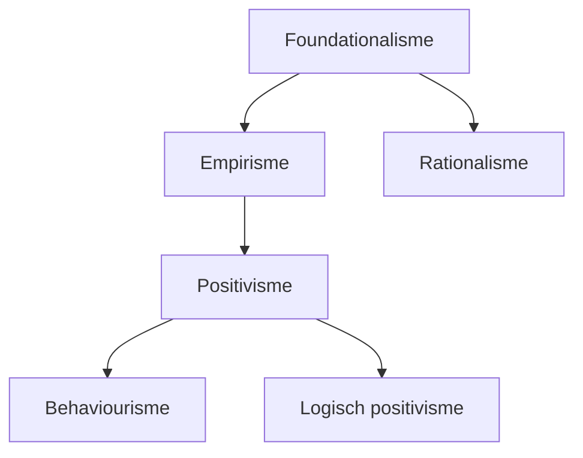
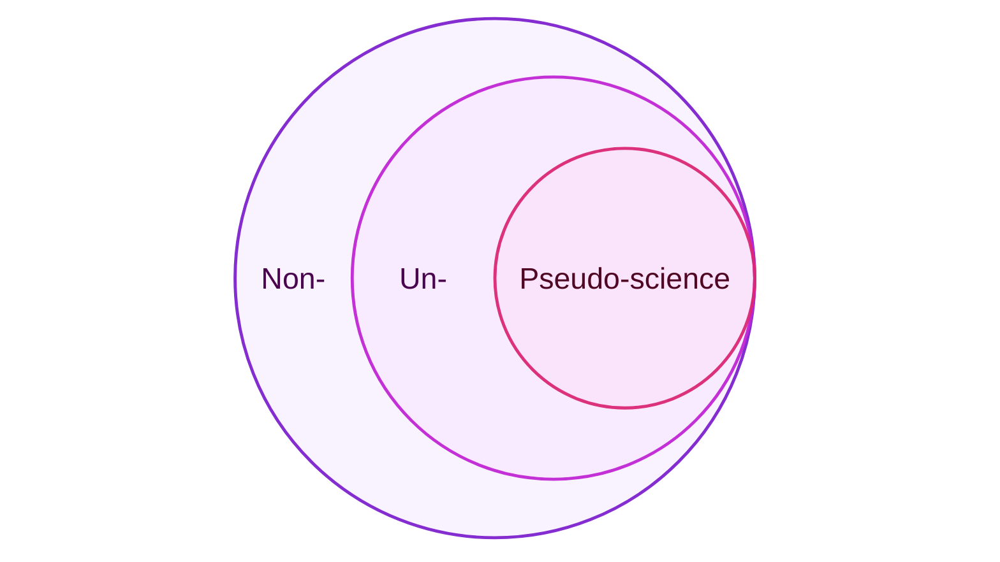

# Wetenschapsfilosofie

<!--
> Sociale wetenschappen kan worden onderverdeeld in twee stromingen:
>
> - **Gedragswetenschappen** kijken naar *individueel gedrag* van *individuen*.
> - **Maatschappijwetenschappen** kijken naar *sociaal gedrag* van *groepen*.
-->

Uitspraken over de aard of structuur van de werkelijkheid noemen we ontologisch. Ontologie is de *zijnsleer* ("studie van dingen die bestaan").

Uitspraken over wat kennis is en hoe kennis tot stand komt of wordt verkregen noemen we epistemologisch. Epistemologie is *kennisleer* ("studie van kennis").

## Paradigma's

Een **paradigma** is een groep wetenschappers met gedeelde opvattingen over wat wetenschap is en hoe het bedreven moet worden. Hieronder worden drie benaderingen toegelicht.

Vroeger was er spraken van een methodestrijd tussen de paradigma's. Tegenwoordig is de wetenschappelijke gemeenschap pragmatischer, en is het ook toegestaan om verschillende paradigma's te combineren. We noemen dit mixed methods.

### Emperisch-analytische benadering

De empirisch-analytische benandering komt voort uit de natuurwetenschappen. Herhaalbaarheid en controleerbaarheid staat centraal.

Kenmerken:

- **Empirisch**: gebaseerd op zintuigelijke waarnemingen.
- **Analytisch**: logisch opgebouwd uit goed-gedefineerde begrippen.

> Herhaalbaarheid is belangrijk voor betrouwbaarheid en waardevrijheid. Als verschillende wetenschappers tot dezelfde conclusies komen is de kans dat persoonlijke waarden meespelen kleiner. We noemen dit **subjectieve overeenstemming** of **intersubjectiviteit**.

<!-- We noemen dit soms ook reductionistich, omdat eenheden (zoals individuen, groepen, organisaties of samenlevingen) worden gereduceerd tot getallen.-->

<!--Er wordt gezocht naar **nomothetische kennis**: wetten die algemene regelmatigheden kunnen beschrijven, en onderzoek is **kwantitatief**.

Onderzoek moet **waardenvrij** zijn: er mogen geen persoonlijke voorkeuren, normen of waarden een rol spelen, en wordt daarom uitgevoerd in **derdepersoonsperspectief**: de onderzoeker mag alleen observeren, nooit participeren.-->

De favoriete methode van deze benadering is het experiment en de enquête.

### Interpretatieve benadering

De interpretatieve benadering komt voort uit ontevredenheid met de natuurwetenschappelijke benadering, waarbij vaak het mechanisme achter gevonden verbanden onduidelijk blijft. In de interpretatieve benadering staat het begrijpen van de sociale werkelijkheid centraal.

Kenmerken:

- **Empirisch**: gebaseerd op waarnemingen, maar deze zijn breder dan puur zintuigelijk.
- **Holistisch**: er wordt gekeken naar een individu of groep als geheel.

<!--Er wordt gezocht naar **ideografische kennis**: het doorgronden van individuele/unieke gevallen, en onderzoek is kwalitatief.-->

<!--
Er kunnen twee stromingen onderscheiden worden:

- **Hermeneutiek**: interpretatie van (geschreven) teksten, in het bijzonder van teksten op het gebied van literatuur, religie en recht.
- **Fenomenologie**: studie van wezenlijke verschijnselen.
-->

De favoriete methode van deze benadering is het kwalitatieve interview of de focusgroep.

### Kritisch-emancipatoire benadering

De kritisch-emancipatoire benadering komt voort uit de marxistische traditie en maatschappelijke betrokkenheid. De "bevrijding" (emancipatie) van sociale overheersing staat centraal.

Kenmerken:

- **Maatschappij-kritisch**: kritiek op onderdrukkende sociaal-maatschappelijke structuren.
- **Wetenschapskritisch**: standaardopvattingen van de wetenschap worden afgewezen.

De favoriete methode van deze bandering is handelings- of actieonderzoek. Dit is onderzoek waarbij onderzoekers en deelnemers samen een leerproces doormaken. Twee belangrijke kenmerken:

- **Empowerment**: onderzoek streeft ernaar de deelnemers verder te helpen. Vaak dienen deelnemers ook als medeonderzoekers en helpen zij bij het schrijven van de paper of het werven van andere deelnemers.

- **Wederkerige adequaatheid**: continu reflecteren en communiceren op het onderzoek door zowel onderzoekers als deelnemers.

| Benadering           | Soort kennis                                                                         | Type&nbsp;onderzoek | Perspectief onderzoeker                                                | Waarden                                      |
| -------------------- | ------------------------------------------------------------------------------------ | -------------- | ----------------------------------------------------------------------------- | ----------------------------------------------------------- |
| Empirisch-analytisch | **Nomothetisch**: het formuleren van wetten die algemene regelmatigheden beschrijven | Kwantitatief   | **3e persoon**: alleen van buitenaf observeren, nooit participeren | **Waardenvrij**: persoonlijke waarden mogen geen rol spelen en het onderzoek niet kleuren |
| Intepretatief | **Ideografisch**: individuele/unieke casussen doorgronden | Kwalitatief   | **1e persoon**: onderzoeker moet de wereld vanuit het perspectief van de deelnemers zien | **Waardenverheldering**: duidelijk zijn over eigen persoonlijke waarden die mogelijk het onderzoek kunnen kleuren |
| Kritisch-emancipatoir | ??? | ??? | ??? | **Waardengebonden**: waarden maken expliciet een deel uit van het onderzoek; niet alleen kennis leveren, maar ook een bepaald doel nastreven |

## Foundationalisme

Het foundationalisme is een visie van wetenschap die stelt dat kennis 'securely established' moet zijn op een 'secure foundation'. Er zijn een aantal stromingen:

Volgens het **empirisme** (Locke) bestaat de 'secure foundation' waarop wetenschap gebouwd wordt uit menselijke ervaringen via zintuigelijke waarnemingen.

<!--
> Belangrijke denker: Locke, met tabula rasa; ideeën komen voort uit ervaringen en moeten gerechtvaardigd worden aan de hand van ervaringen.
-->

Volgens het **rationalisme** (Descartes) bestaat de 'secure foundation' uit alles dat niet rationeel betwijfelbaar is, omdat zintuigen je kunnen bedriegen.

<!--
> Belangrijke denker: Descartes, twijfelexperiment en "Cogito, ergo sum" ("ik denk dus ik ben").
-->

### Positivisme

Het **positivisme** (Comte) is een methode van wetenschap gebaseerd op het empirisme, waarbij kennis voortkomt uit uitsluitend directe observaties en redeneringen gebaseerd op observaties.

Het **logisch positivisme** (Wiener Kreis) is een stroming van het positivisme, die stelt dat alle claims die niet geverifieerd kunnen worden aan de hand van observaties onwetenschappelijke en betekenisloze onzin (ookwel metafysica genoemd) zijn. We noemen dit het **verifieerbaarheidsprincipe** of de **toetsbaarheidseis**.

  
Begrippen die vaak met positivisme verward worden

  
Een punt of onderscheid dat gemaakt wordt door een positivist is niet automatisch positivistisch! Een aantal veelvoorkomende misconcepties:

  <ul>
    <li>
      

        <b>Context of discovery en context of justification</b>:
        Dit onderscheid is geen kenmerkende eigenschap van positivisme; niet alle positivisten maken dit onderscheid, en
        non-positivisten maken het onderscheid ook.
        <!--Logisch positivist Hans Reichenbach maakt voor het eerst onderscheid tussen de context
        waarin een ontdekking voor het eerst gedaan wordt en de context waarin deze uitgelegd
        en gevalideerd wordt als correcte bevinding. Echter maken non-positivisten (zoals Karl Popper)
        dit onderscheid ook.-->
      

    </li>
    <li>
      

        <b>Experimenten</b>: Deze methode is geen kenmerkende eigenschap van positivisme; niet alle positivisten maken gebruik van experimenten, en non-positivisten voeren ook experimenteel onderzoek uit. Het doen van experimenteel onderzoek maakt een onderzoeker niet automatisch positivistisch.
      

    </li>
    <li>
      

        <b>Statistiek</b>: Het gebruikmaken van statistiek is non-positivistisch, omdat het berust op het afleiden van effecten uit data die anders niet direct observeerbaar zouden zijn.
      

    </li>
    <li>
      

        <b>Realisme</b>: Realisme is een stroming die stelt dat er een onzichtbare "ultieme realiteit" bestaat die de fysieke en sociale werkelijkheid bepaalt. Dit is non-positivistisch, omdat er geen direct contact is met deze "ultieme realiteit", en deze dus niet direct observeerbaar is. (De "ultieme realiteit" wordt soms ook "metafysische realiteit" genoemd en dat zegt genoeg.)
      

    </li>
  </ul>

### Falsificationisme

Het **falsificationisme** (Popper) is gerelateerd aan positivisme. Het stelt dat een goede theorie te weerleggen is aan de hand van tegenstrijdig bewijs. Het is zijn antwoord op het inductie&shy;probleem (zie volgende sectie): wetenschap is volgens hem namelijk niet inductief; je toetst theorie niet ter bevestiging, maar om te pogen hem te verwerpen.

Voor het positivisme is falsifiseerbaarheid belangrijk omdat een niet-falsifiseerbare theorie niet toetsbaar is en daarmee de toetsbaarheidseis schendt.

### Problemen met foundationalisme

Empirisme en rationalisme zijn goede concepten, maar kunnen geen 'secure foundation' voor kennis zijn. Dit komt door zes problemen met het foundationalisme:

- **Relativiteit van rede**: wat onbetwijfelbaar en overduidelijk is hangt af van voorkennis, achtergrond, en intellectuele capaciteiten; wat overduidelijk is voor de één is totaal onduidelijk voor de ander.

- **Theorie-geladen perceptie**: percepties zijn niet neutraal: wat we waarnemen hangt af van voorkennis en verwachtingen; om bepaalde dingen op te merken ("dat was een goede/slimme move") is bepaalde voorkennis nodig.

- **Onderdeterminatie van theorie door feiten**: een bepaalde dataset is onvoldoende om de theorie volledig vast te stellen ('te determineren'); alternatieve theoriën bij dezelfde dataset zijn mogelijk.

- **Duhem-Quine these**: als observaties of metingen niet overeenkomen met de hypothese of theorie, kan dat betekenen dat de theorie niet (volledig) klopt, maar het kan ook simpel een foute of onnauwkeurige meting zijn.

- **Inductieprobleem** (Hume): er is geen manier om generaliseerbaarheid van observaties uit het verleden naar de toekomst te garanderen. Voorspellingen van toekomstige gebeurtenissen die je nog niet hebt kunnen observeren zijn zijn onzeker.

- **Sociaal karakter van wetenschap** (Kuhn): wetenschap vindt niet in isolatie plaats, maar in een gemeenschap met gedeelde overtuigingen (aka paradigma). De gemeenschap bepaalt welk onderzoek wel of niet wordt uitgevoerd, en of resultaten geaccepteerd worden.

## Post-positivisme

Postpositivisme is een vorm van **non-foundationalisme**: een stroming in de wetenschap die stelt dat 'secure foundations' waarop kennis kan worden gebouwd niet bestaan. Post-positivisme onderkent en accepteert dat mensen falen ("fallibilisme")

### Absolute waarheid & conjecturele kennis

Volgens de postpositivist bestaat er een "absolute waarheid", waarnaar de wetenschap zoekt. We noemen dit het 'regulatief ideaal'; ideaal, want de waarheid zal nooit door mensen ontdekt worden, omdat mensen biased, subjectief en irrationeel zijn. Het beste dat we kunnen doen is de waarheid *benaderen*, zoals een wiskundige limiet-functie.

We kunnen het woord "waarheid" vervangen met *warranted assertibility*; de waarheid is alles dat sterk genoeg onderbouwd is om naar te handelen.

We hebben geen "feiten", we hebben *warrants*: het meest overtuigende bewijs op een bepaald moment in tijd. Deze warrants volgen uit "competent inquiry": onderzoeksmethodes die op het moment beter zijn dan anderen (maar beter betekent niet "ideaal").

Kennis wordt gezien als conjectureel: voorlopig, en gebaseerd op incompleet bewijs, namelijk de sterkste (maar imperfecte) warrant die op een moment beschikbaar is. Warrants kunnen worden "ingetrokken" als er later sterke bewijs aan het licht komt.

Wetenschap wordt gezien als 'self-corrective', omdat herhaald onderzoek uiteindelijk vanzelf aantoont welke warrants wel of niet kloppen, en foute warrants vervangt met sterker bewijs.

  
Waarom iets geloven als de warrant later weer ingetrokken kan worden?

  
We moeten handelen naar <em>iets</em> in het leven. Opties zijn willekeur, traditie, of kennis. Het zou irrationeel om niet te handelen naar de "beste" (aka meest ondersteunde) kennis die op een moment beschikbaar is. Perfecte kennis heb je niet, en zal je nooit hebben. Je kunt niet meer doen dan handelen naar je beste weten van het moment, ook als in de toekomst betere kennis beschikbaar zal zijn.

### Gebrek aan autoritieve bronnen

Er zijn geen autoritieve bronnen binnen het postpositivisme. In plaats daarvan wordt elke knowledge claim hetzelfde behandeld: de warrant wordt geëvalueerd.

De voor/tegenstanders worden bekeken en afgewogen, en op basis daarvan wordt bepaald of de claim wel of niet aangenomen wordt. (Maar houdt er rekening mee dat dit later weer kan veranderen op basis van de sterkste warrants die dán beschikbaar zijn.)

> **Alleen het bewijs wordt geëvalueerd**, niet de persoon die de claim maakt. Dit onderscheidt postpositivisme van andere stromingen zoals sociaal constructivisme en postmodernisme.

### Relativisme

Relativisme stelt dat iedereen een "eigen waarheid" of "eigen realiteit" heeft, omdat ze andere afwegingen maken over warrants en daardoor andere claims geloven. Postpositivisme wordt soms verward met relativisme.

Echter, ondanks het feit dat postpositivisme stelt dat absolute waarheid onbereikbaar is, gaat het wel uit van één absolute waarheid, die benaderd wordt door (mogelijk foutieve) warrants. Tegenstrijdige claims kunnen niet allebei waar zijn, er kan er maar één overeenkomen met de absolute waarheid.

Het is ook belangrijk om onderscheid te maken tussen overtuigingen en waarheid. Een overtuiging is "alles waarnaar je bereid bent te handelen". Met andere woorden: een overtuiging is iets dat je als waarheid accepteert. Maar "voor waar aannemen" betekent niet dat het ook automatisch waar is.

<!--
Tenslotte is het belangrijk dat:

- Voor de meeste dingen geldt dat ze gewoon *zijn* (de wereld *bestaat*). De proposities die wij gebruiken om de wereld te beschrijven kunnen waar of onwaar zijn.

- Afhankelijk van perspectief kunnen meerdere proposities gelijktijdig waar zijn (denk "9" vs "6"), dus formulering is belangrijk.

- Elke situatie omvat ontelbaar veel waarheden; het grootste deel is echter op de meeste momenten irrelevant.
-->

### Objectiviteit tegenover waarheid

Objectiviteit is geen synoniem voor waarheid, ondanks het feit dat het vaak wel zo gebruikt wordt in literatuur. Waarheid is onbereikbaar; objectiviteit als tegenpool van "bias" of "subjectiviteit" is een label om bepaalde criteria van kwaliteit aan te duiden (aka competent inquiry).

> Met andere woorden: objectiviteit is de beste, maar toch mogelijk foutieve, observatie die je op een moment kan doen; waarheid is hoe het 'echt is', maar is onbereikbaar omdat je deze alleen via mogelijk foutieve observaties of metingen kan benaderen.

## Waarden in wetenschappelijk onderzoek

Volgens het positivisme moet onderzoek **waardeneutraal** of **waardevrij** zijn. Echter volgens sommigen is waardeneutraliteit in de wetenschap onmogelijk. Een aantal perspectieven:

### Weerlegde argumenten tegen waardeneutraliteit

<dl class="box">
  <dt>Argument</dt>
  <dd>Sociale wetenschappen onderzoekt waarden, en kan dus niet waardenneutraal zijn.</dd>
  <dt>Weerlegging</dt>
  <dd>De waarden zijn het onderwerp van onderzoek, zij beïnvloeden het onderzoek zelf niet. Het is mogelijk om de waarden van een ander objectief te onderzoeken.</dd>
</dl>

<dl class="box">
  <dt>Argument</dt>
  <dd>Sommige onderzoekers laten waarden of overtuigingen hun werk beïnvloeden, dus waardenneutraliteit bestaat niet.</dd>
  <dt>Weerlegging</dt>
  <dd>Soms is niet altijd; het feit dat het soms gebeurt betekent niet dat we het goedkeuren. En tenslotte komen we er vaak achter omdat latere wetenschapers wél waardeneutraal zijn.</dd>
</dl>

<dl class="box">
  <dt>Argument</dt>
  <dd>Waardeneutraliteit is onmogelijk omdat er diepgewortelde (culturele) waarden zijn ingebed in onze onderzoeksmethodes en denken, waardoor deze inherent biased zijn.<small style="display: block; padding-top: 1em">(Voorbeelden: marxisten &rarr; westerse waarden; feministen &rarr; mannelijke waarden)</small></dd>
  <dt>Weerlegging</dt>
  <dd>Allereerst is deze aanname niet getoetst, en onmogelijk te toetsen als al het onderzoek inherent biased is, zoals dit argument stelt. Daarnaast is er een filosofisch probleem: biased onderzoek kan niet bestaan als unbiased onderzoek niet ook mogelijk is.  Tenslotte kunnen vraagtekens gesteld worden bij het feit of cultureel bepaalde waarden een probleem vormen als deze de objectiviteit van het onderzoek niet in de weg zitten. Meer over interne en externe waarden in de volgende sectie.</dd>
</dl>

### Correcte argumenten tegen waardeneutraliteit

<dl class="box">
  <dt>Argument</dt>
  <dd>Waardeneutraliteit zelf is ook een waarde, dus wetenschap kan nooit waardeneutraal zijn; zelfs zonder alle andere waarden blijft deze over.</dd>
</dl>

<dl class="box">
  <dt>Argument</dt>
  <dd>De keuze van onderzoeksonderwerp is waardegebonden; er zijn oneindig veel mogelijke onderzoeken uit te voeren, de criteria voor wat te onderzoeken zijn gebaseerd op wat we als waardevol beschouwen.</dd>
</dl>

<dl class="box">
  <dt>Argument</dt>
  <dd>Het evalueren ("waarderen") van hypotheses, theorieën, data, of werk van anderen (in bijv. peer reviews) zijn gebaseerd op bepaalde waarden.</dd>
</dl>

### Interne en externe waarden

Het is duidelijk dat er wel degelijk bepaalde waarden een rol spelen in wetenschappelijk onderzoek. Volgens de postpositivist is dit niet erg. Om dit te begrijpen is het belangrijk verschillende soort waarden te onderscheiden:

- **Interne waarden** bepalen *hoe* je onderzoek doet.

  De interne waarden garanderen dat de interne werking van een onderzoek (argumentatie, gebruikte methodes, uitgevoerde analyses) objectief blijft, en maken wetenschap tot wat het is. Dit zijn de kernwaarden van de wetenschap, en mogen absoluut niet geschonden worden.

- **Externe waarden** bepalen *waarnaar* en *waarom* je onderzoek doet.

  De externe waarden mogen invloed hebben op het onderzoek, zolang de interne werking van het onderzoek gewaarborgd blijft.

> Interne waarden worden soms ookwel "cognitieve waarden" genoemd, als tegenhanger van "ethische waarden". Ethiek is belangrijk, maar geen kernwaarde van de wetenschap: onethisch maar objectief onderzoek is mogelijk.

  
Epistemologische relevantie

  Een ander onderscheid dat gemaakt kan worden, is dat van epistemologische relevantie. Een epistemologisch relevante waarde is <em>inhoudelijk</em>, en draagt bij aan kennisconstructie.

  
Rol van de gemeenschap

  In het postpositivisme wordt gemeenschap (openheid, discussie, peer review) als beschermende factor gezien; objectiviteit een product van het sociale karakter van de wetenschap.
  <blockquote>
Dit onderscheidt postpositivisme van positivisme, waar het sociale karakter van de wetenschap juist als slecht gezien werd, omdat het XXX.
</blockquote>

## Pseudowetenschap

### Demarcatie

Demarcatie ("grens") is het onderscheid maken tussen wetenschap en niet-wetenschap. Dit is belangrijk voor theoretische en praktische redenen:

- **Theoretisch**: vanuit een wetenschapfilosofische perspectief kan demarcatie ons kennis over de wetenschap zelf opleveren.

- **Praktisch**: voor besluitvormingsprocessen is de wetenschap onze meest waardevolle informatiebron. Foutieve informatie (waaronder niet-wetenschap) kan ernstige gevolgen hebben voor gezondheidszorg, klimaat, leefomgeving, onderwijs, journalisme, etc.

<!--

  
Andere demarcatieproblemen

  <ul>
    <li><b>Logisch positivisme</b> maakt onderscheid tussen wetenschap en metaphysics.</li>
    <li><b>Karl Popper</b> maakt onderscheid tussen empirische wetenschap en pure wetenschap of metaphysics. Later noemt herformuleert hij metaphysics als pseudo-science.</li>
  </ul>

-->

### Non-science, unscience en pseudo-science

Voordat we verder ingaan om pseudowetenschap, is het belangrijk een aantal definities op een rijtje te zetten:

- **Non-science** (niet-wetenschappelijk): alles dat niet onder de wetenschap valt. Hieronder vallen ook "onschuldige" domeinen, zoals praktijkkennis, vuistregels, religie, kunst etc.

- **Unscience** (onwetenschappelijk): alles dat de wetenschap tegenspreekt. Hieronder vallen o.a. biased onderzoek en pseudowetenschap. Dit is een subcategorie van non-science.

- **Pseudo-science** (pseudowetenschappelijk): alles dat de wetenschap tegenspreekt maar wel pretendeert wetenschappelijk te zijn. Dit is een subcategorie van unscience.

  
Is pseudowetenschap als begrip relevant?

  <dl>
    <dt>Vraag</dt>
    <dd>Is het niet voldoende om te zeggen "dit is fout", zonder het begrip pseudowetenschap te gebruiken?</dd>
    <dt>Uitleg</dt>
    <dd>Nee, want pseudowetenschap heeft ingebouwde "immuunstategieën" tegen kritiek en tegenbewijs, waardoor normale wetenschappelijke argumentatie ineffectief is om het te ontkrachten. Er is een andere aanpak nodig, en daarom is er behoefte aan een manier om pseudowetenschap te definiëren.</dd>
  </dl>

### Definities van pseudowetenschap

Er zijn een aantal definities van pseudowetenschap. De eerste bestaat uit twee componenten:

<ol class="phil">
  <li data-prime="">het is niet wetenschappelijk,</li>
  <li data-prime="">het pretendeert wel wetenschappelijk te zijn.</li>
</ol>

Deze definitie is te breed, omdat bijv. ook fraude zou voldoen, terwijl fraude normaliter *unscience* is, geen *pseudoscience*.

Een onderscheidend kenmerk van pseudowetenschap is dat van de *deviant doctrine* of ideologie. Geïsoleerde onwetenschap, zelfs opzettelijk en structureel, valt onder unscience. We noemen het pas pseudoscience bij doorlopende, substantiële pogingen tot het promoten van standpunten die algemeen geaccepteerde standpunten tegenspreken.

Daarom wordt component **(2)** vervangen met:

<ol class="phil" start="2">
  <li data-prime="′">het is onderdeel van een onwetenschappelijke doctrine die pretendeert wel wetenschappelijk te zijn.</li>
</ol>

Echter, in sommige gevallen wordt de term 'pseudowetenschap' ook gebruikt om doctrines te beschrijven die claimen de rol van wetenschap te vervullen ("meest betrouwbare kennisbron op een onderwerp zijn"), maar niet pretenderen wetenschappelijk te zijn.

Daarom kan een derde variant van component **(2)** geformuleerd worden:

<ol class="phil" start="2">
  <li data-prime="′′">het is onderdeel van een onwetenschappelijke doctrine die de indruk probeert te wekken de meest betrouwbare kennisbron op een onderwerp te zijn.</li>
</ol>

Definities **(1)**+**(2′)** en **(1)**+**(2′′)** worden afwisselend gebruikt. Vaak wordt pseudowetenschap gedefinieerd als **(1)** + **(2′)**, maar wordt de term vervolgens gebruikt als **(1)** + **(2′′)**.

De definities die tot nu toe gehanteerd zijn laten tijd buiten beschouwing. Volgens sommige filosofen is 'wetenschappelijkheid' niet tijdgebonden; wat vandaag wetenschappelijk is is morgen nog steeds wetenschappelijk. Echter, een essentiële eigenschap van wetenschap is voortgang en voortschrijdend inzicht, dus tijd speelt wel degelijk een rol.

Objectiviteit en wetenschappelijkheid zijn tijdsgebonden: handelen naar de beste kennis en methodes die *op een moment in tijd* beschikbaar zijn. De wetenschap van gisteren kan vandaag achterhaald zijn, maar dat maakt het niet onwetenschappelijk. Het voldeed immers aan de objectiviteitscriteria van het moment. Echter, dezelfde wetenschap vandaag uitgevoerd is wel onwetenschappelijk, aangezien de objectiviteitscriteria zijn veranderd.

Er is behoefte aan een tijdsgebonden variant van **(1)**, zoals:

<ol class="phil">
  <li data-prime="′">in strijd met de meest betrouwbare kennis over een onderwerp die op een tijdstip beschikbaar is.</li>
</ol>

<!-- Het onderscheidende verschil tussen wetenschapn en pseudowetenschap is dus hoe het omgaat met tegenstrijdig bewijs en weerlegging. -->

Een bijkomend voordeel van deze definitie is dat het oordeel over wetenschappelijkheid een inhoudelijke kwestie wordt, in plaats van een filosofisch probleem.

### Demarcatiecriteria

Het [**falsificationisme**](#falsificationisme) (Popper) kan worden gebruikt als demarcatiecriterium om wetenschap van pseudowetenschap te onderscheiden (of voor de logisch positivist: metafysica).

Echter, alleen falsificationisme is onvoldoende (Lakatos), omdat het berust op logica die los staat van feiten of inhoud; een theorie zonder enig bewijs kan wetenschappelijk zijn als hij falsifiseerbaar is, en een goed ondersteunde theorie kan pseudowetenschap zijn als deze niet falsifiseerbaar is.

> Nota bene, de meeste pseudowetenschappen zijn wél falsifiseerbaar, en ook volledig gefalsifiseerd. Hoe wordt omgegaan met tegenbewijs is veel belangrijker om wetenschap van pseudowetenschap te onderscheiden.

<!-- Een ander kritiekpunt op het  is dat het  -->

Het **puzzelcriterium** (Kuhn) stelt dat wetenschap wordt gekenmerkt door puzzelen. Het uit kritiek op het falsificationisme, omdat dat wetenschap typeert aan de hand van revoluties (waarin alles in één keer anders moet), en niet volgens het 'normale' iteratieve proces, dat als "puzzelen" wordt omschreven. <!-- Popper is het oneens omdat het demarcatie een sociologisch vraagstuk in plaats van rationeel probleem maakt. -->

Het **sophisticated (methodogical) falsificationisme** (Lakatos) is een aanpassing van het falsificationisme, dat volledige onderzoeksprogramma's toetst in plaats van individuele theorieën. Een programma is gefalsifiseerd en pseudowetenschappelijk als het degenererend is:

- **Progressief**: nieuwe voorspellingen worden empirisch bevestigd (data na hypotheses).
- **Degenererend**: alleen aanpassingen om problemen te verklaren (hypotheses na data).

<!--In een progressief onderzoeksprogramma zal een theorie steeds empirischer worden.-->

Het **progressiecriterium** (Thagard) voegt een extra criterium aan sophisticated falsificationisme toe: een onderzoeksprogramma is pseudowetenschappelijk als het degenererend is en de onderzoekers "weinig moeite doen om problemen op te lossen, geen interesse hebben in het evalueren van de theorie in relatie tot andere theorieën, en selectief zijn in het accepteren van bewijs en tegenbewijs."

> Het verschil is dus dat Lakatos een programma zonder progressie *altijd* pseudowetenschap vindt, en Thagard het alleen pseudowetenschap vindt als het met opzet degenererend is.

Het **eligibilitycriterium** (Rothbart) stelt dat de objectiviteitscriteria voor het toetsen van een theorie los staan van zogenaamde toetswaardigheidscriteria die bepalen of een theorie überhaupt wel getoetst moet worden. Pseudowetenschappelijke theorieën voldoen hier niet aan:

- De theorie moet een weerlegging van het succes van de rivaaltheorie hebben.
- De theorie moet toetsbare implicaties hebben die tegenstrijdig zijn met de rivaaltheorie.

Het **gemeenschapscriterium** (Bright & Heesen) stelt dat onderzoek wetenschappelijk is als het openlijk beschikbaar wordt gesteld aan de gemeenschap. Dit maakt commercieel, maar objectief onderzoek ook pseudowetenschap, en dit is met opzet.

  
Pseudowetenschappen in relatie tot reguliere wetenschap

  
Er zijn twee vormen van pseudowetenschap, die vooral verschillen in hoe ze de reguliere wetenschap benaderen en afbeelden:

  <ul>
    <li>
<b>Pseudo-theory promotion</b> probeert een eigen theorie te promoten, en presenteert vooral dat de reguliere wetenschap in overeenstemming is met de pseudo-theorie.
</li>
    <li>
<b>Science denialism</b> probeert een geaccepteerde theorie te bevechten, en presenteert vooral dat in de reguliere wetenschap geen consensus is, en creeërt daarmee een gat dat de pseudo-theorie kan vullen. <!--<small>(Voorbeelden zijn: holocaust denial, climate change denial, vaccination denial, evolution denial)</small>-->
</li>
  </ul>

  
Pseudowetenschappen als losse 'eilandjes'

  
Het woord "wetenschap" heeft twee betekenissen:

  <ul>
    <li><b>Individuated</b> ("een wetenschap"): werkveld/vakgebied; tak van kennis of studie.</li>
    <li><b>Unindividuated</b> ("de wetenschap"): begrip als geheel; collectie van wetenschappen.</li>
  </ul>
  
Wetenschappen<!-- (individuated)--> staan altijd met elkaar in verband (astrofysica, biochemie, etc.) en vormen een coherent geheel: de wetenschap<!-- (unindividuated)-->.

Pseudowetenschap is de tegenpool van individuated wetenschap (Reisch). Er zijn indivuele pseudowetenschappen, maar deze staan niet met elkaar, en ook niet met reguliere wetenschapsgebieden, in verband. Er is dan ook geen collectie "de pseudowetenschap".

  
Begrippen die gerelateerd zijn aan pseudowetenschap

  <ul>
    <li>
<b>Scepticisme</b>: Een term met drie relevante betekenissen:

      
<ul>
        <li><b>Philosophical scepticism</b> ('philosophical sceptics'): een filosofische methode, waarbij zaken die heel vanzelfsprekend lijken in twijfel getrokken worden. Nuttig om de justificatie van 'zekerheden' na te gaan.</li>
        <li><b>Scientific scepticism</b> ('science defenders'): kritisch zijn op aannames en fouten in wetenschappelijk onderzoek (bijv. in een peer review). Vooral gebruikt door organisaties of contexten die pseudowetenschap bevechten.</li>
        <li><b>Science denialism</b> ('science deniers'): oppositie van algemeen geaccepteerde standpunten of consensus van de reguliere wetenschap.</li>
      </ul>

    </li>
    <li>
<b>Feitenweerstand</b>: onbereidwilligheid om sterk onderbouwde feiten te accepteren. Een typisch kenmerk van pseudowetenschap, maar komt ook buiten de wetenschap voor.
</li>
    <li>
<b>Conspiracy theories</b>: heimelijke samenzwering met mysterieus of dubieus doel. Betreft implausibele theorieën om sociale fenomenen te verklaren, als alternatief voor een voor de hand liggende theorie die om welke reden dan ook niet geaccepteerd wordt door een groep. 
<!--
Ze zijn epistemologisch interessant omdat ze cirkelredeneringen bevatten waardoor tegenbewijs kan worden geinterpreteerd als bewijs <em>voor</em> de theorie.
--></li>
    <li>
<b>Bullshit</b>: een onwaarheid die geen vorm van liegen is. Liegen is het opzettelijk verspreiden van onwaarheden, met als doel een ander te misleiden. In het geval van bullshit boeit het de persoon die het zegt niet of het waar is of niet, omdat de communicatie een ander doel heeft dan informatieverstrekking (bijv. ragebaiten).
<!--
Pseudowetenschap wordt door sommige filosofen gezien als een vorm van bullshit, omdat het pseudowetenschappers vaak geen interesse hebben in objectieve waarheid (anders zou je geen data faken etc.)
--></li>
    <li>
<b>Epistemisch relativisme</b>: ontkenning van het regulatief ideaal, dat er één absolute of intersubjectieve waarheid is die wetenschap moet nastreven. Dit is vooral nuttig voor de kant met mindere credibiliteit of cognitieve autoriteit<!--, en maakt science denialism mogelijk-->.
</li>
  </ul>

# Geschiedenis van het onderwijs

## Oudheid

### China

In China ontstaat de eerste vorm van georganiseerd onderwijs waar we van weten. Er was grote invloed van Confucius. Volgens hem was inzet belangrijker dan afkomst (meritocratie), en had de leraar een voorbeeldfunctie. Morele vorming werd gedaan door het uit het hoofd leren en internaliseren van spreuken ("aforismen").

### Griekenland

Het Griekse onderwijs zou in twee onderwijsrichtingen kunnen worden ingedeeld:

- **Filosofische scholen**: nadruk op waarheid, kritisch denken, karaktervorming.
- **Retorische scholen**: nadruk op spreken, schrijven, overtuigen, burgerschap.

#### Sofisten (retorisch)

Sofisten waren de eerste rondreizende betaalde leraren in Griekenland. Volgens hen was onderwijs was belangrijk voor de maatschappij en het vormen van burgerschap. Hun onderwijs was een voorbereiding op politiek en bestuur, en de nadruk lag op retoriek, debat, en overtuigen.

> "Sofisterij" wordt nog steeds gebruikt als soort synoniem voor "schijn- of drogredenering", omdat het onderwijs van de sofisten puur gericht was op overtuigen, losstaand van rationaliteit.

Later was hun onderwijs opgedeeld in drie divisies:

- **Primair onderwijs**, waar lezen, schrijven, wiskunden en zang aangeleerd werden. De docent werd een *grammatist* genoemd.
- **Secondair onderwijs**, waar geometrie, tekenen, muziek, grammatica en retorica werden aangeleerd. De docent werd een *grammaticus* genoemd.
- **Hoger of universitair onderwijs** (literatuur geeft geen nadere beschrijving).

Isocrates (dat is een ander persoon dan Socrates!) was een sofist.

#### Socrates (filosofisch)

Socrates had kritiek op het onderwijs: volgens hem moet onderwijs zoeken naar de waarheid, en is kritisch nadenken belangrijk dan overtuigen en feitenreproductie. Hij vond dialoog de beste leermethode en doceerde aan de hand van conversatie, waarin hij leerlingen aanzette tot twijfel en zelfonderzoek. De docent was een daarbij gids, niet alleen kennisbron.

> We hebben geen werken van Socrates teruggevonden, maar zijn leerling Plato heeft wel veel over hem geschreven. Het blijft echter lastig om de historische Socrates te onderscheiden van Plato's literaire Socrates.

#### Plato (filosofisch)

Plato stelde dat de taak van onderwijs het herkennen en ontwikkelen van talent was, en zag het als een middel voor selectie van maatschappelijke rollen. Daarbij was talent belangrijker dan afkomst of geslacht (meritocratie). Hij vond dat vrouwen ook onderwijs moesten krijgen.

#### Sappho (filosofisch)

Sappho was een dichteres en oprichter van de eerste vormingsschool voor meisjes. Het onderwijs was gericht op poëzie, muziek en cultuur, en liet zien dat muziek niet per definitie militair en 'mannelijk' hoefde te zijn.

> Of de school daadwerkelijk heeft bestaan is overigens onzeker: er is geen overlevering van beschikbaar; de school is 'herontdekt' in de Renaissance.

#### Aristoteles (filosofisch)

Aristoteles vond dat onderwijs niet alleen kennisoverdracht moest bewerkstelligen, maar ook praktische wijsheden moest leren, en moest bijdragen aan karakterontwikkeling. Hij leerde moraliteit en deugd aan door gewoontevorming en oefening. Hierbij had de leraar een voorbeeldfunctie. Het onderwijs moest aansluiten op de ontwikkeling van het kind.

### Romeinen

De Romeinen nemen veel van de ideeën en cultuur van de Grieken over. Daaronder ook delen van het onderwijs.

#### Cicero

Cicero zag goed spreken als de kern van goed burgerschap, en stelde dat de ideale spreker ook ideaal moreel ontwikkeld zou zijn. In zeker zin verbind (of verward) hij daarmee taalvermogen en moraliteit. <!--(Een fout die we overigens in recente jaren ook vaak maken met LLMs.)-->

#### Quintilianus

Quintilianus schreef het de eerste systematische beschrijving van het onderwijs. Daarnaast vond hij dat onderwijs moest aansluiten op de ontwikkeling van het kind, dat leerlingen op eigen tempo moesten leren, was hij tegen harde lijfstraffen en benadrukte hij leren via discussie en een positieve relatie tussen docent en leerling.

### Christendom

Jezus gaf les aan de hand van verhalen en analogieën, zodat het toegankelijk (want je hoeft niet te lezen, en makkelijk doorgeven) en begrijpelijk (want makkelijk) was voor een bredere doelgroep. Zijn leer was voornamelijk gericht op morele vorming.

## Middeleeuwen

### Augustinus

Augustinus bekeerde zich op volwassen leeftijd tot het christendom en werd later bisschop van Hippo. Zijn grootste invloed is het verbinden van klassieke filosofie (vooral platonisme) met christelijk denken. Volgens hem volgt intellectutele ontwikkeling uit het bestuderen van klassieke geschriften.

### Alexander de Grootte

Alexander de Grootte bracht kennis over filosofie, wetenschap, taal, en literatuur samen in de bibliotheek van Alexandria. Dat werd het nieuwe intellectuele centrum van de wereld. Ze ontwikkelden wiskunde, geografie en wetenschap volgens de Atheense standaard. Echter verplaatste dit zich langzaam richting Constantinopel. In 640 ging de bibliotheek ten onder in een grote brand.

### Karel de Grote

Karel de Grote doet in de late middeleeuwen een poging tot het organiseren van het onderwijs. Er is een herwaardering van de klassieke kunsten. Het curriculum bestond uit de Vrije Kunsten, opgedeeld in twee delen:

- **Trivium** (basis, vooral taalgericht): grammatica, retorica, logica.
- **Quadrivium** (optioneel, meer wiskundig): rekenen, geometrie, astrologie, muziek.

In de steden ontstaan de eerste universiteit, waar vast aangestelde docenten verschillende opleidingen verzorgen voor studenten uit verschillende regio's. Verschillende steden hadden verschillende specialisaties. Na afronding van een examen ontvingen studenten een graad.

Boeken waren nog zeldzaam en erg duur om te produceren. De focus van het onderwijs was daarom het onthouden van feitenkennis, door veel herhaling ('rote learning') en verschillende geheugentechnieken.

## 16e en 17e eeuw

### Staatsvorm & onderwijsbeleid

Nederland heet nog de Republiek der Zeven Verenigde Nederlanden. Het is geen eenheidsstaat, maar een verzameling autonome gewesten. Er zijn daarom ook geen landelijk onderwijsbeleid, alleen lokale verorderingen, in te delen in drie soorten:

- **Gewestelijke verorderingen** die vooral algemene richtlijnen bevatten.
- **Stedelijke verorderingen** die vooral gericht waren op particulier onderwijs.
- **Plaatselijke verorderingen** vaak in de vorm van een arbeidsovereenkomst tussen het dorpsbestuur of de kerk en de schoolmeester.

> Plaatselijke en gewestelijke verordeningen leken wel sterk op elkaar<!-- (veel waren gebaseerd op  beslissingen gemaakt in de Synode van Dordrecht van 1619, een kerkvergadering tussen belangrijke stromingen van het Christendom in Nederland)-->, en er was in de gehele Republiek algemene consensus over de doelen en vormgeving van het onderwijs.

De rol van de overheid is erg klein. Er werd aan de ene kant weinig bemoeid met het onderwijs, en aan de andere kant ook weinig geld besteedt aan het onderwijs.

<!--Er waren twee soorten onderwijs: stads- en dorpsscholen werden door het lokaal bestuur  en de kerk georganiseerd en waren gebonden aan de lokale verordeningen. Daarnaast waren er ook particuliere schoolmeesters die onderwijs aanboden.-->

### Organisatie en inhoud van het onderwijs

Kerk, staat en onderwijs zijn sterk vervlochten. Het doel van het onderwijs is dan ook vooral godsdienstig. (Hoewel ouders hun kinderen vooral naar school stuurde om te leren lezen en schrijven.)

De vakken zijn godsdienst, lezen, schrijven, en in uitzonderlijke gevallen ook rekenen (maar vaak werden hiervoor extra kosten in rekening gebracht).

<!--
Hiervoor werd in de 16e eeuw en het begin van de 17e eeuw nog het vragenboekje van Marnix van Sint Aldejonde gebruikt, dat zich sterk afzette tegen het rooms-katholieke geloof en kinderen de "verwerpelijkheid" daarvan moest tonen. Gedurende de eeuw werd dit vervangen door een milder vragenboekje van Jacob Borstius.
-->

> Leesonderwijs is gericht op het lezen van de Bijbel; het is een middel voor het godsdienstige onderwijs. Het is ook geen basisvaardigheid zoals in het hedendaagse onderwijs, maar een einddoel opzich.
>
> Het leesonderwijs werd georganiseerd in vier fases:
> - Alfabet leren <small>(vaak meerdere keren in verschillende 'lettertypen')</small>
> - Spellen
> - Spellende lezen
> - Lezende lezen
>
> Pas als een leerling kon lezen mocht deze beginnen met schrijfonderwijs. Schrijven werd nog gezien als een "kunst", die ook niet voor iedereen was weggelegd. Het was belangrijker om mooi te kunnen schrijven dan om überhaupt te kunnen schrijven.

Het onderwijs moest voor iedereen toegankelijk zijn. Daarom is er een maximumbedrag voor schoolgeld, en was het onderwijs voor arme kinderen gratis. Ouders maken hier echter weinig gebruik van, omdat ze het inkomen uit de arbeid van hun kinderen niet kunnen missen, en lezen en schrijven hun positie op de arbeidsmarkt ook niet versterkt.

Het schoolgaan was onregelmatig. Er was geen leerplicht en ouders hielden hun kinderen vaak thuis als er behoefte was aan extra arbeidskrachten. Daarnaast werd schoolgeld per week of per maand betaald, en werd het volledige bedrag gerekend, ook als een kind die periode maar de school maar één keer bezocht had. Daarom hielden ouders, een kind dat al één dag gemist had, vaak de rest van de periode ook thuis.

De verhouding jongens op meiden was ongeveer gelijk, maar meiden leerden minder lang door en hadden over het algemeen meer verzuim omdat er op hen vaker een beroep werd gedaan voor huishoudelijke taken en oppas.

De onderwijsvorm van de tijd was hoofdelijk onderwijs. Dat hield in dat alle leerlingen zelfstandig en op eigen tempo de stof doorwerkten, en zo af en toe overhoord werden door de meester. Het klaslokaal (een eenvoudige, slecht verlichte ruimte) was hier ook op ingericht: er zijn geen vaste plaatsen, en leerlingen zitten of lopen door elkaar, jongens en meiden gemengd.

> Dit was beide volgens de verordeningen niet de bedoeling, maar door het onregelmatige schoolgaan en meubilair van de tijd waren vaste plekken moeilijk te realiseren.

De meester is het centrale figuur. Hij zit midden in de ruimte op een verhoogde lessenaar, waar hij goed overzicht kan houden over de leerlingen. Hij wordt waar nodig (vooral in steden met grotere klassen) ondersteund door zijn vrouw, een ondermeester, of oudere leerlingen.

<!--
Deze vorm van onderwijs was chaotisch, maar volgens de literatuur waren de resultaten "bevredigend".
-->

### Het beroep schoolmeester <small>(ookwel 'schoolhouder')</small>

<!-- Een school werd beheerd door één schoolmeester (ookwel 'schoolhouder'). -->

Er was geen opleiding om schoolmeester te worden en er waren ook geen bekwaamheidseisen, behalve in een paar steden waren een examen afgelegd moest worden. De enige eisen die gesteld werden waren op godsdienstig gebied, en werden gesteld door de kerk: hervormde gezindheid, bij voorkeur lidmaatschap aan een hervormde kerk, godsvrucht en een goede levenswandel. In sommige steden was ervaring als ondermeester wel nodig, waarbij bepaalde leermeesters hoger gewaardeerd werden dan anderen. Er was geen minimumleeftijd om meester te worden (behalve in Dordrecht, daar moest je 25 zijn), maar een leeftijd van 18-20 jaar was gebruikelijk. Ondermeesters begonnen vaak rond ongeveer 12-16 jaar.

In dorpen werden schoolmeesters door de kerk en het dorpsbestuur samen benoemd. Een aanstelling was voor het leven, en bij wangedrag volgde zelden ontslag, omdat de meester dan in de bijstand ("diakonie") terecht zou komen, en dat was duur.

Het inkomen van de schoolmeester was het schoolgeld, dat wekelijks of maandelijks door ouders betaald werd. Hij was zelf verantwoordelijk dit te innen. Daarnaast kregen meesters vaak nog een toelage van de kerk of het dorpsbestuur, en konden ze bijverdienen door het aanbieden van extra diensten, zoals ganzenveren snijden of schrijfvoorbeelden maken.

> Omdat het grootste deel van het inkomen van een schoolmeester direct bij de ouders vandaan kwam, speelden ouders ook een grote rol in het 17e-eeuwse onderwijs.

Het salaris was dusdanig laag dat een meester vaak genoodzaakt was tot nevenwerkzaamheden, zoals ambachten, administratieven functies of een kerkfunctie. (Hiervoor was vaak wel een praktijkexamen nodig.)

Een schoolmeester had geen recht op pensioen, maar kon er wel lief om vragen. Het pensioen was vaak erg laag, en in veel gevallen werd het ingehouden op het salaris van de opvolger.<!-- VRAAG: hoe werkt dat als het salaris uit schoolgeld komt?? --> Weduwen kregen niks.

De meester mocht kinderen straffen naar eigen inzicht. Veelvoorkomende straffen waren een pak slaag (met de plak of roe), opsluiting in de kast en vernedering. <!--(Straffen zoals extra huiswerk, nablijven of strafregels konden toen nog niet gebruikt wordt.)--> <!--Eigenlijk was de enige regel dat schoolmeesters kinderen niet tot bloedens toe mochten slaan.--> De meester was geacht "streng maar vaderlijk" op te treden en moest 'ontzachelijk' zijn: gezag hebben maar tevens spaarzaam omgaan met de plak en roe. De uiterste straf die een meester kon opleggen was een kind van school sturen, maar dat was echt een noodmaatregel, omdat het direct verlies van inkomen voor de meester betekende.

  
Schoolvrouwen

  Het was in principe niet toegestaan voor vrouwen om een dorps- of stadsschool te houden. Echter, soms werd een school gehouden door een man en vrouw samen, of zette een weduwe de school van haar overleden man voort. Daarnaast was in veel dorpen de hulp van de vrouw van de schoolmeester onmisbaar. Eenvoudige particuliere Nederduitse scholen waren wel toegestaan.

### Schooltijden

De school was zes uur per dag open. Op het midden van de dag hadden kinderen twee uur pauze, waarin ze eventueel naar huis kunnen gaan. School begint aanvankelijk om 6:00 of 7:00, maar dit werd gedurende de eeuw steeds later. <!-- Het was bij hoofdelijk onderwijs minder storend als kinderen te laat kwamen. -->

Er waren aanvankelijk ook geen schoolvakanties, maar deze worden later wel ingevoerd en worden ook steeds langer. De vakantie is vooral voor de meester bedoeld; kinderen konden immers elk moment thuisblijven, want de leerplicht was bestond nog niet

Er was geen structuur in het schooljaar. Er was geen eerste of laatste schooldag, er waren geen klassen of overgangen. Iedere leerling had een eigen leerproces, en ging verder waar hij of zij gebleven was. Er was vaak wel sprake van een zomer- en winterseizoen, met aangepaste schooltijden. 

> In de zomer ging de school soms dicht, omdat alle leerlingen dan aan het werk waren op het land. Dit was volgens verorderingen overigens wel verboden.<!-- (En ook om op rooms-katholieke feestdagen de school te sluiten; basically om de katholieken na de reformatie nog een beetje te pesten.)-->

De woensdag- of zaterdagmiddag waren vaak gedeeltelijk vrij. Op zaterdagochtend werd meestal het lokaal opgeruimd, waarna de kerkdienst van zondag alvast werd voorbereid.

### Schooltoezicht

De scholen werden gecontrolleerd door door de zogenaamde "scholarchen", een overblijfsel uit de middeleeuwen. Scholarchen kwamen vaak uit de kerk of het lokale bestuur. Ook werden bepaalde  taken werden gedelegeerd aan de schoolmeestersgilde.

- Bijscholen werden door het schoolmeestersgilde gecontrolleerd.
- Stads- en dorpsscholen werden door de schoolarchen gecontrolleerd.

Het was de bedoeling dat zij de scholen onaangekondigd bezochten. In de praktijk waren bezoeken echter vrijwel altijd aangekondigd (meestal bij prijsuitrijkingen of examens) en goed voorbereidt door de school.<!-- VRAAG: ik dacht dat er geen toetsen waren??-->

Naast hun functie als toezichthouder, losten ze ook verschillende geschillen op tussen schoolhouders en ouders en schoolhouders onderling, en handhaafde ze overige regels uit de verorderingen, zoals bijv. de numerus clausus op de hoeveelheid schoolmeesters in een stad.

> Zoals misschien te verwachten is, was de schoolmeestersgilde over het algemeen strenger in het handhaven van de numerus clausus dan de scholarchen.

Naast de scholarchen en meestersgildes, werden scholen ook bezocht door afgevaardigde van de kerk, in de jaarlijkse visitatie.

### Schoolsoorten

In de middeleeuwen ontstaat de grote school, met een onder- en bovenbouw. In de 16e  eeuw wordt deze opgesplitst in twee schoolsoorten:

- **Nederduitse scholen** (voormalig onderbouw): dorps-, stads- en particuliere scholen waar in het Nederlands lezen en schrijven geleerd wordt.
- **Latijnse scholen** (voormalig bovenbouw): stadsschool waar in het Latijns onderwijs wordt gegeven in verschillende vakken.

Daarnaast kan ook onderscheid gemaakt worden op basis van de financiëring van de school:

- **Stads- en dorpsscholen** worden door de overheid en kerk verzorgd, en waren gebonden aan de regels uit plaatselijke verorderingen, zoals het maximum schoolgeld.
- **Particuliere scholen** worden door zelfstandige ondernemers verzorgd. Vooral in de steden waren de verordeningen gericht op het reguleren van particuliere schoolhouders en hun onderlinge concurrentie (numerus clausus, verbod op overnemen van leerlingen met schulden bij een ander, etc.)

Tussen verschillende scholen bestonden grote verschillen in leeftijd, niveau, aantal leerlingen, schoolgeld, en voorzieningen.

  
Bewaarscholen

  Een ander type "school" was de bewaarschool, een soort primitieve vorm van kinderopvang. Er werd hier geen onderwijs aangeboden.

### Latijnse school

Onder invloed van humanistische beweging in de Renaissance krijgt het onderwijs op Latijnse scholen een grotere focus op cultuur. De nadruk verschuift van het "verloederde" middeleeuwse Latijn dat nog in gebruik was, naar het klassieke Latijn van de oudheid. Daarnaast wordt Grieks geïntroduceerd als bijvak, om het Latijn beter te kunnen begrijpen.

Echter, de verschillen tussen verschillende Latijnse scholen lopen teveel uiteen. Daarom besluit Holland tot het invoeren van de 'schoolorde', die bepaalt welke vakken gegeven worden, hoe het lesrooster eruit ziet, en welke kennis leerlingen aan het einde moeten hebben. Friesland had al in de vorige eeuw een dergelijke verordening opgesteld.

Hieronder staat kort samengevat hoe de schoolorde er ongeveer uitzag (de literatuur was niet heel duidelijk dus dit is het beste dat ik kon doen, sorry):

<table class="t1">
  <thead>
    <tr>
      <th>Vak</th>
      <th>jaar 1 (klas 6)</th>
      <th>jaar 2 (klas 5)</th>
      <th>jaar 3 (klas 4)</th>
      <th>jaar 4 (klas 3)</th>
      <th>jaar 5 (klas 2)</th>
      <th>jaar 6 (klas 1)</th>
    </tr>
  </thead>
  <tbody>
    <tr>
      <th>Calligrafie / schrijven</th>
      <td>6</td>
      <td>4</td>
      <td>4</td>
      <td>4</td>
      <td>facultatief</td>
      <td>facultatief</td>
    </tr>
    <tr>
      <th>Godsdienst</th>
      <td>2</td>
      <td>2 <small>(?)</small></td>
      <td>2 <small>(?)</small></td>
      <td>?</td>
      <td>?</td>
      <td>?</td>
    </tr>
    <tr>
      <th>Latijn</th>
      <td>24</td>
      <td>26</td>
      <td>20</td>
      <td>?</td>
      <td>?</td>
      <td>?</td>
    </tr>
    <tr>
      <td>waarvan grammatica</td>
      <td>24</td>
      <td>6</td>
      <td>?</td>
      <td>?</td>
      <td>?</td>
      <td>?</td>
    </tr>
    <tr>
      <td>waarvan woordenschat</td>
      <td>–</td>
      <td>2</td>
      <td>?</td>
      <td>?</td>
      <td>?</td>
      <td>?</td>
    </tr>
    <tr>
      <td>waarvan lezen</td>
      <td>–</td>
      <td>8</td>
      <td>?</td>
      <td>?</td>
      <td>?</td>
      <td>?</td>
    </tr>
    <tr>
      <td>waarvan oefenen</td>
      <td>–</td>
      <td>6</td>
      <td>?</td>
      <td>?</td>
      <td>?</td>
      <td>?</td>
    </tr>
    <tr>
      <td>waarvan repetities</td>
      <td>–</td>
      <td>2</td>
      <td>?</td>
      <td>?</td>
      <td>?</td>
      <td>?</td>
    </tr>
    <tr>
      <td>waarvan disputen</td>
      <td>–</td>
      <td>2</td>
      <td>?</td>
      <td>?</td>
      <td>?</td>
      <td>?</td>
    </tr>
    <tr>
      <th>Grieks</th>
      <td>–</td>
      <td>–</td>
      <td>4</td>
      <td>2</td>
      <td>2</td>
      <td>2</td>
    </tr>
    <tr>
      <td>waarvan grammatica</td>
      <td>–</td>
      <td>–</td>
      <td>4</td>
      <td>2</td>
      <td>2</td>
      <td>2</td>
    </tr>
    <tr>
      <td>waarvan schrift</td>
      <td>–</td>
      <td>bij calligrafie</td>
      <td>–</td>
      <td>–</td>
      <td>–</td>
      <td>–</td>
    </tr>
    <tr>
      <th>Frans</th>
      <td>?</td>
      <td>?</td>
      <td>?</td>
      <td>?</td>
      <td>?</td>
      <td>?</td>
    </tr>
    <tr>
      <th>Logica &amp; retorica</th>
      <td>–</td>
      <td>–</td>
      <td>–</td>
      <td>?</td>
      <td>?</td>
      <td>?</td>
    </tr>
    <tr>
      <th>Muziek</th>
      <td>–</td>
      <td>–</td>
      <td>–</td>
      <td>–</td>
      <td>facultatief</td>
      <td>facultatief</td>
    </tr>
    <tr>
      <th>Wiskunde / rekenen</th>
      <td>?</td>
      <td>?</td>
      <td>?</td>
      <td>?</td>
      <td>?</td>
      <td>?</td>
    </tr>
    <tr>
      <th>Aardrijkskunde</th>
      <td>?</td>
      <td>?</td>
      <td>?</td>
      <td>?</td>
      <td>?</td>
      <td>?</td>
    </tr>
    <tr>
      <th>Geschiedenis</th>
      <td>?</td>
      <td>?</td>
      <td>?</td>
      <td>?</td>
      <td>?</td>
      <td>?</td>
    </tr>
    <tr>
      <th>Totaal lesuren</th>
      <td colspan="5">32 uur/week</td>
      <td>24 uur/week</td>
    </tr>
  </tbody>
</table>

## 18e eeuw

### Verlichting

De 18e eeuw is de tijd van de Verlichting ziet de opkomst van het rationalisme. Men gaat het onderwijs zien als een oplossing voor armoede, en onderwijs krijgt een pedagogisch karakter. Opvoeding zou leiden tot betere, verstandigere mensen, en iedereen moest hier toegang toe hebben. Het kind was hierbij het uitgangspunt (niet meer behandeld als een mini-volwassene).

Filosofen en pedagogen uit deze tijd willen kerk en onderwijs scheiden, en streven intellectuele emancipatie na als doel van het onderwijs. Echter is hun werk sterk gericht op kinderen uit betere standen. De hervormingen die ze voorstellen zijn in Nederland niet doorgevoerd; de focus van onderwijsvernieuwingen lag op voorlopig op onderwijs voor de massa's.

  
Piëtisme

  Een andere stroming die ook van belang is is het Piëtisme, een stroming van het protestantse geloof uit Duitsland die zorg en opvoeding voor alle mensen stimuleerde. De Verlichting en het Piëtisme hadden een fundamenteel anders mensbeeld (Piëtisme: mens is zondig; Verlichting: mens is goed), maar geloofde beide in de opvoedbaarheid van de mens.

### Inhoud van het onderwijs

Inhoudelijk zijn er ook een aantal veranderingen: er is meer behoefte aan mensen die kunnen lezen, schrijven en rekenen. Geletterdheid wordt hoger gewaardeerd en gezien als een manier om hogerop te klimmen in de maatschappij. Nieuwe vakken zoals aardrijkskunde, geschiedenis en natuurkunde komen op. (Al had natuurkunde een andere focus dan tegenwoordig; 'kennis van de natuur' is een betere beschrijving.)

Het Frans begint het Latijn te vervangen als internationale taal, maar het Latijn blijft voorlopig nog de wetenschappelijke taal en het toegangskaartje tot de universiteit. De school begint ook steeds meer taken op zich te nemen die voorheen in de thuissfeer geleerd werden.

### Schoolsoorten

Schoolvormen die gedurende de voorgaande eeuw ontstonden worden dominanter:

- **Armenscholen**: het was aanvankelijk de bedoeling dat arme kinderen de reguliere stads- en dorpsscholen zouden bezoeken. Echter, meesters hadden dit liever niet, omdat arme kinderen minder geld opbrachten (vaststaand jaarlijks bedrag van de kerk, geen schoolgeld per leerling), en ze het risico liepen betalende leerlingen te verliezen als er teveel armen kwamen. Daarom werden in veel steden armenscholen gesticht.

  De populatie van een armenschool bestond uit twee groepen: werkende kinderen maakte gebruik van de avond- of zondagsschool, kinderen die nog te jong waren om te werken maakte gebruik van de dagsschool.

<!--
- **Weeshuizen**: in weeshuizen kregen kinderen les van de huisvader. In grotere weeshuizen werd soms een aparte meester aangetrokken. Kinderen mochten pas weg als ze met een ambacht in hun levensonderhoud konden voorzien.
-->

- **Fabrieksscholen** en **spinscholen**: scholen gesticht op initiatief van fabriekanten, om de kinderen van hun werknemers op te leiden. Op deze scholen werd school gecombineerd met werken. Een aantal ging falliet omdat er weinig belangstelling was, en er verlies werd gedraait op de productie.

- **Franse scholen**: elke school waar Frans werd onderwezen was in principe een 'Franse school', maar er was ook onderscheid te maken:

  - **Frans-en-Duitse school**: een reguliere Nederduitse school waar ook Frans werd onderwezen als (extra) vak. Het onderwijs zelf wordt aangeboden in het Nederlands. Jongens en meiden zijn gemengd. Dit type school werd hoger gewaardeerd dan andere Nederduitse scholen.

  - **'Echte' Franse school**: een nieuwe klasse school waar het onderwijs volledig in het Frans aangeboden wordt, vaak in meer vakken. Er zijn aparte scholen voor jongens en meiden. Dit type school werd hoger gewaardeerd dan de Frans-en-Duitse scholen.

  Nieuwe vakken die worden aangeboden (afhankelijk van de capaciteiten van de meester) waren onder andere wiskunde, boekhouden, sterrenkunde, tekenen, aardrijskunde, geschiedenis, navigatie, extra talen zoals Hoogduits en Engels, en muziek en dans (door een externe docent).

  <!--Meiden hadden minder technische vakken en meer creatieve en huishoudelijke vakken.-->

- **Konstscholen** (of hoger beroepsonderwijs): leidt op tot technische beroepen. Hiervoor was vaak kennis van Frans als voorkennis nodig, maar het onderwijs werd aangeboden in het Nederlands.

  Er waren een groot aantal verschillende soorten, zoals de rij- en schermscholen ("ruiteracademies"), kweekscholen, militaire scholen, klinische scholen enzovoort.

- **Fundaties van Renswoude**: speciale scholen, gesticht met de erfenis van Maria Duyst van Voorhout, waar (een kleine groep van ~12) begaafde jongens werden opgeleid in tekenen, wiskunde en andere technische vakken. Een doorbraak, omdat voor het eerst kwalitatief goed onderwijs beschikbaar kwam voor de benedenlaag van de bevolking.

### Latijnse school

Na de bloei in de eerste helft van de 17e eeuw kwam de Latijnse school in verval terecht (de teruggang begon al rond 1650). De relevantie van het Latijn in dagelijks gebruik neemt verder af door de opkomst van het Frans. In de 17e eeuw kon men nog eventueel zonder Frans, maar niet zonder Latijn, in de 18e eeuw is dat andersom.

Er zijn nog maar weinig leerlingen, maar steden houden het instituut in leven vanwege de prestige.

> Een andere verandering is dat vanaf de 18e eeuw de nummering van klassen omgedraaid wordt naar de nummering die we tegenwoordig nog steeds gebruiken: 1 voor de eerste klas en 6 voor de laatste.

<!--
Industrialisatie kwam in Nederland pas laat op gang, door een gebrek aan infrastructuur, natuurlijke hulpbronnen, en onvoldoende bereidwilligheid voor investeringen.

Het eind van de 18e eeuw wordt ookwel 'Zeitalter des Pauperismus' genoemd, maar in Nederland was de situatie niet erg extreem. De bevolking kon voldoen in dagelijks onderhoud, en op het platteland was weinig sprake van werkloosheid, afgezien van seizoensgebonden werkloosheid in de winter. Alleen in de steden kwam echter armoede voor.
-->

## 19e eeuw

### Staatsvorm & onderwijsbeleid

Door de Bataafse Revolutie ontstond de Bataafse Republiek, een eenheidsstaat met een centrale regering in Den Haag. Kerk en staat waren officieel gescheiden. Onderwijs werd een kernpunt van het nieuwe nationale beleid, met de doelstelling het opleiden tot maatschappelijke en christelijke deugden.

Hiertoe werd een bewindsman aangesteld: de Agent van Nationale Opvoeding.

  
De Instructie

  
De Agent van Nationale Opvoeding kreeg een uitgebreide beschrijving van zijn takenpakket, genaamd de 'Instructie'. Hierin stond onder andere:

  <ul>
    <li>Zorgen dat iedereen naar school kan en gaat.</li>
    <li>Het samenstellen van een (niet te controversiële) boekenlijst.</li>
    <li>Opstellen en implementeren van bekwaamheidseisen.</li>
    <li>Ontwikkelen van nieuw benoemingsbeleid voor onderwijzers.</li>
  </ul>
  
Er werd daarnaast ook expliciet opgedragen tot een landelijk onderzoek naar schoolresultaten: de eerste landelijke onderwijsenquête.

Aan het begin van de 19e eeuw worden drie wetten doorgevoerd, in 1801, 1803, en 1806. De wetten van 1803 en 1806 waren nodig naar aanleiding van grondswetswijzigingen, maar hebben verder weinig inhoudelijke wijzigingen.

### Organisatie van het onderwijs

In navolging van de wet van 1806 wordt onderwijs een verantwoordelijkheid van de overheid, niet van de kerk. Leerstellig onderwijs wordt verboden: er moet onderwijs worden gegeven 'in de christelijke geest', maar godsdienst mag alleen voorkomen waar relevant voor geschiedenis of opvoeding.

Klassikaal onderwijs vervangt het hoofdelijke onderwijs. De school wordt opgedeeld in drie klassen, op basis van het niveau, met overgangen via een examen. Ook de methodes van het onderwijs veranderen: verklaren, in plaats van stampen. Lijfstraffen worden in het landelijke van 1820 verboden.

Het verzorgen van schoolgebouwen wordt een verantwoordelijkheid van stads- en gemeentebesturen. De gebouwen hoefden niet mooi te zijn, maar er waren wel eisen in verband met medische zijde: voldoende ruimte, lucht en licht konden ziekte voorkomen.

De inrichting van het klaslokaal veranderd ook: 

### Schooltoezicht

### Het beroep van schoolmeester

Het onderwijs van de voorgaande eeuw was van lage kwaliteit door slecht benoemingsbeleid en (financiële) onderwaardering. Daarom komen er bekwaamheidseisen aan het beroep, zijn een toelatingsakte en bewijs van goed gedrag nodig om aangesteld te kunnen worden, en komt er recht op een toereikend inkomen, verzorgd door de lokale overheden.

Er werden vier soorten aktes uitgegeven, van oplopend niveau:

| Rang | Eisen | Aantal uitgegeven |
|--|--|--|
| Vierde rang | Lezen, schrijven en rekenen | 762 |
| Derde rang | Ook kennis van de Nederlandse taal | 704 |
| Tweede rang | Ook aardrijkskunde en geschiedenis | 439 |
| Eerste rang | Alleen in uitzonderlijke gevallen | 12 |

Om een akte te behalen moesten onderwijzers een examen afleggen. Dit examen koste de staat niks, omdat het werd afgenomen door de lokale schoolopzieners.

> De Hervormde Kerk bleef echter een grote invloed hebben op het onderwijs, op twee manieren. Allereest was een groot deel van de onderwijsopziers tevens predikant; ze waren niet in die hoedanigheid gekozen, maar omdat ze bekend stonden als aanhangers van onderwijsvernieuwing. Daarnaast bleven veel onderwijzers een kerkelijke functie aanhouden, en werden zij daarom gecontrolleerd door predikanten, ook wat het onderwijs betreft.

### Schoolsoorten

De wet van 1806 introduceert geen nieuwe schoolsoorten, maar geeft een indeling aan de scholen die voorheen al bestonden:

- **Openbare scholen** worden gefinancierd door de overheid.

- **Bijzonder scholen** worden gefinancierd door particulieren.
  - Eerste klasse: diaconieën, weeshuizen, nutscholen.
  - Tweede klasse: particuliere onderwijzers, inkomsten uit schoolgeld.

<!--
De sociale en politieke structuur van de samenleving was opgedeeld in drie standen:

- De adel
- Burgerij
  - 'gezeten' burgerij, zoals kooplieden, fabrikanten, notarissen, hoge ambtenaren
  - 'eenvoudige' burgerij, zoals ambachtslieden, neringdoenden, lagere ambtenaren, onderwijzers

Voorstel van G.C.C. V atebender: nationaal onderwijs voor iedereen:
- 6-12 jaar (M) / 6-10 jaar (F): opvoedingsinstituut
- paar jaar middelbare 'Franse' school
- jongens naar vakopleiding/ambacht, of Latijse school + uni
  meisjes naar voortgezette meisjesschool tot 14/15 jaar
Te radicaal plan, er werd gezocht naar bijsturing ipv omwenteling; anders gaat de machtsstructuur van de maatschappij kapot.
--->

## Bijlage 1: Complete tijdlijn

## Bijlage 2: Onderwijsdenkers

  
John Locke

  Een bekende filosoof uit deze tijd is John Locke. <!-- Hij stelt dat een mens alles aan zijn opvoeding te danken heeft.--> Volgens hem wordt een mens geboren als onbeschreven blad, en maakt opvoeding hem pas tot volwaarlijk mens<!--, en bepaald daarmee zijn betekenis als mens en bruikbaarheid voor de samenleving-->. De omgeving is dus belangrijker dan <!-- genetische--> aanleg.

  
Jean Jacques Rousseau

  Een andere filosoof uit deze tijd is Jean Jacques Rousseau. Hij stelt dat kinderen van nature nieuwsgierig en goed zijn, en dat opvoeding die nieuwsgierigheid moet koesteren en prikkelen. Hij ziet boeken en straffen als negatieve invloeden en legt nadruk op de voorbeeldfunctie van de leraar.
  <!--
Als je Jean Jacques Rousseau vergelijkt met andere filosofen van de tijd, is een onderscheid tussen hem en bijvoorbeeld John Locke en Mary Wollstonecraft, dat Jean Jacques Rousseau XXX.
-->

  
Mary Wollstonecraft

  
Johann Heinrich Pestalozzi

  Een onderwijsdenker die klassikaal lesgeven introduceert. Hij benadrukt het belang van een individuele aanpak en afstemming op gezinssituatie.

  
Johann Friedrich Herbart

  
Friedrich Fröbel

## Bijlage 3: Boekenoverzicht

# Geschiedenis van de onderwijswetenschappen
