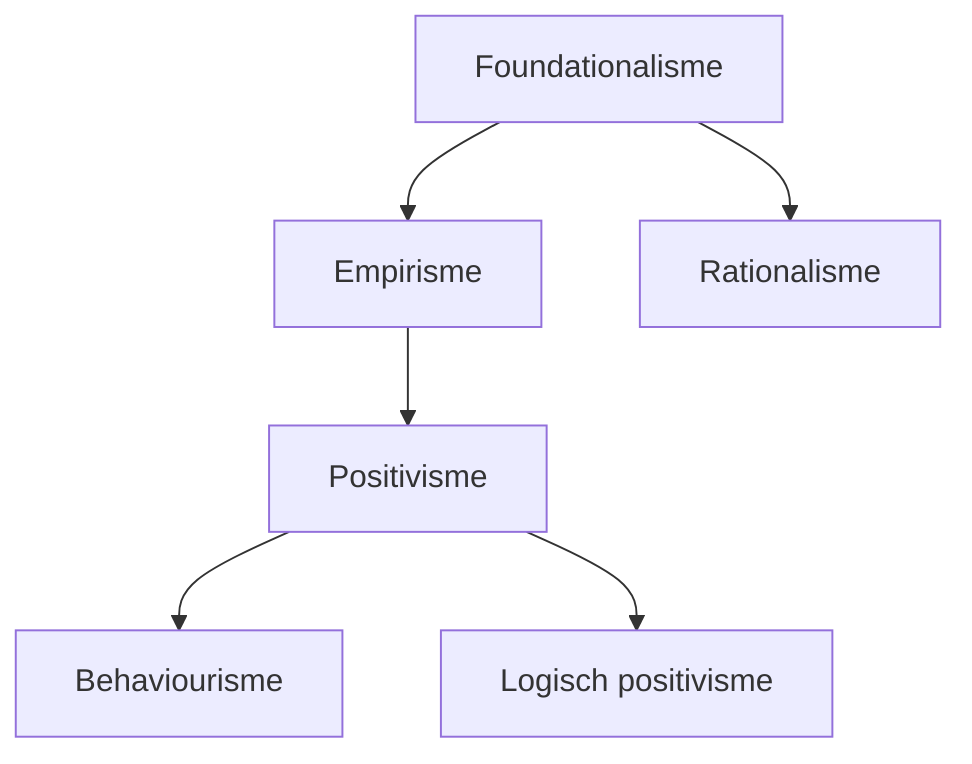
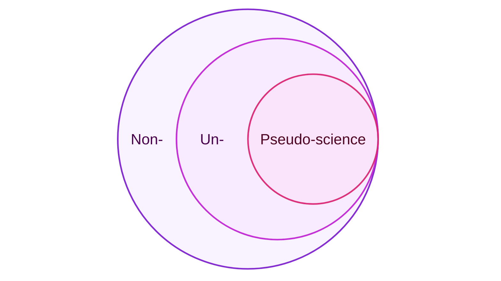

# Wetenschapsfilosofie

> Sociale wetenschappen kan worden onderverdeeld in twee stromingen:
>
> - **Gedragswetenschappen** kijken naar _individueel gedrag_ van _individuen_.
> - **Maatschappijwetenschappen** kijken naar _sociaal gedrag_ van _groepen_.

Uitspraken over de aard of structuur van de werkelijkheid noemen we ontologisch. Ontologie is de _zijnsleer_ ("studie van dingen die bestaan").

Uitspraken over wat kennis is en hoe kennis tot stand komt of wordt verkregen noemen we epistemologisch. Epistemologie is _kennisleer_ ("studie van kennis").

## Paradigma's

Een **paradigma** is een groep wetenschappers met gedeelde opvattingen over wat wetenschap is en hoe het bedreven moet worden. Hieronder worden drie benaderingen toegelicht.

Vroeger was er spraken van een methodestrijd tussen de paradigma's. Tegenwoordig is de wetenschappelijke gemeenschap pragmatischer, en is het ook toegestaan om verschillende paradigma's te combineren. We noemen dit mixed methods.

### Emperisch-analytische benadering

De empirisch-analytische benandering komt voort uit de natuurwetenschappen. Herhaalbaarheid en controleerbaarheid staat centraal.

Kenmerken:

- **Empirisch**: gebaseerd op zintuigelijke waarnemingen.
- **Analytisch**: logisch opgebouwd uit goed-gedefineerde begrippen.

> Herhaalbaarheid is belangrijk voor betrouwbaarheid en waardevrijheid. Als verschillende wetenschappers tot dezelfde conclusies komen is de kans dat persoonlijke waarden meespelen kleiner. We noemen dit **subjectieve overeenstemming** of **intersubjectiviteit**.

<!-- We noemen dit soms ook reductionistich, omdat eenheden (zoals individuen, groepen, organisaties of samenlevingen) worden gereduceerd tot getallen.-->

<!--Er wordt gezocht naar **nomothetische kennis**: wetten die algemene regelmatigheden kunnen beschrijven, en onderzoek is **kwantitatief**.

Onderzoek moet **waardenvrij** zijn: er mogen geen persoonlijke voorkeuren, normen of waarden een rol spelen, en wordt daarom uitgevoerd in **derdepersoonsperspectief**: de onderzoeker mag alleen observeren, nooit participeren.-->

De favoriete methode van deze benadering is het experiment en de enquête.

### Interpretatieve benadering

De interpretatieve benadering komt voort uit ontevredenheid met de natuurwetenschappelijke benadering, waarbij vaak het mechanisme achter gevonden verbanden onduidelijk blijft. In de interpretatieve benadering staat het begrijpen van de sociale werkelijkheid centraal.

Kenmerken:

- **Empirisch**: gebaseerd op waarnemingen, maar deze zijn breder dan puur zintuigelijk.
- **Holistisch**: er wordt gekeken naar een individu of groep als geheel.

<!--Er wordt gezocht naar **ideografische kennis**: het doorgronden van individuele/unieke gevallen, en onderzoek is kwalitatief.-->

<!--
Er kunnen twee stromingen onderscheiden worden:

- **Hermeneutiek**: interpretatie van (geschreven) teksten, in het bijzonder van teksten op het gebied van literatuur, religie en recht.
- **Fenomenologie**: studie van wezenlijke verschijnselen.
-->

De favoriete methode van deze benadering is het kwalitatieve interview of de focusgroep.

### Kritisch-emancipatoire benadering

De kritisch-emancipatoire benadering komt voort uit de marxistische traditie en maatschappelijke betrokkenheid. De "bevrijding" (emancipatie) van sociale overheersing staat centraal.

Kenmerken:

- **Maatschappij-kritisch**: kritiek op onderdrukkende sociaal-maatschappelijke structuren.
- **Wetenschapskritisch**: standaardopvattingen van de wetenschap worden afgewezen.

De favoriete methode van deze bandering is handelings- of actieonderzoek. Dit is onderzoek waarbij onderzoekers en deelnemers samen een leerproces doormaken. Twee belangrijke kenmerken:

- **Empowerment**: onderzoek streeft ernaar de deelnemers verder te helpen. Vaak dienen deelnemers ook als medeonderzoekers en helpen zij bij het schrijven van de paper of het werven van andere deelnemers.

- **Wederkerige adequaatheid**: continu reflecteren en communiceren op het onderzoek door zowel onderzoekers als deelnemers.

| Benadering           | Soort kennis                                                                         | Type&nbsp;onderzoek | Perspectief onderzoeker                                                | Waarden                                      |
| -------------------- | ------------------------------------------------------------------------------------ | -------------- | ----------------------------------------------------------------------------- | ----------------------------------------------------------- |
| Empirisch-analytisch | **Nomothetisch**: het formuleren van wetten die algemene regelmatigheden beschrijven | Kwantitatief   | **3e persoon**: alleen van buitenaf observeren, nooit participeren | **Waardenvrij**: persoonlijke waarden mogen geen rol spelen en het onderzoek niet kleuren |
| Intepretatief | **Ideografisch**: individuele/unieke casussen doorgronden | Kwalitatief   | **1e persoon**: onderzoeker moet de wereld vanuit het perspectief van de deelnemers zien | **Waardenverheldering**: duidelijk zijn over eigen persoonlijke waarden die mogelijk het onderzoek kunnen kleuren |
| Kritisch-emancipatoir | ??? | ??? | ??? | **Waardengebonden**: waarden maken expliciet een deel uit van het onderzoek; niet alleen kennis leveren, maar ook een bepaald doel nastreven |

## Foundationalisme

Het foundationalisme is een visie van wetenschap die stelt dat kennis 'securely established' moet zijn op een 'secure foundation'. Er zijn een aantal stromingen:

Volgens het **empirisme** (Locke) bestaat de 'secure foundation' waarop wetenschap gebouwd wordt uit menselijke ervaringen via zintuigelijke waarnemingen.

<!--
> Belangrijke denker: Locke, met tabula rasa; ideeën komen voort uit ervaringen en moeten gerechtvaardigd worden aan de hand van ervaringen.
-->

Volgens het **rationalisme** (Descartes) bestaat de 'secure foundation' uit alles dat niet rationeel betwijfelbaar is, omdat zintuigen je kunnen bedriegen.

<!--
> Belangrijke denker: Descartes, twijfelexperiment en "Cogito, ergo sum" ("ik denk dus ik ben").
-->

### Positivisme

Het **positivisme** (Comte) is een methode van wetenschap gebaseerd op het empirisme, waarbij kennis voortkomt uit uitsluitend directe observaties en redeneringen gebaseerd op observaties.

Het **logisch positivisme** (Wiener Kreis) is een stroming van het positivisme, die stelt dat alle claims die niet geverifieerd kunnen worden aan de hand van observaties onwetenschappelijke en betekenisloze onzin (ookwel metafysica genoemd) zijn. We noemen dit het **verifieerbaarheidsprincipe** of de **toetsbaarheidseis**.

  
Begrippen die vaak met positivisme verward worden

  
Een punt of onderscheid dat gemaakt wordt door een positivist is niet automatisch positivistisch! Een aantal veelvoorkomende misconcepties:

  <ul>
    <li>
      

        <b>Context of discovery en context of justification</b>:
        Dit onderscheid is geen kenmerkende eigenschap van positivisme; niet alle positivisten maken dit onderscheid, en
        non-positivisten maken het onderscheid ook.
        <!--Logisch positivist Hans Reichenbach maakt voor het eerst onderscheid tussen de context
        waarin een ontdekking voor het eerst gedaan wordt en de context waarin deze uitgelegd
        en gevalideerd wordt als correcte bevinding. Echter maken non-positivisten (zoals Karl Popper)
        dit onderscheid ook.-->
      

    </li>
    <li>
      

        <b>Experimenten</b>: Deze methode is geen kenmerkende eigenschap van positivisme; niet alle positivisten maken gebruik van experimenten, en non-positivisten voeren ook experimenteel onderzoek uit. Het doen van experimenteel onderzoek maakt een onderzoeker niet automatisch positivistisch.
      

    </li>
    <li>
      

        <b>Statistiek</b>: Het gebruikmaken van statistiek is non-positivistisch, omdat het berust op het afleiden van effecten uit data die anders niet direct observeerbaar zouden zijn.
      

    </li>
    <li>
      

        <b>Realisme</b>: Realisme is een stroming die stelt dat er een onzichtbare "ultieme realiteit" bestaat die de fysieke en sociale werkelijkheid bepaalt. Dit is non-positivistisch, omdat er geen direct contact is met deze "ultieme realiteit", en deze dus niet direct observeerbaar is. (De "ultieme realiteit" wordt soms ook "metafysische realiteit" genoemd en dat zegt genoeg.)
      

    </li>
  </ul>

### Falsificationisme

Het **falsificationisme** (Popper) is gerelateerd aan positivisme. Het stelt dat een goede theorie te weerleggen is aan de hand van tegenstrijdig bewijs. Het is zijn antwoord op het inductie&shy;probleem (zie volgende sectie): wetenschap is volgens hem namelijk niet inductief; je toetst theorie niet ter bevestiging, maar om te pogen hem te verwerpen.

Voor het positivisme is falsifiseerbaarheid belangrijk omdat een niet-falsifiseerbare theorie niet toetsbaar is en daarmee de toetsbaarheidseis schendt.

### Problemen met foundationalisme

Empirisme en rationalisme zijn goede concepten, maar kunnen geen 'secure foundation' voor kennis zijn. Dit komt door zes problemen met het foundationalisme:

- **Relativiteit van rede**: wat onbetwijfelbaar en overduidelijk is hangt af van voorkennis, achtergrond, en intellectuele capaciteiten; wat overduidelijk is voor de één is totaal onduidelijk voor de ander.

- **Theorie-geladen perceptie**: percepties zijn niet neutraal: wat we waarnemen hangt af van voorkennis en verwachtingen; om bepaalde dingen op te merken ("dat was een goede/slimme move") is bepaalde voorkennis nodig.

- **Onderdeterminatie van theorie door feiten**: een bepaalde dataset is onvoldoende om de theorie volledig vast te stellen ('te determineren'); alternatieve theoriën bij dezelfde dataset zijn mogelijk.

- **Duhem-Quine these**: als observaties of metingen niet overeenkomen met de hypothese of theorie, kan dat betekenen dat de theorie niet (volledig) klopt, maar het kan ook simpel een foute of onnauwkeurige meting zijn.

- **Inductieprobleem** (Hume): er is geen manier om generaliseerbaarheid van observaties uit het verleden naar de toekomst te garanderen. Voorspellingen van toekomstige gebeurtenissen die je nog niet hebt kunnen observeren zijn zijn onzeker.

- **Sociaal karakter van wetenschap** (Kuhn): wetenschap vindt niet in isolatie plaats, maar in een gemeenschap met gedeelde overtuigingen (aka paradigma). De gemeenschap bepaalt welk onderzoek wel of niet wordt uitgevoerd, en of resultaten geaccepteerd worden.

## Post-positivisme

Postpositivisme is een vorm van **non-foundationalisme**: een stroming in de wetenschap die stelt dat 'secure foundations' waarop kennis kan worden gebouwd niet bestaan. Post-positivisme onderkent en accepteert dat mensen falen ("fallibilisme")

### Absolute waarheid & conjecturele kennis

Volgens de postpositivist bestaat er een "absolute waarheid", maar zal die nooit door mensen ontdekt worden omdat mensen biased, subjectief en irrationeel zijn. Het beste dat we kunnen doen is de waarheid *benaderen*, zoals een wiskundige limiet-functie.

We kunnen het woord "waarheid" vervangen met *warranted assertibility*; de waarheid is alles dat sterk genoeg onderbouwd is om naar te handelen.

We hebben geen "feiten", we hebben *warrants*: het meest overtuigende bewijs op een bepaald moment in tijd. Deze warrants volgen uit "competent inquiry": onderzoeksmethodes die op het moment beter zijn dan anderen (maar beter betekent niet "ideaal").

Kennis wordt gezien als conjectureel: voorlopig, en gebaseerd op incompleet bewijs, namelijk de sterkste (maar imperfecte) warrant die op een moment beschikbaar is. Warrants kunnen worden "ingetrokken" als er later sterke bewijs aan het licht komt.

  
Waarom iets geloven als de warrant later weer ingetrokken kan worden?

  
We moeten handelen naar <em>iets</em> in het leven. Opties zijn willekeur, traditie, of kennis. Het zou irrationeel om niet te handelen naar de "beste" (aka meest ondersteunde) kennis die op een moment beschikbaar is. Perfecte kennis heb je niet, en zal je nooit hebben. Je kunt niet meer doen dan handelen naar je beste weten van het moment, ook als in de toekomst betere kennis beschikbaar zal zijn.

### Gebrek aan autoritieve bronnen

Er zijn geen autoritieve bronnen binnen het postpositivisme. In plaats daarvan wordt elke knowledge claim hetzelfde behandeld: de warrant wordt geëvalueerd.

De voor/tegenstanders worden bekeken en afgewogen, en op basis daarvan wordt bepaald of de claim wel of niet aangenomen wordt. (Maar houdt er rekening mee dat dit later weer kan veranderen op basis van de sterkste warrants die dán beschikbaar zijn.)

> **Alleen het bewijs wordt geëvalueerd**, niet de persoon die de claim maakt. Dit onderscheidt postpositivisme van andere stromingen zoals sociaal constructivisme en postmodernisme.

### Relativisme

Relativisme stelt dat iedereen een "eigen waarheid" of "eigen realiteit" heeft, omdat ze andere afwegingen maken over warrants en daardoor andere claims geloven. Postpositivisme wordt soms verward met relativisme.

Echter, ondanks het feit dat positivisme stelt dat absolute waarheid onbereikbaar is, gaat het wel uit van één absolute waarheid, die benaderd wordt door (mogelijk foutieve) warrants. Tegenstrijdige claims kunnen niet allebei waar zijn, er kan er maar één overeenkomen met de absolute waarheid.

Het is ook belangrijk om onderscheid te maken tussen overtuigingen en waarheid. Een overtuiging is "alles waarnaar je bereid bent te handelen". Met andere woorden: een overtuiging is iets dat je als waarheid accepteert. Maar "voor waar aannemen" betekent niet dat het automatisch waar is.

<!--
Tenslotte is het belangrijk dat:

- Voor de meeste dingen geldt dat ze gewoon *zijn* (de wereld *bestaat*). De proposities die wij gebruiken om de wereld te beschrijven kunnen waar of onwaar zijn.

- Afhankelijk van perspectief kunnen meerdere proposities gelijktijdig waar zijn (denk "9" vs "6"), dus formulering is belangrijk.

- Elke situatie omvat ontelbaar veel waarheden; het grootste deel is echter op de meeste momenten irrelevant.
-->

### Objectiviteit tegenover waarheid

Objectiviteit is geen synoniem voor waarheid, ondanks het feit dat het vaak wel zo gebruikt wordt in literatuur. Waarheid is onbereikbaar; objectiviteit als tegenpool van "bias" of "subjectiviteit" is een label om bepaalde criteria van kwaliteit aan te duiden (aka competent inquiry).

> Met andere woorden: objectiviteit is de beste, maar toch mogelijk foutieve, observatie die je op een moment kan doen; waarheid is hoe het 'echt is'.

## Waarden in wetenschappelijk onderzoek

Volgens het positivisme moet onderzoek **waardeneutraal** of **waardevrij** zijn. Echter volgens sommigen is waardeneutraliteit in de wetenschap onmogelijk. Een aantal perspectieven:

### Weerlegde argumenten tegen waardeneutraliteit

<dl class="box">
  <dt>Argument</dt>
  <dd>Sociale wetenschappen onderzoekt waarden, en kan dus niet waardenneutraal zijn.</dd>
  <dt>Weerlegging</dt>
  <dd>De waarden zijn het onderwerp van onderzoek, zij beïnvloeden het onderzoek zelf niet. Het is mogelijk om de waarden van een ander objectief te onderzoeken.</dd>
</dl>

<dl class="box">
  <dt>Argument</dt>
  <dd>Sommige onderzoekers laten waarden of overtuigingen hun werk beïnvloeden, dus waardenneutraliteit bestaat niet.</dd>
  <dt>Weerlegging</dt>
  <dd>Soms is niet altijd; het feit dat het soms gebeurt betekent niet dat we het goedkeuren. En tenslotte komen we er vaak achter omdat latere wetenschapers wél waardeneutraal zijn.</dd>
</dl>

<dl class="box">
  <dt>Argument</dt>
  <dd>Waardeneutraliteit is onmogelijk omdat er diepgewortelde (culturele) waarden zijn ingebed in onze onderzoeksmethodes en denken, waardoor deze inherent biased zijn.<small style="display: block; padding-top: 1em">(Voorbeelden: marxisten &rarr; westerse waarden; feministen &rarr; mannelijke waarden)</small></dd>
  <dt>Weerlegging</dt>
  <dd>Allereerst is deze aanname niet getoetst, en onmogelijk te toetsen als al het onderzoek inherent biased is, zoals dit argument stelt. Daarnaast is er een filosofisch probleem: biased onderzoek kan niet bestaan als unbiased onderzoek niet ook mogelijk is.  Tenslotte kunnen vraagtekens gesteld worden bij het feit of cultureel bepaalde waarden een probleem vormen als deze de objectiviteit van het onderzoek niet in de weg zitten. Meer over interne en externe waarden in de volgende sectie.</dd>
</dl>

### Correcte argumenten tegen waardeneutraliteit

<dl class="box">
  <dt>Argument</dt>
  <dd>Waardeneutraliteit zelf is ook een waarde, dus wetenschap kan nooit waardeneutraal zijn; zelfs zonder alle andere waarden blijft deze over.</dd>
</dl>

<dl class="box">
  <dt>Argument</dt>
  <dd>De keuze van onderzoeksonderwerp is waardegebonden; er zijn oneindig veel mogelijke onderzoeken uit te voeren, de criteria voor wat te onderzoeken zijn gebaseerd op wat we als waardevol beschouwen.</dd>
</dl>

<dl class="box">
  <dt>Argument</dt>
  <dd>Het evalueren ("waarderen") van hypotheses, theorieën, data, of werk van anderen (in bijvoorbeeld peer reviews) zijn gebaseerd op bepaalde waarden.</dd>
</dl>

### Interne en externe waarden

Het is duidelijk dat er wel degelijk bepaalde waarden een rol spelen in wetenschappelijk onderzoek. Volgens de postpositivist is dit niet erg. Om dit te begrijpen is het belangrijk verschillende soort waarden te onderscheiden:

- **Interne waarden** bepalen *hoe* je onderzoek doet.

  De interne waarden garanderen dat de interne werking van een onderzoek (argumentatie, gebruikte methodes, uitgevoerde analyses) objectief blijft, en maken wetenschap tot wat het is. Dit zijn de kernwaarden van de wetenschap, en mogen absoluut niet geschonden worden.

- **Externe waarden** bepalen *waarnaar* en *waarom* je onderzoek doet.

  De externe waarden mogen invloed hebben op het onderzoek, zolang de interne werking van het onderzoek gewaarborgd blijft.

> Interne waarden worden soms ookwel "cognitieve waarden" genoemd, als tegenhanger van "ethische waarden". Ethiek is belangrijk, maar geen kernwaarde van de wetenschap: onethisch maar objectief onderzoek is mogelijk.

  
Epistemologische relevantie

  Een ander onderscheid dat gemaakt kan worden, is dat van epistemologische relevantie. Een epistemologisch relevante waarde is <em>inhoudelijk</em>, en draagt bij aan kennisconstructie.

  
Rol van de gemeenschap

  In het postpositivisme wordt gemeenschap (openheid, discussie, peer review) als beschermende factor gezien; objectiviteit een product van het sociale karakter van de wetenschap.
  <blockquote>
Dit onderscheidt postpositivisme van positivisme, waar het sociale karakter van de wetenschap juist als slecht gezien werd, omdat het XXX.
</blockquote>

## Pseudowetenschap

### Demarcatie

Demarcatie ("grens") is het onderscheid maken tussen wetenschap en niet-wetenschap. Dit is belangrijk voor theoretische en praktische redenen:

- **Theoretisch**: vanuit een wetenschapfilosofische perspectief kan demarcatie ons kennis over de wetenschap zelf opleveren.

- **Praktisch**: voor besluitvormingsprocessen is de wetenschap onze meest waardevolle informatiebron. Foutieve informatie (waaronder niet-wetenschap) kan ernstige gevolgen hebben voor gezondheidszorg, klimaat, leefomgeving, onderwijs, journalisme, etc.

<!--

  
Andere demarcatieproblemen

  <ul>
    <li><b>Logisch positivisme</b> maakt onderscheid tussen wetenschap en metaphysics.</li>
    <li><b>Karl Popper</b> maakt onderscheid tussen empirische wetenschap en pure wetenschap of metaphysics. Later noemt herformuleert hij metaphysics als pseudo-science.</li>
  </ul>

-->

### Non-science, unscience en pseudo-science

Voordat we verder ingaan om pseudowetenschap, is het belangrijk een aantal definities op een rijtje te zetten:

- **Non-science** (niet-wetenschappelijk): alles dat niet onder de wetenschap valt. Hieronder vallen ook "onschuldige" domeinen, zoals praktijkkennis, vuistregels, religie, kunst etc.

- **Unscience** (onwetenschappelijk): alles dat de wetenschap tegenspreekt. Hieronder vallen o.a. biased onderzoek en pseudowetenschap. Dit is een subcategorie van non-science.

- **Pseudo-science** (pseudowetenschappelijk): alles dat de wetenschap tegenspreekt maar wel pretendeert wetenschappelijk te zijn. Dit is een subcategorie van unscience.

  
Is pseudowetenschap als begrip relevant?

  <dl>
    <dt>Vraag</dt>
    <dd>Is het niet voldoende om te zeggen "dit is fout", zonder het begrip pseudowetenschap te gebruiken?</dd>
    <dt>Uitleg</dt>
    <dd>Nee, want pseudowetenschap heeft ingebouwde "immuunstategieën" tegen kritiek en tegenbewijs, waardoor normale wetenschappelijke argumentatie ineffectief is om het te ontkrachten. Er is een andere aanpak nodig, en daarom is er behoefte aan een manier om pseudowetenschap te definiëren.</dd>
  </dl>

### Definities van pseudowetenschap

Er zijn een aantal definities van pseudowetenschap. De eerste bestaat uit twee componenten:

<ol class="phil">
  <li data-prime="">het is niet wetenschappelijk,</li>
  <li data-prime="">het pretendeert wel wetenschappelijk te zijn.</li>
</ol>

Deze definitie is te breed, omdat bijvoorbeeld ook fraude zou voldoen, terwijl fraude normaliter *unscience* is, geen *pseudoscience*.

Een onderscheidend kenmerk van pseudowetenschap is dat van de *deviant doctrine* of ideologie. Geïsoleerde onwetenschap, zelfs opzettelijk en structureel, valt onder unscience. We noemen het pas pseudoscience bij doorlopende, substantiële pogingen tot het promoten van standpunten die algemeen geaccepteerde standpunten tegenspreken.

Daarom wordt component **(2)** vervangen met:

<ol class="phil" start="2">
  <li data-prime="′">het is onderdeel van een onwetenschappelijke doctrine die pretendeert wel wetenschappelijk te zijn.</li>
</ol>

Echter, in sommige gevallen wordt de term 'pseudowetenschap' ook gebruikt om doctrines te beschrijven die claimen de rol van wetenschap te vervullen ("meest betrouwbare kennisbron op een onderwerp zijn"), maar niet pretenderen wetenschappelijk te zijn.

Daarom kan een derde variant van component **(2)** geformuleerd worden:

<ol class="phil" start="2">
  <li data-prime="′′">het is onderdeel van een onwetenschappelijke doctrine die de indruk probeert te wekken de meest betrouwbare kennisbron op een onderwerp te zijn.</li>
</ol>

Definities **(1)**+**(2′)** en **(1)**+**(2′′)** worden afwisselend gebruikt. Vaak wordt pseudowetenschap gedefinieerd als **(1)** + **(2′)**, maar wordt de term vervolgens gebruikt als **(1)** + **(2′′)**.

De definities die tot nu toe gehanteerd zijn laten tijd buiten beschouwing. Volgens sommige filosofen is 'wetenschappelijkheid' niet tijdgebonden; wat vandaag wetenschappelijk is is morgen nog steeds wetenschappelijk. Echter, een essentiële eigenschap van wetenschap is voortgang en voortschrijdend inzicht, dus tijd speelt wel degelijk een rol.

Objectiviteit en wetenschappelijkheid zijn tijdsgebonden: handelen naar de beste kennis en methodes die *op een moment in tijd* beschikbaar zijn. De wetenschap van gisteren kan vandaag achterhaald zijn, maar dat maakt het niet onwetenschappelijk. Het voldeed immers aan de objectiviteitscriteria van het moment. Echter, dezelfde wetenschap vandaag uitgevoerd is wel onwetenschappelijk, aangezien de objectiviteitscriteria zijn veranderd.

Er is behoefte aan een tijdsgebonden variant van **(1)**, zoals:

<ol class="phil">
  <li data-prime="′">in strijd met de meest betrouwbare kennis over een onderwerp die op een tijdstip beschikbaar is.</li>
</ol>

<!-- Het onderscheidende verschil tussen wetenschapn en pseudowetenschap is dus hoe het omgaat met tegenstrijdig bewijs en weerlegging. -->

Een bijkomend voordeel van deze definitie is dat het oordeel over wetenschappelijkheid een inhoudelijke kwestie wordt, in plaats van een filosofisch probleem.

### Demarcatiecriteria

Het [**falsificationisme**](#falsificationisme) (Popper) kan worden gebruikt als demarcatiecriterium om wetenschap van pseudowetenschap te onderscheiden (of voor de logisch positivist: metafysica).

Echter, alleen falsificationisme is onvoldoende (Lakatos), omdat het berust op logica die los staat van feiten of inhoud; een theorie zonder enig bewijs kan wetenschappelijk zijn als hij falsifiseerbaar is, en een goed ondersteunde theorie kan pseudowetenschap zijn als deze niet falsifiseerbaar is.

> Nota bene, de meeste pseudowetenschappen zijn wél falsifiseerbaar, en ook volledig gefalsifiseerd. Hoe wordt omgegaan met tegenbewijs is veel belangrijker om wetenschap van pseudowetenschap te onderscheiden.

<!-- Een ander kritiekpunt op het  is dat het  -->

Het **puzzelcriterium** (Kuhn) stelt dat wetenschap wordt gekenmerkt door puzzelen. Het uit kritiek op het falsificationisme, omdat dat wetenschap typeert aan de hand van revoluties (waarin alles in één keer anders moet), en niet volgens het 'normale' iteratieve proces, dat als "puzzelen" wordt omschreven. <!-- Popper is het oneens omdat het demarcatie een sociologisch vraagstuk in plaats van rationeel probleem maakt. -->

Het **sophisticated (methodogical) falsificationisme** (Lakatos) is een aanpassing van het falsificationisme, dat volledige onderzoeksprogramma's toetst in plaats van individuele theorieën. Een programma is gefalsifiseerd en pseudowetenschappelijk als het degenererend is:

- **Progressief**: nieuwe voorspellingen worden empirisch bevestigd (data na hypotheses).
- **Degenererend**: alleen aanpassingen om problemen te verklaren (hypotheses na data).

<!--In een progressief onderzoeksprogramma zal een theorie steeds empirischer worden.-->

Het **progressiecriterium** (Thagard) voegt een extra criterium aan sophisticated falsificationisme toe: een onderzoeksprogramma is pseudowetenschappelijk als het degenererend is en de onderzoekers "weinig moeite doen om problemen op te lossen, geen interesse hebben in het evalueren van de theorie in relatie tot andere theorieën, en selectief zijn in het accepteren van bewijs en tegenbewijs."

> Het verschil is dus dat Lakatos een programma zonder progressie *altijd* pseudowetenschap vindt, en Thagard het alleen pseudowetenschap vindt als het met opzet degenererend is.

Het **eligibilitycriterium** (Rothbart) stelt dat de objectiviteitscriteria voor het toetsen van een theorie los staan van zogenaamde toetswaardigheidscriteria die bepalen of een theorie überhaupt wel getoetst moet worden. Pseudowetenschappelijke theorieën voldoen hier niet aan:

- De theorie moet een weerlegging van het succes van de rivaaltheorie hebben.
- De theorie moet toetsbare implicaties hebben die tegenstrijdig zijn met de rivaaltheorie.

Het **gemeenschapscriterium** (Bright & Heesen) stelt dat claims wetenschappelijk zijn als ze openlijk beschikbaar worden gesteld aan de gemeenschap. Dit maakt commercieel, maar objectief onderzoek ook pseudowetenschap, en dit is met opzet.

  
Pseudowetenschappen in relatie tot reguliere wetenschap

  
Er zijn twee vormen van pseudowetenschap, die vooral verschillen in hoe ze de reguliere wetenschap benaderen en afbeelden:

  <ul>
    <li>
<b>Pseudo-theory promotion</b> probeert een eigen theorie te promoten, en presenteert vooral dat de reguliere wetenschap in overeenstemming is met de pseudo-theorie.
</li>
    <li>
<b>Science denialism</b> probeert een geaccepteerde theorie te bevechten, en presenteert vooral dat in de reguliere wetenschap geen consensus is, en creeërt daarmee een gat dat de pseudo-theorie kan vullen. <!--<small>(Voorbeelden zijn: holocaust denial, climate change denial, vaccination denial, evolution denial)</small>-->
</li>
  </ul>

  
Pseudowetenschappen als losse 'eilandjes'

  
Het woord "wetenschap" heeft twee betekenissen:

  <ul>
    <li><b>Individuated</b> ("een wetenschap"): werkveld/vakgebied; tak van kennis of studie.</li>
    <li><b>Unindividuated</b> ("de wetenschap"): begrip als geheel; collectie van wetenschappen.</li>
  </ul>
  
Wetenschappen<!-- (individuated)--> staan altijd met elkaar in verband (astrofysica, biochemie, etc.) en vormen een coherent geheel: de wetenschap<!-- (unindividuated)-->.

Pseudowetenschap is de tegenpool van individuated wetenschap (Reisch). Er zijn indivuele pseudowetenschappen, maar deze staan niet met elkaar, en ook niet met reguliere wetenschapsgebieden, in verband. Er is dan ook geen collectie "de pseudowetenschap".

# Geschiedenis van het onderwijs

# Geschiedenis van de onderwijswetenschappen
